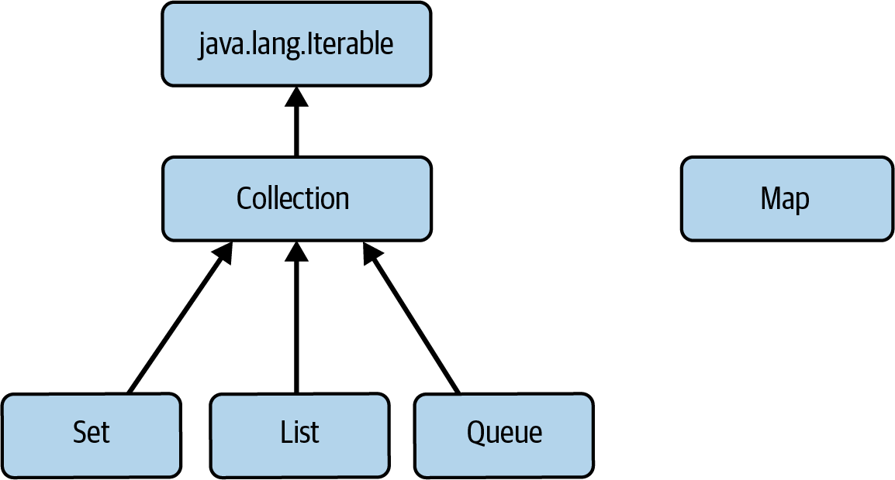

### Java Collections Framework

Show answer

A _collection_ is an object that provides access to a group of objects, allowing them to be processed in a uniform way.

A _collections framework_ provides a uniform view of a set of collection types
specifying and implementing common data structures, following consistent design rules so that they can work together.

---

### The Main Interfaces of the Java Collections Framework

Show answer

- [`java.lang.Iterable` - in order to be used for an _enhanced for statement_, usually called a _foreach_ statement.](#iteration-via-collection-of-elements)
- [`java.util.Collection` - the core functionality required of any collection other than a Map](#javautilcollection)
- [`java.util.Set` - order is not significant and there can be no duplicates]()
- [`java.util.List` - order is significant and accommodates duplicate elements]()
- [`java.util.Queue` - holds elements for processing, yielding them up in the order in which they are to be processed](queues/faq.queues.md#what-is-specific-about-queues-among-other-java-collections)

- [`java.util.Map` - key-value entries to store and retrieve elements.]()

---

### Sequenced Collections: Purpose and Comparison with Other Types

Show answer

Sequenced Collections provide a unified API for working with ordered collections and their reversed views.

These sequenced collections differ from:
- `Collection`, `Set`, or `Map` in that they have a defined _order_, called in the documentation an _encounter order_.
- `Queue`, which also has a defined _order_, in that they can be iterated in either direction.

---

### Sequenced Collections vs Queue

Show answer

`Queue` — although queues have order, sequenced collections allow iteration in both directions.

---

### Sequenced Collection Ordering Types

Show answer

The ordering of sequenced collections can be derived in two different ways:
1. for some, like `List`, elements retain the order in which they were added (sometimes called externally ordered types),
2. whereas for others, like [`NavigableSet`](sets/faq.sets.md#navigableset)),
   the ordering is dictated by the values of the elements (also known as internally ordered types).

Externally ordered and internally ordered terms reflect the difference between
an order that is arbitrarily imposed on the elements, for example by the order in which they are added,
and an order that is an inherent property of the elements themselves, such as alphabetic ordering on strings.

---

### Which Interfaces Correspond to Internally Ordered Collections?

Show answer

- `NavigableSet`
- `NavigableMap`

---

### Hierarchy of Sequenced Collections

Show answer

- [`SequencedCollection`](#sequenced-collections)
- [`SequencedSet`](sets/faq.sets.md#sequencedset)
- [`NavigableSet`](sets/faq.sets.md#navigableset)
- [`Deque`](queues/faq.queues.md#deque)
- [`SequencedMap`](maps/faq.maps.md#sequencedmap)
- [`NavigableMap`](maps/faq.maps.md#navigablemap)

---

### Externally Ordered Collections

Show answer

- implementations of `java.util.List`
- implementations of `Deque`
- `LinkedHashSet`
- `LinkedHashMap`

All of them extend or implement `SequencedSet`/`SequencedMap`

---

### Internally Ordered Collections

Show answer

- Implementations of `NavigableSet`
- Implementations of `NavigableMap`

---

### Ordered Collections That Do Not Implement `SequencedCollection`

Show answer

The following `Queue` implementations do not extend `SequencedCollection`,
but they yield elements up in the order according to the values of the elements.
- `PriorityQueue`
- `PriorityBlockingQueue`
- `DelayQueue`

---
