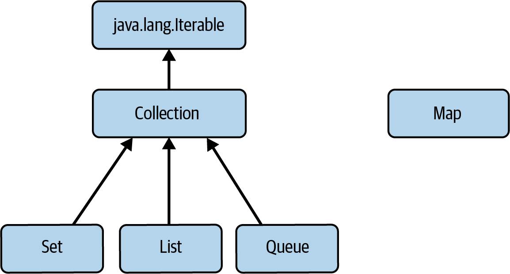
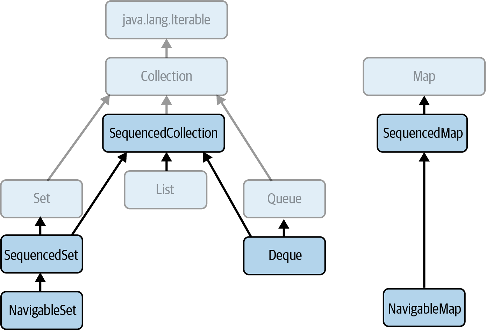

- [Java Collections Framework](#java-collections-framework)
- [The Main Interfaces of the Java Collections Framework](#the-main-interfaces-of-the-java-collections-framework)
- [Sequenced Collections, the purpose](#sequenced-collections)
- [Iteration via collection of elements](#iteration-via-collection-of-elements)
- [Iterate over a collection and consume its elements one-by-one](#iterate-over-a-collection-and-consume-its-elements-one-by-one)
- [What is used in `for` loops?](#what-is-used-in-for-loops)
- [When `for` loop via explicit use of an iterator is necessary?](#when-for-loop-via-explicit-use-of-an-iterator-is-necessary-)
- [What structural changes you could apply when iterate via `for`](#what-structural-changes-you-could-apply-when-iterate-via-for)
- [Alternative way to applying structural changes, requirement](#alternative-way-to-applying-structural-changes-requirement)
- [`java.util.Collection`](#javautilcollection)
- [`java.util.SequencedCollection`](#sequencedcollection)
- [There are several ways of implementing each of these interfaces. Why doesn’t the framework just use the best implementation for each interface?](#there-are-several-ways-of-implementing-each-of-these-interfaces-why-doesnt-the-framework-just-use-the-best-implementation-for-each-interface)
- [What is used to choose the right implementation?](#what-is-used-to-choose-the-right-implementation)
- [The main kinds of operations that most collection interfaces require](#the-main-kinds-of-operations-that-most-collection-interfaces-require)
- [Data structures used as the basis of the implementations](#data-structures-used-as-the-basis-of-the-implementations)
- [Arrays vs Linked Lists](#arrays-vs-linked-lists)
- [Arrays/Linked Lists vs Hash tables](#arrayslinked-lists-vs-hash-tables)
- [What is used internally for implementations based on hash tables, requirements](#what-is-used-internally-for-implementations-based-on-hash-tables-requirements)
- [Working with native arrays](#working-with-native-arrays)
- [What can and cannot be done with a list, created from an array `Arrays.asList(arr)`](#what-can-and-cannot-be-done-with-a-list-created-from-an-array-arraysaslistarr)
- [Views in the Collection Framework](#views-in-the-collection-framework)
- [Performance of the collections](#performance-of-the-collections)
- [Operation complexity](#operation-complexity)
- [Preventing collections changing, benefits, challenges](#preventing-collections-changing-benefits-challenges)
- [Advantages of Unmodifiability](#advantages-of-unmodifiability)
- [What you must think about when you are storing objects in a Set, a Map, or an internally ordered Queue?](#what-you-must-think-about-when-you-are-storing-objects-in-a-set-a-map-or-an-internally-ordered-queue)
- [Collection modifying](#collection-modifying)
- [Distributed workloads](#distributed-workloads)
- [Collections and Thread Safety, options](#collections-and-thread-safety-options)
- [Mechanisms of concurrent collections](#mechanisms-of-concurrent-collections)
- [Collection iterators and Thread Safety](#collection-iterators-and-thread-safety)
- [Removing Elements API](#removing-elements-api)
- [Adding the element into collection vs its removing, regarding method signature](#adding-the-element-into-collection-vs-its-removing-regarding-method-signature)
- [Collection methods that copy elements into array. Why are they needed?](#collection-methods-that-copy-elements-into-array-why-are-they-needed)
- [Why is any type allowed for T in the declarations of the `toArray` methods?](#why-is-any-type-allowed-for-t-in-the-declarations-of-the-toarray-methods)
- [Comment the following code](#comment-the-following-code)

### Java Collections Framework

A _collection_ is an object that provides access to a group of objects, allowing them to be processed in a uniform way.
A _collections framework_ provides a uniform view of a set of collection types 
specifying and implementing common data structures, following consistent design rules so that they can work together.

### The Main Interfaces of the Java Collections Framework

- [`java.lang.Iterable` - in order to be used for an _enhanced for statement_, usually called a _foreach_ statement.](#iteration-via-collection-of-elements)
- [`java.util.Collection` - the core functionality required of any collection other than a Map](#javautilcollection)
- [`java.util.Set` - order is not significant and there can be no duplicates]()
- [`java.util.List` - order is significant and accommodates duplicate elements]()
- [`java.util.Queue` - holds elements for processing, yielding them up in the order in which they are to be processed](queues/faq.queues.md#what-is-specific-about-queues-among-other-java-collections)

- [`java.util.Map` - key-value entries to store and retrieve elements.]()



### Sequenced Collections

These sequenced collections differ from `Collection`, `Set`, or `Map` in that they have a defined _order_, 
called in the documentation an _encounter order_.

They differ from Queue, which also has a defined _order_, in that they can be iterated in either direction. 
The ordering of sequenced collections can be derived in two different ways: 
1. for some, like `List`, elements retain the order in which they were added (sometimes called externally ordered types), 
2. whereas for others, like `NavigableSet` (see [`SequencedSet` and `NavigableSet`](sets/faq.sets.md#sequencedset-and-navigableset)), 
   the ordering is dictated by the values of the elements (also known as internally ordered types).  

Externally ordered and internally ordered terms reflect the difference between 
an order that is arbitrarily imposed on the elements, for example by the order in which they are added,
and an order that is an inherent property of the elements themselves, such as alphabetic ordering on strings.

- [`SequencedCollection`](#sequenced-collections)
- [`SequencedSet` and `NavigableSet`](sets/faq.sets.md#sequencedset-and-navigableset)
- [`Deque`](queues/faq.queues.md#deque)
- [`SequencedMap`](maps/faq.maps.md#sequencedmap)
- [`NavigableMap`](maps/faq.maps.md#navigablemap)



### Iteration via collection of elements

This ability to iterate over the collection of elements is provided by `java.lang.Iterable` interface.

It exposes three methods:
- `void forEach(Consumer<? super T> action)` - Performs action for each element of the Iterable
- `Iterator<T> iterator()` - Returns an iterator over elements of type T
- `Spliterator<T> spliterator()` - Creates a Spliterator over the elements described by this Iterable
  (for parallel streams)

### Iterate over a collection and consume its elements one-by-one

Using `java.lang.Iterable.forEach()` - method, common for all the collections:
```java
coll.forEach(System.out::println);
```

### What is used in `for` loops?

Using `Iterator`:
1. Via explicit use of an iterator:
    ```java
    for (Iterator<String> itr = coll.iterator() ; itr.hasNext() ; ) {
      System.out.println(itr.next());
    }
    ```
2. The previous iteration way is awkward compared to the `foreach` statement, which uses `Iterator` internally:
    ```java
    for (String s : coll) {
      System.out.println(s);
    }
    ```
   The target of a foreach statement can be an array or any class that implements the interface `Iterable`. 
   Since the `Collection` interface extends Iterable, any set, list, or queue can be the target of foreach.

### When `for` loop via explicit use of an iterator is necessary? 

It is necessary when you want to make a structural change to a collection-broadly speaking, 
adding or removing elements-in the course of iteration.

### What structural changes you could apply when iterate via `for`

`Iterator` exposes only a method for removal of collection elements, 
but its subinterface `ListIterator`, available to `List` implementations, 
also provides methods to add and replace elements.

### Alternative way to applying structural changes, requirement

If memory constraints don’t prevent you from making a new copy of the list, 
streams offer a neater solution to this problem:
```java
List<String> strings = new ArrayList<>(List.of("alpha", "bravo", "charlie"));
List<String> modifiedStrings = strings.stream()
  .filter(s -> s.contains("r"))
  .toList();
assert modifiedStrings.equals(List.of("bravo", "charlie"));
```

### `java.util.Collection`

Collection, which exposes the core functionality required of any collection other than a Map. 
Its methods support managing elements by:
- adding or removing single or multiple elements
- checking membership of a single - `contains()` or multiple values - `containsAll()` 
- inspecting - `isEmpty()`, `size()` 
- exporting elements - making elements available for further processing - 
  `iterator()`, `spliterator()`, `stream()`, `parallelStream()`, `toArray()` 

### SequencedCollection

The SequencedCollection interface provides versions of these 
that can be applied to the first and last element of the collection: 
`addFirst`, `addLast`, `removeFirst`, `removeLast`, `getFirst`, and `getLast`. 

In addition, SequencedCollection provides a reversed view - that is, a way of working with the collection 
as though the ordering has been reversed. 

This simplifies many programming problems and often provides more efficient implementations.

### There are several ways of implementing each of these interfaces. Why doesn’t the framework just use the best implementation for each interface?

That would certainly make life simpler.
If an implementation is a greyhound for some operations, Murphy’s law tells us that it will be a tortoise for others.
Because there is no “best” implementation of any of the interfaces **for every situation**.

### What is used to choose the right implementation?

You always have to make a trade-off, 
judging which operations are used most frequently in your application and 
choosing the implementation that optimizes those operations.

### The main kinds of operations that most collection interfaces require

The three main kinds of operations that most collection interfaces require:
- insertion and removal of elements by position
- retrieval of elements by content
- iteration over the collection elements

The various implementations provide many variations on these operations, 
but the main differences among them can be discussed in terms of how they carry out these three.

### Data structures used as the basis of the implementations

#### Arrays

Because arrays are implemented directly in hardware, they have the properties of random-access memory: 
very fast for accessing elements by position and for iterating over them, 
but slower for inserting and removing elements at arbitrary positions 
(because that may require adjusting the position of other elements). 

Arrays are used in the Collections Framework as the backing structure for:
- ArrayList
- CopyOnWriteArrayList
- EnumSet
- EnumMap and 
- for many of the Queue and Deque implementations. 

They also form an important part of the mechanism for implementing hash tables.

#### Linear linked lists

These consist of chains of linked cells. 
Each cell contains a reference to data and a reference to the next cell in the list 
(and, in some implementations, the previous cell). 
Linked lists perform quite differently from arrays: 
accessing elements by position is slow, 
because you have to follow the reference chain from the start of the list, 
but insertion and removal operations can be performed in constant time by rearranging the cell references. 

Linked lists are the primary backing structure used for the classes:
- ConcurrentLinkedQueue
- LinkedBlockingQueue
- LinkedList

#### Other (nonlinear) linked data structures

Linked structures are particularly suitable for representing nonlinear types like trees and skip lists 
(see “ConcurrentSkipListSet”), especially if they need to be rearranged as new elements are added. 
Such structures provide an inexpensive way of maintaining sorted order in their data, 
allowing fast searching by content. 

- Trees are the backing structures for `TreeSet` and `TreeMap`. 
- Skip lists are used in `ConcurrentSkipListSet` and `ConcurrentSkipListMap`.

#### Hash tables

These provide a way of storing elements indexed on their content rather than on an integer-valued index, as with lists. 
In contrast to arrays and linked lists, hash tables provide no support for accessing elements by position, 
but access by content is usually very fast, as are insertion and removal. 

Hash tables are the backing structure for many Set and Map implementations, including:
- `HashSet`
- `LinkedHashSet`
- `HashMap`
- `LinkedHashMap`
- `WeakHashMap`
- `IdentityHashMap`
- `ConcurrentHashMap`

### Arrays vs Linked Lists

Arrays are very fast for accessing elements by position and for iterating over them,
but slower for inserting and removing elements at arbitrary positions
(because that may require adjusting the position of other elements).

Linked lists - accessing elements by position is slow,
because you have to follow the reference chain from the start of the list,
but insertion and removal operations can be performed in constant time by rearranging the cell references.

### Arrays/Linked Lists vs Hash tables

In contrast to arrays and linked lists, hash tables provide no support for accessing elements by position,
but access by content is usually very fast, as are insertion and removal.

### What is used internally for implementations based on hash tables, requirements

The content-based indexing of hashed collections depends on two Object methods, `hashCode` and `equals`, 
which are applied in succession to position an element for insertion or to locate it for retrieval. 
The requirements on the relationship between these methods are defined in the contract for `hashCode`. 

The crucial requirement, sometimes overlooked - with disastrous consequences - by Java programmers, 
is that if two objects are equal according to the `equals` method, 
then the result of calling `hashCode` on each must be the same. 

If `hashCode` depends on an instance field - or any other data about an object - that is not used by the `equals` method, 
then the first stage of a retrieval operation will very likely be misdirected. 

One way this can occur is if you do not override `Object::hashCode` at all; 
the value that it returns in this case will be implementation-dependent (in OpenJDK, it is usually randomly generated) 
but is in any case highly unlikely to be the same for two different instances.

### Working with native arrays

Suppose we want to test for the presence of a particular object in an array. 
One obvious way to do this is to iterate over the array elements, 
testing each for equality with the search target. 

An alternative would be to use `contains` method of `List` interface to do that work instead. 
An array is not a `List`, though, so how can a `List` method be useful in handling it? 

We might well want to avoid the overhead of creating a new `ArrayList` object, 
physically copying all the elements of the array into a new collection. 

In this situation, a better answer is to get a `List` view of the array - an object that "looks like" a `List`, 
but implements all its operations **directly on the underlying array**. 

The method `asList` of the utility class `Arrays` provides such a view:
```java
Integer[] arr = {1, 2, 3};
var list = Arrays.asList(arr);
```

The data “of” the view actually resides in the underlying structure,
so changes made to that structure are immediately visible in the view, and vice versa. 
For example, the following code compiles and runs without errors:

```java
Integer[] arr = {1, 2, 3};
var list = Arrays.asList(arr);
list.set(0, 3);                 // change the list view...
assert arr[0] == 3;             // and the underlying array changes
arr[2] = 0;                     // now change the underlying array...
assert list.get(2) == 0;        // and the list view changes
```

### What can and cannot be done with a list, created from an array `Arrays.asList(arr)`

The simple view that it returns supports some List operations, 
such as contains, 
and methods like get and set that access or replace the array elements, 
but it won’t allow you to make structural modifications, 
like adding or removing elements, which aren’t supported by the underlying array.

### Views in the Collection Framework

Views allows to avoid the overhead of creating an object copy,
physically copying all the elements of one collection into a new collection.

The Collections API exposes many methods returning views. 
For example, the keys of a `Map` can be viewed as a `Set`, as can its entries; 
collections can be viewed as unmodifiable, and so on. 

Each of these views has different rules 
dictating which modifications they will accept and reflect into the backing collection. 
In descending order of permissiveness, they may allow:

- All changes
- Some structural and all nonstructural modifications
- Only nonstructural modifications
- No modifications at all (fully unmodifiable)

So the interfaces that these views implement have some of their operations labeled `optional`.

Views can generally be composed for read operations and are often commutative - that is, can be applied in any order. 
For example:

```java
List<String> names = List.of("alpha", "bravo", "charlie", "delta");
List<String> reverseThenSublist = names.reversed().subList(1, 3);
List<String> subListThenReverse = names.subList(1, 3).reversed();
assert reverseThenSublist.equals(subListThenReverse);
```

### Performance of the collections

Unfortunately, this is very difficult both to predict in theory and to assess in practice. 
Many factors contribute to it, including:

- How often any of the collection’s operations are executed
- Which operations are executed most frequently
- The time cost of each of the operations that are executed
- How many orphaned objects each produces, and what overhead is incurred in collecting them
- The locality properties (discussed in the following subsection) of the collection
- How much parallelism is involved, both at instruction and thread level

The study of how these factors combine to affect the speed of a real-life system 
belongs to the subject of performance tuning, 
the most important rule of which is often quoted in the form provided by Donald Knuth (1974):
"_Premature optimization is the root of all evil._"

The explanation of this remark is twofold. 
1. First, for many programs, performance is just not a critical issue. 
   If a program is rarely executed or already uses few resources, optimization is a waste of effort, 
   and indeed may well be harmful. 
2. Second, even for performance-critical programs, 
   assessing which part is critical normally requires accurate measurement; 
   in the same paper, Knuth added, 
   “_It is often a mistake to make a priori judgments about what parts of a program are really critical, 
   since the universal experience of programmers who have been using measurement tools 
   has been that their intuitive guesses fail._”

This carries an important implication about comparing the performance of different collections. 
For example, `CopyOnWriteArrayList` provides highly efficient concurrent read operations 
at the cost of very expensive writes. 

So to use it in a system that requires highly performant concurrent access to a List, 
you have to have confidence, gained by measurement if necessary, 
that read operations greatly outnumber writes.

### Operation complexity

Big-O notation: 

|  **Time**  | **Common Name** | **Effect on the execution count <br/> if N is doubled** |                 	**Example algorithms**                  |
|:----------:|:---------------:|:-------------------------------------------------------:|:--------------------------------------------------------:|
|    O(1)    |    Constant     |                        Unchanged                        |               Insertion into a hash table                |
|  O(log N)  |   Logarithmic   |             Increased by a constant amount              |                  Insertion into a tree                   |
|    O(N)    |     Linear      |                         Doubled                         |                      Linear search                       |
| O(N log N) |                 |        Doubled plus an amount proportional to N         |                        Merge sort                        |
|   O(N2)    |    Quadratic    |                   Increased fourfold                    | Insertion sort worst case <br/> (input in reverse order) |

### Preventing collections changing, benefits, challenges

One important feature of the functional style is that its data structures are _immutable_ - 
that is, their state cannot be modified after their creation. Immutability confers a number of advantages on a program:
- Immutable objects are thread-safe
- Immutable objects are perfectly encapsulated, thus removing the need for _defensive copying_
- Immutability guarantees stable lookup in keyed and ordered collections
- Immutability reduces the number of states a program can be in, making it simpler, clearer, 
  and easier to understand and reason about.

Realizing these advantages in a Java program is difficult.
For mutable components the often difficult requirement is that the entire object graph must 
have guaranteed exclusive access to them.

This has led to alternative conflicting terminologies for describing immutability of collections:
- Frameworks like Guava and Eclipse Collections refer to immutability of an entire object graph as _deep immutability_. 
  They refer to a collection that refuses modification **at the first level** - that is, 
  an attempt to add, remove, or replace an element - as _shallow immutability_, or often just _immutability_.
- The Java Collections Framework documentation uses _immutability_ to mean immutability of the entire object graph. 
  What the other frameworks refer to as “_shallow immutability_”, 
  the Java documentation calls _unmodifiability_.

### Advantages of Unmodifiability

Unmodifiability (also referred as _shallow immutability_ by Guava and Eclipse Collections) -
refusing modification **at the first level** - that is,
an attempt to add, remove, or replace an element.

Its advantages:
- Collections of immutable objects, including wrapper objects and strings, are not uncommon, 
  and unmodifiable collections of these provide the full benefits of immutability.
- Even partial immutability reduces the number of program states that you have to consider 
  when understanding a program and reasoning about its correctness.
- Because unmodifiable sets and maps can be backed by arrays instead of hashed structures, 
  they can provide very significant space savings.

### What you must think about when you are storing objects in a Set, a Map, or an internally ordered Queue?

Whenever you are storing objects in a Set, a Map, or an internally ordered Queue, 
ensure that the fields used by the collection to organize its contents are immutable.

### Collection modifying

You should use streams to modify collection and its elements.
Streams are a mechanism for transporting a sequence of values from a source to a destination 
through a series of operations, typically implemented as lambdas, 
each of which can transform, drop, or insert values on the way

#### Modify via Streams API
```java
Point origin = new Point(0, 0);
List<Integer> intList = Arrays.asList(1, 2, 3, 4, 5);
OptionalDouble maxDistance = intList.stream()
    .map(i -> new Point(i % 3, i / 3))
    .mapToDouble(p -> p.distanceFrom(origin))
    .max();
```
Advantages:
1. more concise and readable, 
2. often uses less intermediate storage, 
3. handles an empty source gracefully, and 
4. can never attempt to mutate the source collection

#### Modify without Streams
```java
Point origin = new Point(0, 0);
List<Integer> intList = Arrays.asList(1, 2, 3, 4, 5);
List<Point> pointList = new ArrayList<>();
for (Integer i : intList) {
  pointList.add(new Point(i % 3, i / 3));
}
double maxDistance = 0;
for (Point p : pointList) {
  maxDistance = Math.max(p.distanceFrom(origin), maxDistance);
}
```
Disadvantages:
1. very verbose
2. the intermediate collection `pointList` is an overhead on the operation of the program, 
   resulting in increased garbage collection costs or even in heap space exhaustion
3. the intent of the program is hard to discern, 
   because the crucial operations are interspersed with the code for collection handling

### Distributed workloads

Distributed workloads - distributes workloads over multiple cores.
This is achieved by use of _recursive decomposition_, 
in which a data set is broken down into parts for separate processing, 
with the results of the constituent processes being combined on completion.

Implementing recursive decomposition requires knowing how to split tasks and how eventually to execute sufficiently 
small ones without further splitting. The strategy for these operations depends on the source of the data: 
accordingly, every implementation of `Iterable` - in other words, every `Collection` subtype - 
has an associated `Spliterator` object, which contains the appropriate strategies for that collection.

The stream framework hides the complexity of programming _recursive decomposition_ in the convenient abstraction 
of parallel streams. If a stream is created parallel or made parallel by a call of the `parallel` method, 
the framework applies _recursive decomposition_ to the data set being streamed and 
assigns each of the resulting parts to its own thread:

```java
OptionalDouble maxDistance = intList.stream()
    .parallelStream()
    .map(i -> new Point(i % 3, i / 3))
    .mapToDouble(p -> p.distance(0, 0))
    .max();
```
Each thread is, ideally, assigned a core on which it can execute without interruption. 
In the best case - that of a large data set requiring compute-intensive processing with very little I/O - 
this can result in near-perfect parallelization.

### Collections and Thread Safety, options

#### Synchronized Wrapper Collections

The performance cost of internal synchronization in the JDK 1.0 collections led the designers 
to avoid it when the Collections Framework was first introduced in JDK 1.2.

#### Concurrent Collections

The concurrent collections remove the necessity for client-side locking.
External synchronization is not even possible with these collections, 
as there is no one object that when locked will block all methods. 
Where operations need to be atomic - for example, inserting an element into a `Map` only if it is currently absent - 
the concurrent collections provide a method specified to perform atomically; in this case, `ConcurrentMap.putIfAbsent`.

If you need thread safety, the concurrent collections generally provide much better performance 
than synchronized collections. 
This is primarily because their throughput is not reduced by the need to serialize access, 
as is the case with the synchronized collections. 
Synchronized collections also suffer the overhead of managing locks, 
which can be high if there is much contention. 
These differences can lead to efficiency differences of two orders of magnitude 
for concurrent access by more than a few threads.

### Mechanisms of concurrent collections

#### copy-on-write

This is the only one that does not use the new primitives. 
Classes that use _copy-on-write_ store their values in an internal array, which is effectively immutable; 
any change to the value of the collection results in a new array being created to represent the new values. 
Synchronization is used by these classes, though only briefly, during the creation of a new array. 
Because read operations do not need to be synchronized, 
copy-on-write collections perform well in the situations for which they are designed - 
those in which reads greatly predominate over writes. 

The collection classes `CopyOnWriteArrayList` and `CopyOnWriteArraySet` use this mechanism.

#### compare-and-set (CAS)

This group of thread-safe collections relies on hardware operations generically known as _compare-and-set_ (CAS), 
which provide a fundamental improvement on traditional synchronization. 
To see how CAS works, consider a computation in which the value of a single variable is used as input 
to a long-running calculation whose eventual result is used to update the variable. 
Traditional synchronization makes the whole computation atomic,
excluding any other thread from concurrently accessing the variable. 
This reduces opportunities for parallel execution and therefore throughput. 
An algorithm based on CAS behaves differently: a thread makes a local copy of the variable and 
performs the calculation without getting exclusive access. 
Only when it is ready to update the variable does it call CAS, 
which in one atomic operation compares the variable’s value with its value at the start and, 
if they are the same, updates it with the new value. 
If they are not the same, the variable must have been modified by another thread; 
in this situation, the CAS thread can try the whole computation again using the new value, 
or give up, or - in some algorithms - continue, 
because the interference will have actually done its work for it! 
This style of locking is called _optimistic concurrency control_, 
in contrast to the traditional _pessimistic_ style, 
which blocks all other threads from access to the variable while this thread’s operation is in progress. 

Collections using CAS include _ConcurrentLinkedQueue_ and _ConcurrentSkipListMap_.

#### `java.util.concurrent.locks.Lock` based implementation

The third group uses implementations of `java.util.concurrent.locks.Lock`, 
an interface introduced in Java 5 as a more flexible alternative to classical synchronization. 
A Lock has the same basic behavior as classical synchronization, 
but a thread can also acquire it under special conditions: 
- only if the lock is not currently held, or 
- if it becomes free only within a set timeout period, or 
- if the thread is not interrupted. 

Unlike synchronized code, in which an object lock is held while a code block or a method is executed, 
a Lock is held until its unlock method is called 
(making it possible for a Lock to be released in a different block or method from that in which it was acquired). 

Some of the collection classes in this group make use of these features to divide the collection into parts 
that can be separately locked, giving improved concurrency. 
For example, `LinkedBlockingQueue` has separate locks for the head and tail ends of the queue so that elements 
can be added and removed in parallel. Other collections using these locks include 
most of the implementations of `BlockingQueue`.

### Collection iterators and Thread Safety

#### Fail-Fast Iterators

These iterators are default for not-concurrent collections

Every time the iterators access the backing collection,
they check it for structural modification
(which, in general, means that elements have been added to or removed from the collection)
by comparing the collection’s modification counter with their own internal copy.

A discrepancy implies that the collection has been modified, but not by one of the iterator’s own methods;
in that case, the iterator fails immediately, throwing `ConcurrentModificationException` rather
than continuing to attempt to iterate over the modified collection with unpredictable results.

Note that this fail-fast behavior is provided to help find and diagnose bugs;
it is not guaranteed as part of the collection contract.

#### Snapshot iterators

Copy-on-write collections have snapshot iterators.

These collections are backed by arrays that, once created, are never changed; 
if a value in the collection needs to be changed, a new array is created. 
This means an iterator can read the values in one of these arrays (but never modify them) 
without danger of them being changed by another thread. 
Snapshot iterators do not throw `ConcurrentModificationException`.

#### Weakly consistent iterators

Weakly consistent iterators reflect some but not necessarily all the changes that 
have been made to their backing collections since they were created. 
For example, if elements in the collection have been modified or removed before the iterator reaches them, 
it definitely will reflect these changes, but no such guarantee is made for insertions. 

Weakly consistent iterators do not throw `ConcurrentModificationException`.

Collections that have weakly consistent iterators:
- those which rely on CAS
- collections, that are implemented based on `java.util.concurrent.locks.Lock`

### Removing Elements API

- `void clear()` - removes all elements
- `boolean remove(Object o)` - remove an element o
- `boolean removeAll(Collection<?> c)` - remove all occurrences of the elements in c
- `boolean retainAll(Collection<?> c)` - remove the elements not in c
- `boolean removeIf(Predicate<? super E> p)` remove the elements for which p is true

### Adding the element into collection vs its removing, regarding method signature

- `boolean add(E e)` - add the element e
- `boolean remove(Object o)` - remove an element o

If the argument `o` to remove is `null`, the method will remove a single `null` from the collection if one is present. 
Otherwise, if any elements `e` are present for which `o.equals(e)`, it removes one; 
if not, it leaves the collection unchanged and returns false.

Why isn't `Collection.remove(Object o)` generic?

The signatures of `Collection` methods `contains`, `remove`, and `retain`, 
each of which take a parameter of type `Object`, and the corresponding collection-oriented versions 
`containsAll`, `removeAll`, and `retainAll`, which take a `Collection<?>`. 
Why are these methods not generified to take parameters of type `E` or (respectively) `Collection<E>`?

A moment’s thought shows that these methods, which remove elements from the collection or test for membership, 
do not have the potential to compromise its type safety - unlike `add` and `addAll`, 
whose signatures do indeed specify the type `E`. 
So the designers could safely choose these parameter types. But why did they? 
Different reasons have been proposed (including by the designers themselves), including:

- Backward compatibility. To minimize the number of breaking changes caused by the introduction of generics, 
  the **only methods generified were those that were necessary to ensure type safety**, like `add` and `addAll`.
- Allowing the use of bounded wildcard types.
  Suppose that a collection parameter to a method is given a type `Set<? extends Foo>`. 
  If `contains` required that parametric type, it could never be used in this situation, 
  since no argument could be supplied of type `? extends Foo` (except null). 
  Giving the parameter of contains the type `Object` ensures that it can be used with collections of any type.
- Accommodating unrelated types. The most compelling reason is that in many situations, 
  such as calculating the intersection of two collections, the types of the elements may be completely unrelated. 
  In that example, the intersection being calculated was between a collection of type `PhoneTask` 
  and a collection of its supertype `Task`, but even this relationship is unnecessary. 
  For example, think of calculating the intersection of two collections of List objects. 
  Two Lists are equal if they contain the same elements, 
  so `retainAll` could plausibly be used to preserve in a `Collection<ArrayList>` only those `ArrayLists` 
  that were equal to some element of a different `Collection<LinkedList>`. 
  The only parameter type for `retainAll` that makes that possible is `Collection<?>`.

The trade-off between the two alternatives for these collection method types is quite subtle. 
On the one hand, it can be argued that using `Object` as the parameter type means that some errors will be missed 
that would be caught by the more precise typing.
After all, one of the key advantages of generics is that their precise typing enables more errors 
to be caught at compile time. 
But in cases like those mentioned here, where the precise typing would be inappropriate, 
it would have to be evaded with additional unchecked casts - one of the major sources of imprecision 
in the generics type system. 

Whether you feel that the designers made the right or the wrong choice, 
it is worth knowing the issues that lay behind the decision.

### Collection methods that copy elements into array. Why are they needed?

- `Object[] toArray()` return a new created array containing the elements of this collection
- `<T> T[] toArray(T[] t)` copy contents to an existing `T[]` array (for any T)
- `<T> T[] toArray(IntFunction<T[]> generator)` copy contents to a new `T[]` array, 
  created by a function producing a new `T[]` of a given size

These methods are important because many APIs - principally older ones and those 
for which performance is especially important - expose methods that accept or return arrays.

The arguments of the last two methods are required in order to provide the virtual machine 
with the reifiable type of the array.

The new array will be created during the method execution.
If the array supplied as the argument to the second overload of `toArray` is long enough, 
it is used to receive the elements of the collection, overwriting its existing elements.

### Why is any type allowed for T in the declarations of the `toArray` methods?

- `<T> T[] toArray(T[] t)` copy contents to an existing `T[]` array (for any T)
- `<T> T[] toArray(IntFunction<T[]> generator)` copy contents to a new `T[]` array,
  created by a function producing a new `T[]` of a given size

The type variable `T` is unrelated to the collection type parameter `E`, 
permitting errors at run time that it seems should have been caught at compile time.

```java
List.of(1, 2, 3).toArray(new String[0])    // array store exception
```
compiles successfully but throws `ArrayStoreException` at run time.

Why not restrict the array component type to exactly `E`, the parametric type of the collection? 
The principal reason is to allow the possibility of giving the array a more specific component type 
than that of the collection, when the elements of the collection all happen to belong to the same subtype:
```java
List<Object> l = List.of("zero", "one");
String[] a = l.toArray(new String[0]);
```
Here, a list of objects happens to contain only strings, so it can be converted into a `String[]`.
If the list contains an object that is not a string, the error is caught at run time rather than compile time:

```java
List<Object> l = List.of("zero", "one", 2);
String[] a = l.toArray(new String[0]);      // throws ArrayStoreException
```

In general, you may want to copy a collection of a given type into:
- an array of a more specific type (for instance, copying a list of objects into an array of strings, as just shown) or 
- of a more general type (for instance, copying a list of strings into an array of objects).

One drawback of this design is that, applied to collections of wrapper types, 
it doesn’t accommodate automatic unboxing into the corresponding array of primitives:

```java
List<Integer> l = List.of(0, 1, 2);
int[] a = l.toArray(new int[0]);  // compile-time error
```
This is illegal because the parameter T in the method call must - as for any type parameter - be a reference type.

Solutions:
1. resort to copying the array explicitly:
    ```java
    jshell> List<Integer> integers = List.of(0, 1, 2);
    integers ==> [0, 1, 2]
    jshell> int[] ints = new int[integers.size()];
    ints ==> int[3] { 0, 0, 0 }
    jshell> for (int i=0; i<integers.size(); i++) { ints[i] = integers.get(i); }
    jshell> ints
    ints ==> int[3] { 0, 1, 2 }
    ```
2. using the Stream API:
    ```java
    jshell> int[] ints = integers.stream()
       ...>     .mapToInt(Integer::intValue)
       ...>     .toArray();
    ints ==> int[3] { 0, 1, 2 
    ```

###

### Respect the ‘Ownership’ of Collections

todo

###

### Comment the following code

#### structural changes during iteration
```java
List<String> strings = new ArrayList<>(List.of("alpha", "bravo", "charlie"));
for (String s : strings) {
  if (! s.contains("r")) {
    strings.remove(s);      
  }
}
```
You get `ConcurrentModificationException`:
```java
strings.remove(s);      // throws ConcurrentModificationException
```
Solution:
```java
List<String> strings = new ArrayList<>(List.of("alpha", "bravo", "charlie"));
for (Iterator<String> itr = strings.iterator() ; itr.hasNext() ; ) {
  String s = itr.next();
  if (! s.contains("r")) {
    itr.remove();
  }
}
```
If memory constraints don’t prevent you from making a new copy of the list,
streams offer a neater solution to this problem:
```java
List<String> strings = new ArrayList<>(List.of("alpha", "bravo", "charlie"));
List<String> modifiedStrings = strings.stream()
  .filter(s -> s.contains("r"))
  .toList();
assert modifiedStrings.equals(List.of("bravo", "charlie"));
```

#### Using implementations based on hash tables

```java
class Person {
  private final String name;
  public Person(String name) {
    this.name = name;
  }
  @Override
  public boolean equals(Object o) {
    return o instanceof Person p && name.equals(p.name);
  }
}
Set<Person> people = new HashSet<>();
people.add(new Person("Alice"));
if (people.contains(new Person("Alice"))) {
  //do something  
}
```
This class should override `hashCode` so that it depends only on the same field that equals depends on (i.e., name). 
But it does not; as a result, hashed collections will not work correctly.


Solution - implement `hashCode()`:
```java
class Person {
  private final String name;
  public Person(String name) {
    this.name = name;
  }
  @Override
  public boolean equals(Object o) {
    return o instanceof Person p && name.equals(p.name);
  }
  @Override
  public int hashCode() {
    return name.hashCode();
  }
}
```

#### Content-Based Organization
```java
class Person {
  private String name;
  public Person(String name) {
    this.name = name;
  }
  public void setName(String name) {
    this.name = name;
  }
  public int hashCode() {
    return name.hashCode();
  }
  public boolean equals(Object o) {
    return o instanceof Person p && name.equals(p.name);
  }
}
Set<Person> people = new HashSet<>();
Person alice = new Person("Alice");
people.add(alice);
alice.setName("Bob");
//what the following checks return:
people.contains(new Person("Alice"));
people.contains(new Person("Bob"));
```
An object of type Person can be reliably retrieved, but only if the value of name is unchanged. 
If that field is modified, the collection can no longer match the object with either the old or the new value.

To avoid problems like this, the best guideline is this: 
whenever you are storing objects in a Set, a Map, or an internally ordered Queue, 
ensure that the fields used by the collection to organize its contents are immutable.

#### Collection to array #1

```java
Collection<String> cs = ...
String[] sa = cs.toArray(new String[0]);
```
The new array will be created during `toArray` method execution, 
although if the array supplied as the argument to the second overload of toArray is long enough, 
it is used to receive the elements of the collection, overwriting its existing elements.

#### Collection to array #2

```java
List.of(1, 2, 3).toArray(new String[0]);
```

The code compiles successfully but throws `ArrayStoreException` at run time.

#### Collection to array of primitives

```java
List<Integer> l = List.of(0, 1, 2);
int[] a = l.toArray(new int[0]);  
```

You get compile-time error. 
This is illegal because the parameter T in the method call must - as for any type parameter - be a reference type.

Solutions:
1. resort to copying the array explicitly:
    ```java
    jshell> List<Integer> integers = List.of(0, 1, 2);
    integers ==> [0, 1, 2]
    jshell> int[] ints = new int[integers.size()];
    ints ==> int[3] { 0, 0, 0 }
    jshell> for (int i=0; i<integers.size(); i++) { ints[i] = integers.get(i); }
    jshell> ints
    ints ==> int[3] { 0, 1, 2 }
    ```
2. using the Stream API:
    ```java
    jshell> int[] ints = integers.stream()
       ...>     .mapToInt(Integer::intValue)
       ...>     .toArray();
    ints ==> int[3] { 0, 1, 2 
    ```

#### dd