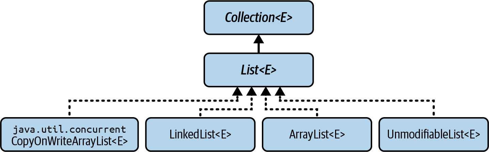

- [Lists, its purpose, compare with other collections](#lists-its-purpose-compare-with-other-collections)
- [What it means to be equal for two lists?](#what-it-means-to-be-equal-for-two-lists)
- [`List.hashCode`](#listhashcode)
- [`List` Interface Methods](#list-interface-methods)
- [Methods Inherited from SequencedCollection and their List equivalents](#methods-inherited-from-sequencedcollection-and-their-list-equivalents)
- [`List.remove`, what must you care about?](#listremove-what-must-you-care-about)
- [Changes in list view and its backing list issue](#changes-in-list-view-and-its-backing-list-issue)
- [`Iterator` vs. `ListIterator`](#iterator-vs-listiterator)
- [List Hierarchy](#list-hierarchy)
- [`ArrayList`](#arraylist)
- [`ArrayList` backed data structure, related issues](#arraylist-backed-data-structure-related-issues)
- [`ArrayList` performance](#arraylist-performance)
- [`LinkedList`, recommendations](#linkedlist-recommendations)
- [`UnmodifiableList`](#unmodifiablelist)
- [Lists for multithreaded context](#lists-for-multithreaded-context)
- [`CopyOnWriteArrayList`](#copyonwritearraylist)
- [Comparing List Implementations](#comparing-list-implementations)
- [List implementation choice](#list-implementation-choice)
- [ArrayList vs LinkedList](#arraylist-vs-linkedlist)
- [Using LinkedList instead of ArrayList if the insertions and removals are at the start of the list](#using-linkedlist-instead-of-arraylist-if-the-insertions-and-removals-are-at-the-start-of-the-list)
- [Using `ArrayDeque` for random access](#using-arraydeque-for-random-access)

### Lists, its purpose, compare with other collections

A list is a collection that (unlike a set) can contain duplicates, 
and that (unlike a queue) gives the user full visibility of and control over the ordering of its elements. 

The corresponding Collections Framework interface is `List<E>`.

### What it means to be equal for two lists?

The List contract overrides the `equals` method; 
it states that a `List` can only ever be equal to another `List`, 
and then only if they contain **the same elements, in the same order**.

### `List.hashCode`

todo

### `List` Interface Methods

#### Positional Access Methods
- `void add(int index, E e)` add element e at given index
- `boolean addAll(int index, Collection<? extends E> c)` add contents of c at given index
- `E get(int index)` return element at given index
- `E remove(int index)` remove element at given index
- `E set(int index, E e)` replace element at given index by e

#### Search Methods
- `int indexOf(Object o)` return index of first occurrence of o
- `int lastIndexOf(Object o)` return index of last occurrence of o

These methods search for a specified object in the list and return its numerical position, 
or `-1` if the object is not present.

#### View-Generating Methods
- `List<E> subList(int fromIndex, int toIndex)` return a view of a portion of the list
- `List<E> reversed()` provide a reverse-ordered view of the original collection

#### List Iteration Methods
- `ListIterator<E> listIterator()` return a `ListIterator` for this list, initially positioned at index 0
- `ListIterator<E> listIterator(int idx)` return a `ListIterator` for this list, initially positioned at index `idx`

#### [Methods Inherited from SequencedCollection](#methods-inherited-from-sequencedcollection-and-their-list-equivalents)

### Methods Inherited from SequencedCollection and their List equivalents

| SequencedCollection call | List positional access call |
|:-------------------------|:----------------------------|
| addFirst(el)             | add(0, el)                  |
| addLast(el)              | add(el)                     |
| getFirst()               | get(0)                      |
| getLast()                | get(size() - 1)             |
| removeFirst()            | remove(0)                   |
| removeLast()             | remove(size() - 1)          |

### `List.remove`, what must you care about?

The declaration of `remove` has an unfortunate conflict with the inherited method `Collection::remove` 
in the case of a `List<Integer>`. 
Although overload resolution rules make it clear that a call like `list.remove(0)` 
refers to the element at index 0, 
this is a common source of confusion to programmers, 
and hence a common source of errors as well.

### Changes in list view and its backing list issue

#### for list view you get via `subList`
Changes made to the `sublist` write through to the backing list, but the reverse is true only for nonstructural changes. 
If any structural changes are made to the backing list by insertion or deletion other than via the sublist, 
subsequent attempts to use the sublist will result in a `ConcurrentModificationException`.

#### for list view you get via `reversed`
The view returned by `reversed` allows any modifications that are permitted by the original list.

### `Iterator` vs. `ListIterator`

`ListIterators` - a subtype of `Iterator` with additional features that take advantage of a List’s sequential nature:
- `E previous()` (additionally to `E next()`)
- `boolean hasPrevious()`, (additionally to `boolean hasNext()`)
- `void set(E)` and `void add(E)` additionally to `void remove()`

### List Hierarchy

- [`ArrayList`](#arraylist)
- [`LinkedList`](#linkedlist-recommendations)
- [`UnmodifiableList`](#unmodifiablelist)
- [`CopyOnWriteArrayList`](#copyonwritearraylist)

### `ArrayList`

todo

### `ArrayList` backed data structure, related issues

`ArrayList` - a list backed by an array. Arrays, once created, they cannot be resized.

The standard implementation of `ArrayList` stores the `List` elements in contiguous array locations, 
with the first element always stored at index 0 in the array. 
It requires an array at least large enough (with sufficient capacity) to contain the elements, 
together with a way of keeping track of the number of "_occupied_" locations (the size of the `List`). 
If an `ArrayList` has grown to the point where its size is equal to its capacity, 
attempting to add another element will require it to replace the backing array with a larger one 
capable of holding the old contents and the new element, 
and with a margin for further expansion 
(the standard implementation actually uses a new array that is 1.5 times the length of the old one).

### `ArrayList` performance

The performance of `ArrayList` reflects array performance for “random-access” operations:
set and get take constant time.

The downside of an array implementation is in inserting or removing elements at arbitrary positions,
because that may require adjusting the position of other elements.

### `LinkedList`, recommendations

There is rarely a good reason to choose it as a List implementation:
- since the list must iterate internally to reach the required position, 
  positional add and remove have linear time complexity, on average
- Compared to a circular array implementation like `ArrayDeque`, 
  it is superior only in addition of the first or last element, 
  since it never has to copy or resize as an array-backed implementation must do **when its capacity is reached**.
- [Avoid `LinkedList`](todo)

### `UnmodifiableList`

The unmodifiable lists can be obtained from the various overloads of the factory methods `List::of` and `List::copyOf`.

The properties of the members of this family are described in the Javadoc for List:
- They are unmodifiable - elements cannot be added or removed.
  Calling any mutator method will always cause an `UnsupportedOperationException` to be thrown.
- They are null-hostile. Attempts to create them with null elements will result in `NullPointerException`.
- The lists and their `subList` views implement the RandomAccess interface.

### Lists for multithreaded context

- If so, you should use [`CopyOnWriteArrayList`](#copyonwritearraylist), 
  if you can - that is, if writes to the list will be relatively infrequent.
- If not, you will have to use a synchronized wrapper around `ArrayList` or `LinkedList`.

### `CopyOnWriteArrayList`

Pros:
This combination of thread safety with fast read access is useful in some concurrent programs, 
especially when a collection of observer objects needs to receive frequent event notifications.

Cons:
The cost is that the array that backs the collection has to be treated as immutable, 
so a new copy is created whenever any changes are made to the collection. 
This cost may be acceptable if changes to the set of observers occur only rarely.

### Comparing List Implementations

|                        | get  | add   | add(int,e) | contains | iterator.next | remove(0) | iterator.remove                 |
|:-----------------------|:-----|:------|:-----------|:---------|:--------------|:----------|:--------------------------------|
| `ArrayList`            | O(1) | O(1)  | O(N)       | O(N)     | O(1)          | O(N)      | O(N)                            |
| `LinkedList`           | O(N) | O(1)  | O(1)(a)    | O(N)     | O(1)          | O(1)      | O(1) (a)                        |
| `CopyOnWriteArrayList` | O(1) | 	O(N) | O(N)       | O(N)     | O(1)          | O(N)      | `UnsupportedOperationException` |

(a) The complexity measures of `O(1)` for the operations `add(int,e)` and `iterator.remove` for `LinkedList` 
should be understood in the context of the `O(N)` complexity of the operation needed to locate the site 
of the addition or removal.

### List implementation choice

As always, if in doubt, measure your application's performance with each implementation.

#### Whether your application requires thread safety. 
If so, you should use `CopyOnWriteArrayList`, if you can - that is, if writes to the list will be relatively infrequent. 
If not, you will have to use a synchronized wrapper around `ArrayList` or `LinkedList`.

### ArrayList vs LinkedList

- ArrayList is better for random access and scenarios where you mostly read elements.
- LinkedList is better for frequent insertions/deletions in the middle of the list. 
  In practice, however, this is rarely the case.

### Using LinkedList instead of ArrayList if the insertions and removals are at the start of the list

If you only:
- need fast insertions/removals at both ends (complexity - O(1) amortized) and 
- don’t need random access, ArrayDeque is usually better.
It’s implemented as a resizable array, optimized for queue operations.

Lower memory overhead compared to LinkedList.

### Using `ArrayDeque` for random access

For relatively infrequent random access, use:
- an iterator, or
- copy the `ArrayDeque` elements into an array using `toArray`. 
