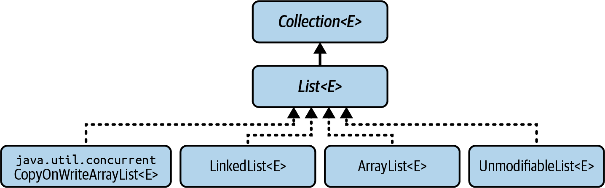

### What is the purpose of lists, and how do they differ from other collection types?

Show answer

Lists preserve positional ordering and allow explicit access to elements by index.

Unlike:
- a set, **allows duplicate elements**, and 
- a queue, **provides full control over the ordering** of its elements.

In the Java Collections Framework, this behavior is defined by the `List<E>` interface.

### What does it mean for two lists to be equal?

Show answer

- Two lists are considered equal if and only if they contain **the same elements in the same order**.
- Element equality is determined using the `equals` method of the elements themselves.

### How is `List.hashCode` calculated?

Show answer

The `hashCode` of a `List` is computed from the hash codes of its elements, in **iteration order**, 
so that lists which are equal according to `equals` produce the same hash code.

### What methods are exposed by the `List` API?

Show answer

#### Index‑based methods
- `void add(int index, E e)` add element e at given index
- `boolean addAll(int index, Collection<? extends E> c)` add contents of c at given index
- `E get(int index)` return element at given index
- `E remove(int index)` remove element at given index
- `E set(int index, E e)` replace element at given index by e

#### Search Methods
- `int indexOf(Object o)` return index of first occurrence of o
- `int lastIndexOf(Object o)` return index of last occurrence of o

These methods search for a specified object in the list and return its numerical position, 
or `-1` if the object is not present.

#### View-Generating Methods
- `List<E> subList(int fromIndex, int toIndex)` return a view of a portion of the list
- `List<E> reversed()` provide a reverse-ordered view of the original collection

#### List Iteration Methods
- `ListIterator<E> listIterator()` return a `ListIterator` for this list, initially positioned at index 0
- `ListIterator<E> listIterator(int idx)` return a `ListIterator` for this list, initially positioned at index `idx`

#### [Methods Inherited from SequencedCollection](#how-do-methods-from-sequencedcollection-map-to-corresponding-list-operations)

### How do methods from SequencedCollection map to corresponding List operations?

Show answer

| SequencedCollection call | List positional access call |
|:-------------------------|:----------------------------|
| addFirst(el)             | add(0, el)                  |
| addLast(el)              | add(el)                     |
| getFirst()               | get(0)                      |
| getLast()                | get(size() - 1)             |
| removeFirst()            | remove(0)                   |
| removeLast()             | remove(size() - 1)          |

### What common issues arise when using `List.remove`?

Show answer

The `List.remove` method can be confusing because it **overloads** the `remove` method inherited from `Collection`.

This is especially problematic for `List<Integer>`:
- `remove(int index)` removes the element **at the specified position**
- `remove(Object o)` removes the **first occurrence of the given value**

As a result, a call like `list.remove(0)` removes the element at index `0`,  
*not* the element with value `0`. Although this behavior is well defined by the language’s overload‑resolution rules, 
it is a common source of programmer confusion and bugs.

To avoid mistakes, be explicit when removing by value, for example:
- use `list.remove(Integer.valueOf(0))` to remove the value `0`
- or assign the argument to an `Integer` variable before calling `remove`

### How do changes to a list view and its backing list affect each other?

Show answer

#### for list view you get via `subList`
Changes made to the `sublist` write through to the backing list, but the reverse is true only for nonstructural changes. 
If any structural changes are made to the backing list by insertion or deletion other than via the sublist, 
subsequent attempts to use the sublist will result in a `ConcurrentModificationException`.

#### for list view you get via `reversed`
The view returned by `reversed` allows any modifications that are permitted by the original list.

### What is the difference between `Iterator` and `ListIterator`?

Show answer

`ListIterators` - a subtype of `Iterator` with additional features that take advantage of a List’s sequential nature:
- `E previous()` (additionally to `E next()`)
- `boolean hasPrevious()`, (additionally to `boolean hasNext()`)
- `void set(E)` and `void add(E)` additionally to `void remove()`

### What is the hierarchy of `List` implementations in Java?

Show answer

- [`ArrayList`](#what-is-arraylist)
- [`LinkedList`](#what-considerations-should-be-taken-into-account-when-using-linkedlist)
- [`UnmodifiableList`](#what-is-unmodifiablelist-and-how-is-it-intended-to-be-used)
- [`CopyOnWriteArrayList`](#what-is-copyonwritearraylist-and-how-does-it-work)

### What is `ArrayList`?

Show answer

`ArrayList` is a resizable, array‑backed implementation of the `List` interface,
whose growth is handled by reallocating and copying its underlying array.

### What data structure is `ArrayList` based on, and what are the implications of this choice?

Show answer

`ArrayList` is backed by a **contiguous array**, which cannot be resized once created.

Elements are stored starting at index `0`, with the list tracking its current size separately from the array’s capacity. 
When the array becomes full, `ArrayList` grows by **allocating a larger array and copying existing elements** into it.

As a result:
- Random access is fast.
- Adding elements is usually efficient.
- Resizing is costly due to array reallocation and copying.

### What are the performance characteristics of `ArrayList`?

Show answer

The performance characteristics of `ArrayList` closely mirror those of arrays for
**random‑access operations**: both `get` and `set` execute in constant time (`O(1)`).

The main drawback of this array‑based design appears when **inserting or removing elements
at arbitrary positions**. Such operations may require shifting subsequent elements to maintain
contiguous storage, resulting in linear‑time complexity (`O(n)`).

### What considerations should be taken into account when using `LinkedList`?

Show answer

There is rarely a good reason to choose `LinkedList` as a `List` implementation.

- Because a linked list must **traverse nodes sequentially** to reach a given position, positional
  operations such as `add(int, E)` and `remove(int)` have **linear time complexity** on average.

- Inserting or removing elements at the beginning or end of a `LinkedList` can be done in
  constant time. However, array‑based deque implementations such as `ArrayDeque` provide the
  same asymptotic guarantees for these operations.

- For most use cases, especially when indexed access (in the case of List) or efficient iteration is required, 
  array‑backed alternatives such as `ArrayList` and `ArrayDeque` outperform `LinkedList`.

### What is `UnmodifiableList`, and how is it intended to be used?

Show answer

Unmodifiable lists can be created using the factory methods `List.of` and `List.copyOf`.

- **They are unmodifiable**: elements cannot be added, removed, or replaced.  
  Any attempt to call a mutator method results in an `UnsupportedOperationException`.

- **They are null‑hostile**: attempts to create an unmodifiable list containing `null`
  elements result in a `NullPointerException`.

- **They support efficient random access**: the lists themselves, as well as their
  `subList` views, implement the `RandomAccess` interface.

These characteristics make unmodifiable lists a safe and efficient choice for exposing read‑only collections.

### What are the options for working with lists in multithreaded applications?

Show answer

When working with lists in a multithreaded context, the choice of implementation depends on the expected access pattern:

- If **writes are infrequent**, prefer `CopyOnWriteArrayList`.  
  It provides thread safety without external synchronization and offers excellent read performance by allowing concurrent, lock‑free reads.

- If **writes are frequent**, use a **synchronized wrapper** around a mutable list such as `ArrayList` or `LinkedList`
  (for example, via `Collections.synchronizedList`).  
  This ensures thread safety but requires careful external synchronization when iterating.

### What is `CopyOnWriteArrayList`, and how does it work?`

Show answer

**Pros**
`CopyOnWriteArrayList` combines **thread safety with very fast read access**, making it well suited for
concurrent scenarios where reads greatly outnumber writes. A typical example is a collection of
observer or listener objects that need to receive frequent notifications without blocking.

**Cons**  
The backing array is treated as **immutable**. Every mutating operation (such as `add` or `remove`)
creates a **new copy of the entire array**, which is a costly operation in terms of time and memory.
This overhead is acceptable only when modifications are **rare** compared to reads; otherwise,
performance degrades significantly.

### What are the differences between `List` implementations?

Show answer

|                        | get  | add   | add(int,e) | contains | iterator.next | remove(0) | iterator.remove                 |
|:-----------------------|:-----|:------|:-----------|:---------|:--------------|:----------|:--------------------------------|
| `ArrayList`            | O(1) | O(1)  | O(N)       | O(N)     | O(1)          | O(N)      | O(N)                            |
| `LinkedList`           | O(N) | O(1)  | O(1)(a)    | O(N)     | O(1)          | O(1)      | O(1) (a)                        |
| `CopyOnWriteArrayList` | O(1) | 	O(N) | O(N)       | O(N)     | O(1)          | O(N)      | `UnsupportedOperationException` |

(a) The complexity measures of `O(1)` for the operations `add(int,e)` and `iterator.remove` for `LinkedList` 
should be understood in the context of the `O(N)` complexity of the operation needed to locate the site 
of the addition or removal.

### What factors should influence the choice of a List implementation?

Show answer

When choosing a `List` implementation, an important factor to consider is 
**whether the list will be used in a multithreaded context**.

- If **thread safety is not required**, prefer non‑synchronized implementations such as `ArrayList`,
  which offer better performance and lower overhead.

- If the list **must be shared between multiple threads**, choose the implementation based on usage patterns:
  - If **reads are frequent and writes are rare**, `CopyOnWriteArrayList` is a good choice due to its
    thread‑safe, lock‑free read operations.
  - If **writes are frequent**, use a synchronized list (for example, via
    `Collections.synchronizedList`) and ensure proper external synchronization during iteration.

Selecting the appropriate implementation helps balance correctness, performance, and scalability
in concurrent applications.

### What are the differences between `ArrayList` and `LinkedList`?

Show answer

- **`ArrayList`** is generally the better choice for **random access** and scenarios where
  the list is **read frequently**. Accessing elements by index is fast, and iteration
  benefits from contiguous memory layout and good CPU cache locality.

- **`LinkedList`** can be more suitable for **frequent insertions or deletions in the middle
  of the list**, as these operations do not require shifting elements.
  However, each element is stored in a separate node, which leads to **poor cache locality**
  and reduced iteration performance. In practice, this memory and cache inefficiency often
  outweighs its advantages, making `LinkedList` a less optimal choice in most real‑world cases.

### What should be considered when choosing `LinkedList` over `ArrayList` for frequent insertions and removals at the beginning?

Show answer

If you only need **fast insertions and removals at both ends of the list** and **do not require random access**, 
using **`ArrayDeque` is usually a better option**.

- **`ArrayDeque`** provides **amortized `O(1)`** performance for insertions and removals at both the head and the tail.
- It is implemented as a **resizable circular array**, optimized specifically for queue and deque operations.
- Compared to `LinkedList`, it has **lower memory overhead** and significantly **better cache locality**, 
  which leads to improved performance in practice.

In such scenarios, `ArrayDeque` is generally preferable to both `ArrayList` and `LinkedList`.

### What are the limitations and considerations of using `ArrayDeque`?

Show answer

`ArrayDeque` does **not support direct random access** by index. 
If occasional access to its elements is required, there are two practical approaches:

- Use an **iterator** to traverse the deque and access elements sequentially.  
  This is suitable when access is infrequent and order‑based processing is acceptable.

- Convert the deque to an **array using `toArray`**, then access elements by index on the resulting array.  
  This approach incurs a one‑time copy cost but allows efficient indexed access afterward.

For workloads that require **frequent random access**, 
a list implementation such as `ArrayList` is typically a better choice.

