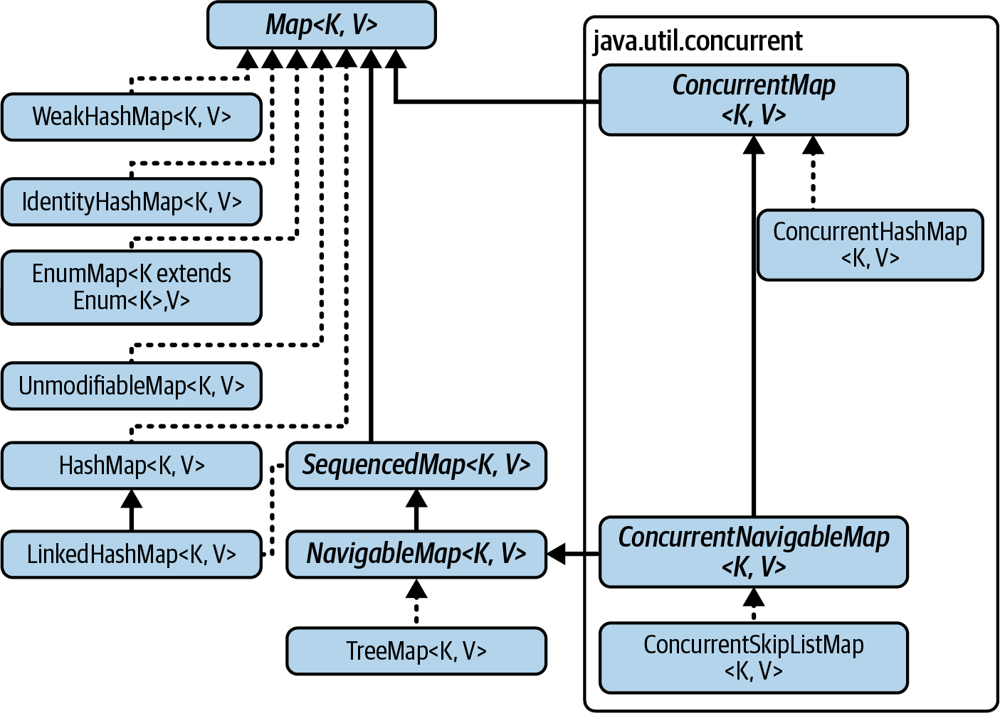
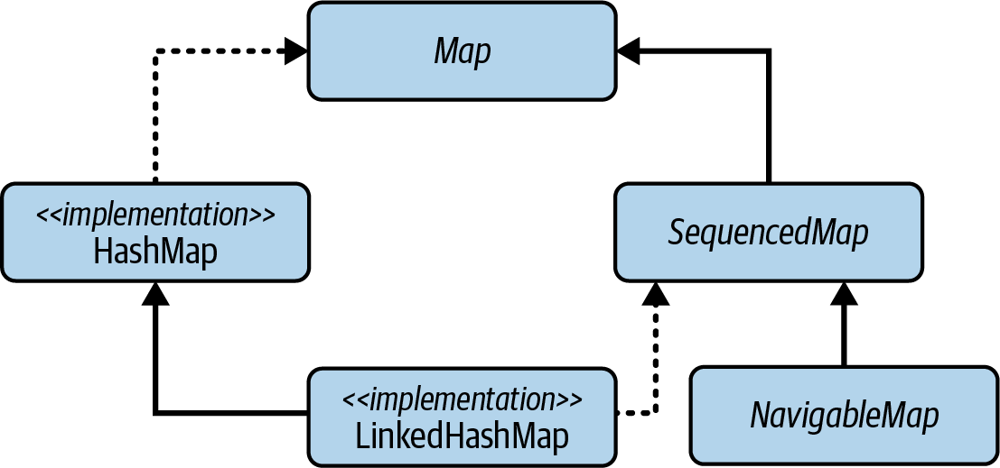

## Java Maps, API

<details>
 <summary><strong>Show questions</strong></summary>

### A Map, its purpose and performance characteristics
<details>
 <summary>Show answer</summary>

A Map stores key-to-value associations, or entries, in which the keys are unique. 
Its implementations provide very fast - ideally, constant-time - operations 
to look up the value corresponding to a given key.

A Map is considered as a Set of map entries (key-value pairs).
A map entry is defined by the `Map.Entry` interface.

</details>

### How to determine whether two Java maps are equal?
<details>
 <summary>Show answer</summary>

A `Map` can only ever be equal to another Map, and then only if they are the same size and contain equal entries.

</details>

### The hash code of a Map
<details>
 <summary>Show answer</summary>

The hash code of a Map is the sum of the hash codes of its entries.

</details>

### Groups of `Map` Interface Methods
<details>
 <summary>Show answer</summary>

- [Iterable-like operations](#iterable-like-operations-of-map-interface)
- [Collection-like operations of `Map` interface](#collection-like-operations-of-map-interface)
- [Compound operations of `Map` interface](#groups-of-compound-operations)
- [Views methods of `Map` interface](#views-methods-of-map-interface)
- [Factory Methods of `Map` interface](#factory-methods-of-map-interface)

Mnemonic by first letters:
`I-C-C-V-F` -> _I Collect Cool View Factories._
(Imagine a collector who loves cool views and factories.)

</details>

### Iterable-like operations of `Map` interface
<details>
 <summary>Show answer</summary>

- `void forEach(BiConsumer<K,V> action)` - perform action on each entry in the map, 
  in the iteration order of the entry set if that is specified.
  In the same way that `Iterable::forEach`

</details>

### Collection-like operations of `Map` interface
<details>
 <summary>Show answer</summary>

#### Adding or replacing associations:
- `V put(K key, V value)` - add or replace a key-value association; 
  return the old value if the key was present, otherwise null 
- `void putAll(Map<K,V> m)` - copy all the mappings in m into the receiver
- `void replaceAll(BiFunction<K,V,V>; remapper)` - replace each value with the result of invoking remapper
#### Removing associations:
- `void clear()` - remove all associations from this map
- `V remove(Object key)` - remove the association, if any, with the given key; 
  return the value with which it was associated if any, and otherwise null
#### Querying the contents of a map:
- `V get(Object k)` return the value corresponding to k, or null if k is not present as a key
- `boolean containsKey(Object k)` return true if k is present as a key
- `boolean containsValue(Object v)` return true if v is present as a value
- `int size()` return the number of associations
- `boolean isEmpty()` return true if there are no associations

</details>

### Groups of compound operations
<details>
 <summary>Show answer</summary>

They fall into two groups, corresponding to the two different styles of locking, pessimistic and optimistic:
- [Pessimistic-style atomic operations](#pessimistic-style-atomic-operations)
- [Optimistic-style atomic operations](#optimistic-style-atomic-operations)

</details>

### Pessimistic-style atomic operations
<details>
 <summary>Show answer</summary>

Pessimistic-style operations - assuming conflicts are frequent (safe but less concurrent).
These are essential in multithreaded environments to avoid unsafe test-then-act operation sequences.
They are also very useful as convenience methods for non-thread-safe maps.
- `V getOrDefault(Object k, V defaultValue)` - return the value to which k is mapped, 
  or defaultValue if this map contains no mapping for the key
- `V putIfAbsent(K key, V value)` - create a key-value mapping if the key is absent or mapped to null; 
  in these cases, return null, and otherwise return the current value
- `V computeIfAbsent(K k, Function<K,V> mapper)` apply the mapper function to `k` 
  and use the result to create a key-value pair, unless either `k` is currently mapped to a non-`null` value 
  or the result is `null`; 
  return the value now associated with `k`, or `null` if `k` is not now present in the map
- `V merge(K k, V newValue, BiFunction<V,V,V> remapper)` - if `k` is not present or is mapped to `null`, 
   associate it with `newValue`; otherwise, apply `remapper` to the existing value and `newValue` 
   and associate `k` with the result if it is non-`null`, or otherwise remove `k`
- `V compute(K k, BiFunction<K,V,V> remapper)` - use the result computed by `remapper` from `k` 
   and the existing value (or null if `k` is not present) to create or modify a key-value pair, and return the result; 
   if the computed result is `null`, remove any existing entry and return `null`
- `V computeIfPresent(K k, BiFunction<K,V,V> remapper)` - if k is currently mapped to `null`, return `null`; 
   otherwise, use the result computed by `remapper` from `k` and the existing value to replace that value, 
   and return the result; 
   if the computed result is `null`, remove the existing entry and return `null`

</details>

### Optimistic-style atomic operations, idea
<details>
 <summary>Show answer</summary>

Optimistic-style operations - lets operations proceed without locks and checks for conflicts (like version changes) 
only at commit time, assuming conflicts are rare (faster but requires retries).

These methods support the optimistic style of concurrent locking. 
See [“Mechanisms of concurrent collections”](todo). 
The uses of these conditional update methods are probably fairly narrow in non-concurrent systems,
but they may be convenient for some applications.

For example, a caller may fetch a key’s value, value `A`, and work on a task based on that value. 
When the task is complete, the caller will want to update the value to value `B`. 
However, a second concurrent caller might also fetch value `A` and start working, 
and eventually it may want to update the value to value `C`; 
thus, the callers’ updates are racing.

In order to avoid conflicting updates, the callers can use the `replace(K,V,V)` method. 
This performs an update and returns true only when the current value in the map matches the first argument. 
Otherwise, the method does nothing and returns false. 
Callers are expected to pass the previous expected value as the first argument. 
The caller that “wins” the race will see the original value, as expected, and its update will be performed. 
The caller that “loses” will see a different value from its original value, no update will be performed, 
and the method will return false. At that point the “losing” caller is expected to retry its operation, 
possibly discarding work that it might have performed based on the original value.

</details>

### Optimistic-style atomic operations
<details>
 <summary>Show answer</summary>

- `V replace(K k, V newValue)` - performs an unconditional state change,
  modifying an existing mapping without the risk of creating a new one.
  Its complement is `putIfAbsent`, which will not modify an existing mapping but only create a new one.
- `boolean replace(K k, V oldValue, V newValue)` - performs an update and returns true only when the current value
  in the map matches the first argument. Otherwise, the method does nothing and returns false.
- `boolean remove(Object key, Object value)` - remove the entry for this key if it is mapped to this value, 
  returning true if the operation succeeded. 
  Effects a conditional state change to a terminal state in which the mapping is removed

</details>

### Views methods of `Map` interface
<details>
 <summary>Show answer</summary>

- `Set<Map.Entry<K,V>> entrySet()` - return a Set view of the associations
- `Set<K> keySet()` - return a Set view of the keys
- `Collection<V> values()` - return a Collection view of the values

</details>

### Factory Methods of `Map` interface
<details>
 <summary>Show answer</summary>

TODO add factory methods for all maps classes

These methods create unmodifiable Map objects. 
See [`UnmodifiableMap`](todo)
- `static <K,V> LinkedHashMap<K,V> newLinkedHashMap(int numMappings)`
- `Map.of(...)`
- `Map.ofEntries(...)`
- `Map.copyOf(Map<? extends K, ? extends V> map)`

</details>

### How to get the old value and put the new one into the map?
<details>
 <summary>Show answer</summary>

`V put(K key, V value)` add or replace a key-value association; 
return the old value if the key was present, otherwise null.

</details>

### Using null values in a Map
<details>
 <summary>Show answer</summary>

The contracts for `put`, `remove`, and `get` present a problem with `null`-tolerant maps: 
a returned `null` for a map key can signify:
- either that a null value had been associated with that key, or 
- that the key was not present. 

The method `containsKey` can be used to distinguish between these situations. 
This problem normally arises only with non-concurrent maps, as concurrent maps usually do not accept nulls. 

If you want to write to a null-tolerant map conditionally on a key being absent or present, 
one of the compound methods may be useful. 

However, with non-concurrent maps they cannot be relied on to act atomically, 
so they may appear to behave inconsistently if used on such a map when it is under concurrent access.

This is [the _TOCTOU_ problem](todo). 

The design decision to allow null values in maps is evaluated in [nulls](todo).

</details>

### Views, what must you remember about when apply changes?
<details>
 <summary>Show answer</summary>

The view collections returned by `entrySet`, `keySet`, `values` methods are backed by the map, 
so they reflect changes to the map. 

The connection in the opposite direction is more limited: 
you can remove elements from the view collections, 
but attempting to add elements will result in an `UnsupportedOperationException`.

</details>

### Removing a key from the set returned by `keySet`
<details>
 <summary>Show answer</summary>

Removing a key from the `keyset` removes the single corresponding key-value association.

</details>

### Removing a value from the collection returned by `values`
<details>
 <summary>Show answer</summary>

Removing a value from the collection returned by `values`, on the other hand,
removes only one of the associations mapping to it;
the value may still be present as part of an association with a different key.

</details>

### Using an iterator over the view
<details>
 <summary>Show answer</summary>

An iterator over the view will become undefined if the backing map is concurrently modified.

</details>

### Compound Operations, history
<details>
 <summary>Show answer</summary>

Because maps are very often used in multithreaded environments, 
the interface exposes a variety of compound actions. 
These fuse a conditional test - whether a key is absent or present, possibly with a specific value - 
either with a supplied value or with an action, represented by a lambda, to compute the value lazily. 


The primary intended use of these methods is to perform conditional transactions on the state of a concurrent map. 

Some methods of this group originally formed the `ConcurrentMap` interface 
when that was introduced in the `java.util.concurrent` package. 

Later, the introduction of default methods in Java 8 allowed the `Map` interface to be extended to include them, 
and new ones were added to both `Map` and `ConcurrentMap`.

</details>

### You want to use a default value for all the keys without storing that value in the map
<details>
 <summary>Show answer</summary>

If a map has values only for certain keys, the `getOrDefault` method allows you to use a default value 
for all other keys without having to store that value in the map against them all.

</details>

### You want to write something the first time you see it but not thereafter
<details>
 <summary>Show answer</summary>

`putIfAbsent` is useful if you want to write something the first time you see it but not thereafter. 
For example, to record the timestamp corresponding to the first occurrence of a particular kind of event, 
you could write:

```java
Map<EventKind,Long> firstOccurrenceMap = ... ;
...
firstOccurrenceMap.putIfAbsent(event.getKind(), System.currentTimeMillis());
```

</details>

### What issue exist with `putIfAbsent`?
<details>
 <summary>Show answer</summary>

```java
Map<EventKind,Long> firstOccurrenceMap = ... ;
...
firstOccurrenceMap.putIfAbsent(event.getKind(), System.currentTimeMillis());
```

In this example, the overhead of boxing the timestamp into a Long will be incurred for every event, not only the first. 
You will usually want to avoid this performance cost by using another compound method, `computeIfAbsent`, 
which computes the new value lazily:

```java
firstOccurrenceMap.computeIfAbsent(event.getKind(),
  key -> System.currentTimeMillis());
```

</details>


### How to add an element to a `Map<K, List<V>>` - creating the list on first insert?
<details>
 <summary>Show answer</summary>

```java
map.computeIfAbsent(key, k -> new ArrayList<V>()).add(newValue);
```

- For the missing key k, create a new empty `ArrayList<V>` and associate it with that key.
  So after `computeIfAbsent` call, you are guaranteed that `map.get(key)` returns a non-null `ArrayList<V>`.
- The result of `computeIfAbsent` is the list associated with the key. 
  Then `.add(newValue)` adds the new element to that list.

</details>

### How to apply some logic and remove entry? Give an example
<details>
 <summary>Show answer</summary>

In the same way that `computeIfAbsent` is most useful where it may be necessary to add a new key, 
`computeIfPresent` can be used to remove an existing one. 
In an earlier example, we saw how to use `putIfAbsent` to produce a map 
from each kind of event to the timestamp of its first occurrence. 

Now suppose that we later want to process a different phase of the event stream so that the first event - 
and only the first - of each kind in this later phase triggers 
the writing of a log entry with the previously recorded timestamp. 

We can do that as follows:

```java
firstOccurrenceMap.computeIfPresent(event.getKind(), (kind, timestamp) -> {
  log.info("first occurrence of event " + kind + " was at " + timestamp);
  return null;
});
```

Returning `null` from the lambda ensures that the key will be removed from the map 
so that the log message can only be triggered once for each kind of event.

</details>

### How to either initialize an entry value to a given string `msg` or append a new value to an existing one?
<details>
 <summary>Show answer</summary>

```java
map.merge(key, msg, String::concat);
```

</details>

### What used for accumulating values based on the key’s properties and any previous value?
<details>
 <summary>Show answer</summary>

`Map.compute`

For instance, to map each word to the total character count that all its occurrences contribute to the text length

```java
map.compute(word, (s,i) -> s.length() + (i == null ? 0 : i));
```

Full example:

```java
Map<String, Integer> map = new HashMap<>();
map.compute("apple", (s, i) -> s.length() + (i == null ? 0 : i));
map.compute("banana", (s, i) -> s.length() + (i == null ? 0 : i));
// map ==> {banana=6, apple=5}

```


</details>

### `Map.merge` vs `Map.compute`
<details>
 <summary>Show answer</summary>

`compute`, is similar to `merge`, but with the difference that instead of an initial value, 
it allows the contents of the `key` to be used in a lazy computation of the new value:

```java
map.compute(word, (s,i) -> s.length() + (i == null ? 0 : i));
```

- Use `merge` when you want to add or combine values (like counters or lists).
- Use `compute` when you need full control and possibly use the key in the logic.

| Feature          | compute                              | merge                                   |
|------------------|--------------------------------------|-----------------------------------------|
| Function params  | (key, oldValue)                      | (oldValue, newValue)                    |
| When key absent  | Function called with oldValue = null | Puts the given value directly           |
| Typical use case | Complex logic based on key and value | Accumulating or combining values easily |

</details>

### `Map.compute` vs `Map.computeIfPresent` vs `Map.computeIfAbsent`
<details>
 <summary>Show answer</summary>

- `computeIfAbsent` - Use when you want to initialize a value if it’s missing
- `computeIfPresent` - Use when you want to update an existing value only if it’s present.
- `compute` - Use when you want full control over the value regardless of presence.

</details>

### `Map.Entry` interface, its methods
<details>
 <summary>Show answer</summary>

The members of the set returned by `entrySet` implement the interface `Map.Entry`, representing a key-value association. 
This interface exposes:
- factory methods for creating `Comparators` by key and value and 
- instance methods for accessing the components of the entry.
- An optional `setValue` method can be used to change the value in an entry if the backing map is modifiable, 
  and if so will write changes through.

</details>

### Iteration over entries, returned by `entrySet`, recommendations
<details>
 <summary>Show answer</summary>

According to the Javadoc, a `Map.Entry` object obtained by iterating over a set returned by `entrySet` 
retains its connection only for the duration of the iteration, 
but in fact this is only a guaranteed minimum: 
implementation behaviors vary, some preserving the connection indefinitely. 

However, modern idioms for map processing depend less than before on durable `Map.Entry` objects: 
where in the past you might have used a `Map.Entry` set iterator to remove some entries, 
you would now be more likely to call `entrySet.removeIf`. 

Alternatively, and also for use cases in which you want to change association values, 
the instance methods of `Map` provide a variety of ways to remove mappings or alter their values.

</details>

### How to create `Map.Entry`?
<details>
 <summary>Show answer</summary>

You can create `Map.Entry` objects using the `Map.entry` factory method; 
this is most commonly useful for creating [unmodifiable Maps](todo).

</details>

</details>

---

## Java Maps interfaces and implementations

<details>
 <summary><strong>Show questions</strong></summary>

### Hierarchy of Map Implementations
<details>
 <summary>Show answer</summary>



</details>

### Constructors for Map implementations
<details>
 <summary>Show answer</summary>

`HashMap`, `LinkedHashMap`, and `WeakHashMap` have other constructors for configuration purposes, 
but these have been replaced in practice by factory methods, 
for the reasons described in ["creation of `HashSet`"](../sets/faq.sets.md#creation-of-hashset).

`static <K,V> HashMap<K,V> HashMap::newHashMap(int numElements)`
static <K,V> WeakHashMap<K,V> newWeakHashMap(int numMappings)

</details>

### `HashMap`, its performance and its iterators
<details>
 <summary>Show answer</summary>

`HashMap` implemented based on hash tables with the related performance.

In particular, `HashMap` provides constant-time performance for `put` and `get`. 
Although in principle constant-time performance is only attainable with no collisions, 
it can be closely approached by the use of rehashing to control the load and 
thereby to minimize the number of collisions.

Iteration over a collection of keys or values requires time proportional 
to the capacity of the map plus the number of key-value mappings that it contains. 

The iterators are fail-fast.

</details>

### `WeakHashMap`, its purpose
<details>
 <summary>Show answer</summary>

Most maps keep ordinary (“strong”) references to all the objects they contain. 
That means that even when a key has become unreachable by any means other than through the map itself, 
its mapping cannot be garbage collected.
So preserving entries unnecessarily has the potential to degrade garbage collection performance and create memory leaks. 
The idea behind `WeakHashMap` is to avoid this situation by allowing a mapping and its referenced objects 
to be reclaimed once the key is no longer reachable in the application.

</details>

### `WeakHashMap` implementation details
<details>
 <summary>Show answer</summary>

Internally, `WeakHashMap` holds references to its key objects through objects of the class `java.lang.ref.WeakReference`. 
A [`WeakReference`](../../references_caches/faq.references_caches.md#weakreference) 
introduces an extra level of indirection in reaching an object.

</details>

### `WeakHashMap` performance
<details>
 <summary>Show answer</summary>

`WeakHashMap` performs similarly to `HashMap`, 
though more slowly because of the overheads of the extra level of indirection for keys. 
The cost of clearing out unwanted key-value associations before each operation is proportional 
to the number of associations that need to be removed because the garbage collector has reclaimed the key.

</details>

### `IdentityHashMap`, idea, its purpose, use-cases
<details>
 <summary>Show answer</summary>

`IdentityHashMap` for the equivalence relation on its keys, it uses the identity relation. 
In other words, every physically distinct object is a distinct key.

An `IdentityHashMap` differs from an ordinary `HashMap` in that two keys are considered `equal` 
only if they are physically the same object: `identity`, rather than `equals`, is used for key comparison. 
That sets the contract for `IdentityHashMap` at odds with the contract for the interface it implements, namely `Map`, 
which specifies that equality should be used for key comparison. 

The Javadoc for `Map` assumes that the equivalence relation for maps is always defined by the `equals` method, 
whereas in fact `IdentityHashMap` uses a different relation, 
as do all implementations of `NavigableMap`

The main purpose of `IdentityHashMap` is to support operations in which a graph 
has to be traversed and information stored about each node. 
Serialization is one such operation. 
The algorithm used for traversing the graph must be able to check, for each node it encounters, 
whether that node has already been seen; 
otherwise, graph cycles could be followed indefinitely. 
For cyclic graphs, we must use identity rather than equality to check whether nodes are the same. 
Calculating equality between two graph node objects requires calculating the equality of their fields, 
which in turn means computing all their successors—and we are back to the original problem. 
An `IdentityHashMap`, by contrast, will report a node as being present only 
if that same node has previously been put into the map.

Use Case: 
- Object Graph Serialization
- Detect Cycles in Object Graph

</details>

### `EnumMap`
<details>
 <summary>Show answer</summary>

Implementing a mapping from an enumerated type is straightforward and very efficient.
In an array implementation, the `ordinal` value of each enumerated type constant can serve 
as the index of the corresponding value. 
The basic operations of `get` and `put` can be implemented as array accesses, in constant time. 
An iterator over the key set takes time proportional to the number of constants 
in the enumerated type and returns the keys in their natural order (the order in which the enum constants are declared). 

Iterators over the collection views of this class are weakly consistent.

</details>

### UnmodifiableMap, idea, creation, performance
<details>
 <summary>Show answer</summary>

The properties of the members of this family are described in the Javadoc for Map:
- They are unmodifiable; keys and values cannot be added or removed.
  Calling any mutator method will always cause `UnsupportedOperationException` to be thrown.
- They are null-hostile. Attempts to create them with null keys or values will result in a `NullPointerException`.
- They reject duplicate keys at creation time.
  Duplicate keys passed to a factory method result in an `IllegalArgumentException`.

Creating unmodifiable maps:
- `Map.of` - limited number of entries
- `Map.ofEntries` and `Map.entry` - unlimited number of entries
- `Map.copyOf`

Like the other unmodifiable collections, unmodifiable maps are backed by fixed-length arrays. 
They have the advantages over hashed collections of:
- reduced memory footprint
- faster iteration  
- better spatial locality. 

With a `hashCode` function that provides good distribution, lookup is `O(1)`. 
As with `UnmodifiableSet`, and for the same reason, 
the order of iteration over the entry or key set is randomly determined for each virtual machine instance.

</details>

### Hierarchy of `SequencedMap` and related types
🔗 Copy link

<details>
 <summary>Show answer</summary>

- [`SequencedMap`](#sequencedmap)
- [`NavigableMap`](#navigablemap)



</details>

### `SequencedMap`
<details>
 <summary>Show answer</summary>

A `SequencedMap` is a Map that maintains its entries in a defined order.

</details>

### `SequencedMap` API
<details>
 <summary>Show answer</summary>

#### Adding or updating entries
- `V  putFirst(K k, V v)` - insert the given mapping, or updates it if it is already present
- `V  putLast(K k, V v)` - insert the given mapping, or updates it if it is already present

#### Inspecting entries
- `Map.Entry<K,V> firstEntry()`
- `Map.Entry<K,V> lastEntry()`

#### Removing entries
- `Map.Entry<K,V> pollFirstEntry()` remove and return the first entry, or null if the map is empty
- `Map.Entry<K,V> pollLastEntry()` remove and return the last entry, or null if the map is empty

#### View-generating methods
- `SequencedMap<K,V> reversed()` return a reverse-ordered view of the map
- `SequencedSet<Map.Entry<K,V>> sequencedEntrySet()` return a `SequencedSet` view of the map’s entrySet
- `SequencedSet<K> sequencedkeySet()` return a `SequencedSet` view of the map’s keySet
- `SequencedCollection<V> sequencedValues()` return a `SequencedCollection` view of the map’s values collection

</details>

### `SequencedMap` view-generating methods
<details>
 <summary>Show answer</summary>

[See view-generated methods](#view-generating-methods)

</details>

### Direct `SequencedMap` implementations
<details>
 <summary>Show answer</summary>

- [`LinkedHashMap`](#linkedhashmap)

</details>

### `LinkedHashMap`
<details>
 <summary>Show answer</summary>

Like `LinkedHashSet`, the class `LinkedHashMap` refines the contract of its parent class, `HashMap`, 
by guaranteeing the order in which iterators return its elements. 
Also like `LinkedHashSet`, it implements the sequenced subinterface (`SequencedMap`) of its main interface.

</details>

### `LinkedHashMap` iteration, compare with `LinkedHashSet`
<details>
 <summary>Show answer</summary>

Unlike `LinkedHashSet`, however, `LinkedHashMap` offers a choice of iteration orders; 
elements can be returned either:
- in the order in which they were inserted in the map—the default or
- in the order in which they were accessed (from least recently to most recently accessed). 

 
An access-ordered `LinkedHashMap` is created by supplying an argument of true for the last parameter of the constructor:

```java
public LinkedHashMap(int initialCapacity, float loadFactor, boolean accessOrder)
```

Supplying false will give an insertion-ordered map. 
The other constructors, which are just like those of `HashMap`, also produce insertion-ordered maps. 
As with `LinkedHashSet`, iteration over a `LinkedHashMap` takes time proportional 
only to the number of elements in the map, not its capacity.

</details>

### Iteration over a collection of keys or values returned by a `LinkedHashMap`
<details>
 <summary>Show answer</summary>

Iteration over a collection of keys or values returned by a `LinkedHashMap` is linear in the number of elements. 
The iterators over such collections are fail-fast.

</details>

### An access-ordered `LinkedHashMap`, its purpose
<details>
 <summary>Show answer</summary>

Access-ordered maps are especially useful for constructing 
[least recently used (LRU) caches](../../references_caches/faq.references_caches.md#an-access-ordered-linkedhashmap-its-purpose).

</details>

### `NavigableMap`
<details>
 <summary>Show answer</summary>

A `NavigableMap` is a `SequencedMap` whose keys form a `NavigableSet` so that its entries are automatically sorted 
by the key ordering and its methods can find keys and key-value pairs adjacent to a target key value.

The interface `NavigableMap` adds to `SequencedMap` a guarantee that its iterator will traverse the 
map in ascending key order and, like `NavigableSet`, adds further methods to 
find the entries adjacent to a target key value. 
Also like `NavigableSet`, `NavigableMap` extends and in effect replaces an older interface, 
`SortedMap`, which imposes an ordering on its keys: either their natural ordering or that of a Comparator. 
The equivalence relation on the keys of a NavigableMap is again defined by the ordering relation; 
two keys that compare as equal—that is, 
for which the comparison method returns 0—will be regarded as duplicates by a NavigableMap

</details>

### `SequencedMap::putFirst` for `TreeMap`
<details>
 <summary>Show answer</summary>

In the case of an internally ordered implementation like `TreeMap`, 
both `SequencedMap::putFirst` and `SequencedMap::putLast` methods will throw `UnsupportedOperationException`.

</details>

### `NavigableMap` methods API
<details>
 <summary>Show answer</summary>

#### Retrieving the Comparator
- `Comparator&lt;? super K> comparator()` return the map’s key comparator if it has been given one, 
  instead of relying on the natural ordering of the keys; otherwise, return null

#### Getting Range Views
- `SortedMap<K,V> subMap(K fromKey, K toKey)`
  return a view of the portion of this map whose keys range from fromKey, inclusive, to toKey, exclusive 
- `SortedMap<K,V> headMap(K toKey)`	return a view of the portion of this map whose keys are strictly less than toKey
- `SortedMap<K,V> tailMap(K fromKey)` 
  return a view of the portion of this map whose keys are greater than or equal to fromKey
- `NavigableMap<K,V> subMap(K fromKey, boolean fromInclusive, K toKey, boolean toInclusive)`
  return a view of the portion of this map whose keys range from fromKey to toKey
- `NavigableMap<K,V> headMap(K toKey, boolean inclusive)`
  return a view of the portion of this map whose keys are less than (or equal to, if inclusive is true) toKey
- `NavigableMap<K,V> tailMap(K fromKey, boolean inclusive)`	
  return a view of the portion of this map whose keys are greater than (or equal to, if inclusive is true) fromKey

#### Getting Closest Matches
- `Map.Entry<K,V> ceilingEntry(K Key)` return a key-value mapping associated with 
  the least key greater than or equal to the given key, or null if there is no such key
- `K ceilingKey(K Key)`	return the least key greater than or equal to the given key, or null if there is no such key
- `Map.Entry<K,V> floorEntry(K Key)` return a key-value mapping associated with
  the greatest key less than or equal to the given key, or null if there is no such key 
- `K floorKey(K Key)` return the greatest key less than or equal to the given key, or null if there is no such key
- `Map.Entry<K,V> higherEntry(K Key)` return a key-value mapping associated with 
  the least key strictly greater than the given key, or null if there is no such key
- `K higherKey(K Key)` return the least key strictly greater than the given key, or null if there is no such key
- `Map.Entry<K,V> lowerEntry(K Key)` return a key-value mapping associated with 
  the greatest key strictly less than the given key, or null if there is no such key
- `K lowerKey(K Key)` return the greatest key strictly less than the given key, or null if there is no such key

#### Other views:
- `NavigableMap<K,V> descendingMap()` return a reverse-order view of the map
- `NavigableSet<K> descendingKeySet()` return a reverse-order key set
- `NavigableSet<K> navigableKeySet()` return a forward-order key set

</details>

### NavigableMap methods that return range views
<details>
 <summary>Show answer</summary>

Each of the methods in this group appears in two overloads:
- one inherited from `SortedMap` and returning a half-open SortedMap view, and 
- one defined in `NavigableMap` and returning a `NavigableSet` view that can be open, half-open, or closed 
  according to the user’s choice - provide more flexibility.

</details>

### NavigableMap methods that return entries and key views in different orders
<details>
 <summary>Show answer</summary>

- `NavigableMap<K,V> descendingMap()` return a reverse-order view of the map
- `NavigableSet<K> descendingKeySet()` return a reverse-order key set
- `NavigableSet<K> navigableKeySet()` return a forward-order key set

</details>

### Why `keySet` method, inherited from `Map`, could not simply be overridden using a covariant return type to return a `NavigableSet`?
<details>
 <summary>Show answer</summary>

Indeed, the platform implementations of `NavigableMap::keySet` do return a `NavigableSet`. 
But there is a compatibility concern: 
if `TreeMap::keySet` were to have its return type changed from `Set` to `NavigableSet`, 
any existing `TreeMap` subclasses that override that method would fail to compile 
unless they too changed their return type.
[See _Maintain Binary Compatibility_](todo)

</details>

### `NavigableMap` implementations
<details>
 <summary>Show answer</summary>

- [`TreeMap`](#treemap)

</details>

### `TreeMap`
<details>
 <summary>Show answer</summary>

In fact, the internal representation of a `TreeSet` is just a `TreeMap` in which every key 
is associated with the same standard value, 
so the explanation of the mechanism and performance of red-black trees 
[given there](../sets/faq.sets.md#what-data-structure-is-backed-by-treeset-its-properties)
applies equally here.

</details>

### `TreeMap` construction
<details>
 <summary>Show answer</summary>

The constructors for `TreeMap` include, besides the standard ones, 
one that allows you to supply a `Comparator` and one that allows you to create a `TreeMap` from another `NavigableMap` 
(strictly speaking, from a `SortedMap`), using both the same comparator and the same mappings:
- `public TreeMap(Comparator<? super K> comparator)`
- `public TreeMap(SortedMap<K, ? extends V> m)`


Notice that the second of these constructors, 
which is defined so as to allow the new map to accept the ordering of the one supplied, 
suffers from a similar problem to the corresponding constructor of `TreeSet`: 
the standard conversion constructor - the one that takes a `Map` as its argument - 
always uses the natural ordering of the keys, 
so if you supply a reference to a `SortedMap` to the conversion constructor of `TreeMap`, 
the ordering of the constructed map will depend on the static type of that reference.

</details>

### `TreeMap` performance and its iterators
<details>
 <summary>Show answer</summary>

`TreeMap` has similar performance characteristics to `TreeSet`: 
the basic operations (get, put, and remove) perform in O(log N) time. 

The collection view iterators are fail-fast.

</details>

</details>

---

## Maps for multithreaded context

<details>
 <summary><strong>Show questions</strong></summary>

### Map interfaces for concurrent environment
<details>
 <summary>Show answer</summary>

- [`ConcurrentMap`](#concurrentmap)
- [`ConcurrentNavigableMap`](#concurrentnavigablemap-purpose)

</details>

### ConcurrentMap
<details>
 <summary>Show answer</summary>

`ConcurrentMap` - It provided declarations for four methods:
`putIfAbsent`, `remove`, and two overloads of `replace` - that perform compound operations atomically. 
At Java 8, new [compound operations](#groups-of-compound-operations) were introduced, 
and `ConcurrentMap` was provided with default implementations for these. 
However, the existing four compound methods were promoted to the `Map` interface, 
so `ConcurrentMap` no longer exposes any new functionality

</details>

### Concurrent map implementations
<details>
 <summary>Show answer</summary>

- [`ConcurrentHashMap`](#concurrenthashmap) - implementation of `ConcurrentMap`
- [`ConcurrentSkipListMap`](#concurrentskiplistmap-idea-performance-iterators) - implementation of `ConcurrentNavigableMap`

</details>

### `ConcurrentHashMap`
<details>
 <summary>Show answer</summary>

The class `ConcurrentHashMap` provides an implementation of `ConcurrentMap` and offers an effective solution 
to the problem of reconciling throughput with thread safety. 
It is optimized for reading, so retrievals do not block even while the table is being updated. 
To allow for this, the contract states that the results of retrievals will reflect the latest update operations 
completed before the start of the retrieval. 
Concurrent updates can proceed safely, even while the table is being resized.

</details>

### `ConcurrentHashMap` creation issue
<details>
 <summary>Show answer</summary>

The constructors for `ConcurrentHashMap` are similar to those of `HashMap`, 
but with an extra one that provides the programmer 
with the ability to hint to the implementation the expected number of concurrently updating threads 
(its concurrency level):
- `ConcurrentHashMap(int initialCapacity, float loadFactor, int concurrencyLevel)`

</details>

### When `ConcurrentHashMap` should be used? What must you care about?
<details>
 <summary>Show answer</summary>

`ConcurrentHashMap` is a useful implementation of `Map` in any concurrent application 
where it is unnecessary to lock the entire table; 
this is the one capability of synchronized maps that it does not support. 
This affects the results of aggregate status methods such as `size`, `isEmpty`, and `containsValue`. 
A map cannot be locked as a whole, so if it is undergoing concurrent updates it will be changing 
while these methods are working. 
In that case, their results will not reflect any consistent state and **should be treated as approximations**.

</details>

### `ConcurrentHashMap` performance and its iterators
<details>
 <summary>Show answer</summary>

Disregarding locking overheads, the cost of the operations of `ConcurrentHashMap` are similar to those of `HashMap`. 
The collection views return weakly consistent iterators.

</details>

### `ConcurrentNavigableMap`, purpose
<details>
 <summary>Show answer</summary>

`ConcurrentNavigableMap` inherits from both `ConcurrentMap` and `NavigableMap`. 
It contains just the methods of these two interfaces, with a few changes to make the return types more precise.
The range-view methods inherited from `SortedMap` and `NavigableMap` now return views of type `ConcurrentNavigableMap`.

</details>

### Range-view methods of `ConcurrentNavigableMap` vs `NavigableMap`
<details>
 <summary>Show answer</summary>

The compatibility concerns that prevented `NavigableMap` from overriding the methods of `SortedMap` 
don’t apply to overriding the range-view methods of `NavigableMap` or `SortedMap`; 
because neither of these has any implementations that have been retrofitted to the new interface, 
the danger of breaking implementation subclasses does not arise. 
For the same reason, it is now possible to override `keySet` to return `NavigableSet`.

</details>

### `ConcurrentNavigableMap` implementations
<details>
 <summary>Show answer</summary>

- [`ConcurrentSkipListMap`](#concurrentskiplistmap-idea-performance-iterators)

</details>

### `ConcurrentSkipListMap`, idea, performance, iterators
<details>
 <summary>Show answer</summary>

The relationship between `ConcurrentSkipListMap` and `ConcurrentSkipListSet` is like that 
between `TreeMap` and `TreeSet`. 
A `ConcurrentSkipListSet` is implemented by a `ConcurrentSkipListMap` 
in which every key is associated with the same standard value, 
so the mechanism and performance of the skip list implementation applies equally here: 
the basic operations (get, put, and remove) have O(log N) complexity, 
and iterators over the collection views execute next in constant time. 

These iterators are weakly consistent.

</details>

</details>

---

## Maps choice and practice

<details>
 <summary><strong>Show questions</strong></summary>

### Comparing Map Implementations
<details>
 <summary>Show answer</summary>

| Map Type              | get      | containsKey | next     | Notes                     |
|-----------------------|----------|-------------|----------|---------------------------|
| HashMap               | O(1)     | O(1)        | O(h/N)   | *h* is the table capacity |
| WeakHashMap           | O(1)     | O(1)        | O(h/N)   | *h* is the table capacity |
| LinkedHashMap         | O(1)     | O(1)        | O(h/N)   | *h* is the table capacity |
| IdentityHashMap       | O(1)     | O(1)        | O(h/N)   | *h* is the table capacity |
| EnumMap               | O(1)     | O(1)        | O(1)     |                           |
| TreeMap               | O(log N) | O(log N)    | O(log N) |                           |
| ConcurrentHashMap     | O(1)     | O(1)        | O(h/N)   | *h* is the table capacity |
| ConcurrentSkipListMap | O(log N) | O(log N)    | O(1)     |                           |

</details>

### Collecting streams of elements into the Map
<details>
 <summary>Show answer</summary>

When you collect stream(s) of elements into the Java map you need to think about if:
- keys might be duplicated
- values might contain null

1. If the elements are under your control, static and gets created programmatically, you can use:
    ```java
    .collect(toMap(Map.Entry::getKey, Map.Entry::getValue));
    ```
   [See `MapsConcatenationTest.uniqueKeys_NotNullableValues()`](src/test/java/com/savdev/maps/MapsConcatenationTest.java)
2. If value might contain null, you cannot use `toMap` collector, you get NPE, use more generic collector instead:
    ```java
    .collect(
        HashMap::new,
        (m,e)-> m.put(e.getKey(), e.getValue()),
        HashMap::putAll);
    ```
   [See `MapsConcatenationTest.uniqueKeys_NullableValues()`](src/test/java/com/savdev/maps/MapsConcatenationTest.java)
3. If keys might contain duplicated keys, you get NPE by default.
    
    See [`.MapsConcatenationTest.duplicatedKeys_DefaultMerge()`](src/test/java/com/savdev/maps/MapsConcatenationTest.java)

    Possible solutions:

    either you can merge duplicated elements into a single one:
    ```java
    .collect(toMap(
      Map.Entry::getKey,
      Map.Entry::getValue,
      //in this test  example we merge id from one employee with the name from another
      (v1, v2) -> new Employee(v1.id(), v2.name())));
    ```
   [See `MapsConcatenationTest.duplicatedKey_ExplicitMerging()`](src/test/java/com/savdev/maps/MapsConcatenationTest.java)
    or you create map, where value is a list of elements with:
    ```java
    .collect(groupingBy(SomeObject::someField);
    ```
    or to get a better control of values, use mapping:
    ```java
    .collect(groupingBy(
        Map.Entry::getKey,
        Collectors.mapping(
          Map.Entry::getValue,
          toList())));
    ```
   [See `MapsConcatenationTest.duplicatedKey_Grouping()`](src/test/java/com/savdev/maps/MapsConcatenationTest.java)

</details>

</details>

---