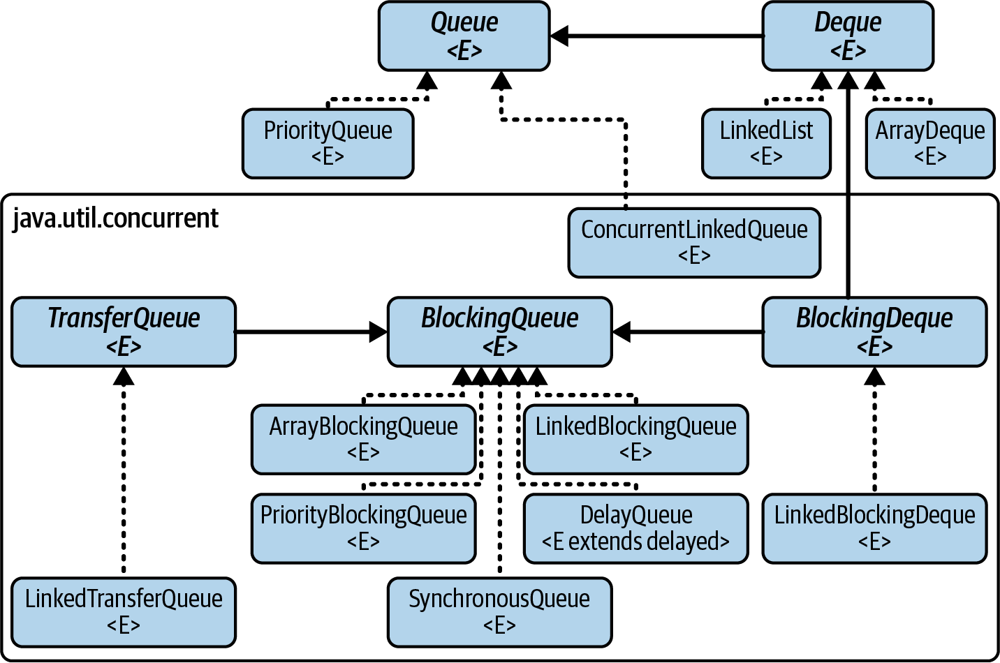
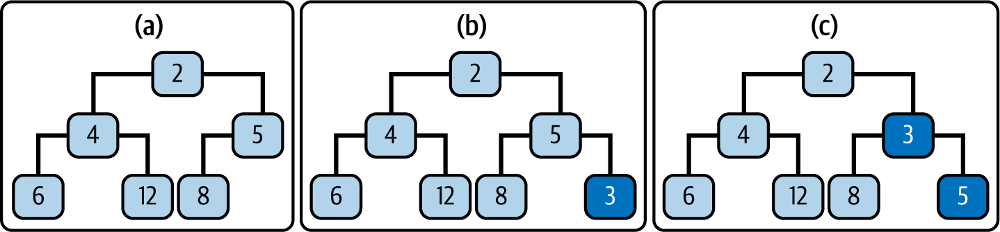
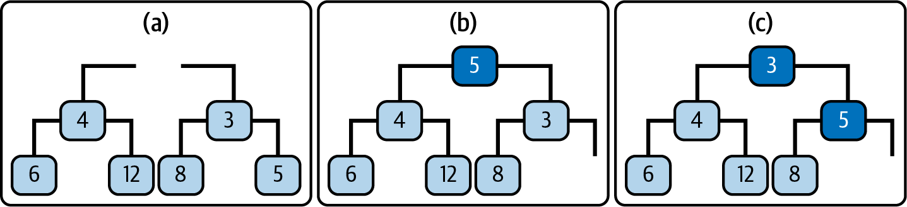

### What is the purpose of `Queue`?

Show answer

A queue is a collection that holds elements for processing and retrieves them in a defined order, 
usually first‑in, first‑out (FIFO). 

### What is specific to the `Queue` interface compared to other Java collection interfaces?

Show answer

**Queues differ fundamentally from other Java collections in their intended use.**

Sets, lists, and maps are typically _owned_ by another object and represent part of that object’s internal state.

**Queues, by contrast, are generally used as communication mechanisms rather than as state holders.**

They are designed to transmit elements from _producers_ to _consumers_, often decoupling the two.

**A queue may have multiple producers and multiple consumers**, which can be objects, threads, or even processes. 
This makes queues especially suited for coordination, task scheduling, and concurrent programming.

### What is the hierarchy of the `Queue` interface in the Java Collections Framework?

Show answer

### Why might a simple queue be insufficient in some scenarios, and what alternatives are available?

Show answer

**The methods provided by the Queue interface are useful 
only when the element at the head is actually the one we want to process next.**

In some situations, it may be important to inspect or compare all outstanding tasks before deciding which one to handle. 
With a strictly queue‑based to‑do manager and limited time, you might end up processing tasks in an unhelpful order — 
such as going for coffee just before an important meeting.

As an alternative, one could use a `List`, which offers more flexible access to its elements. 
However, this comes at the cost of significantly weaker support for multithreaded use in most list implementations.

**Note**: While `PriorityQueue` allows a comparator to reorder elements so that the most appropriate 
task appears at the head, this may not be the most expressive or maintainable way 
to represent the logic for selecting the next task to process.
This approach can hide complex decision logic inside ordering rules, 
making the task‑selection algorithm harder to read and maintain.

### What is the main distinguishing factor between different `Queue` implementations?

Show answer

**The primary difference between Queue implementations lies in their ordering semantics**.

Choosing a particular Queue implementation means choosing **how elements are ordered and selected for processing**. 
Different implementations embody different rules that determine the order in which elements are retrieved.

### What are examples of queue ordering?

Show answer

- **FIFO (first in, first out)** - elements are processed in the order in which they are submitted.

  Examples: `ArrayDeque`, `LinkedBlockingQueue`
- **LIFO (Last‑In, First‑Out)** - elements are processed in reverse order of insertion, also known as **stack** behavior.
  
  Example: a `Deque` used as a stack
- **Priority‑based ordering** - elements are ordered according to a supplied comparator (or their natural ordering), 
  so the highest‑priority element is processed first.
  
  Example: `PriorityQueue`
- **Delay‑based ordering** - elements are held until a specified delay has expired, 
  and are only made available for processing afterward.
  
  Example: `DelayQueue`

### What factors should be considered when choosing a Queue implementation?

Show answer

- [**Ordering policy**](#what-are-examples-of-queue-ordering)

  Different queue implementations impose different rules on element ordering, such as 
  FIFO, LIFO, priority‑based ordering, or delay‑based availability.
- **Thread safety**
 
  Some queues are thread‑safe by design (primarily those in java.util.concurrent), 
  while others — such as `PriorityQueue`, `ArrayDeque`, and `LinkedList` — are not and require external synchronization.
- **Blocking behavior**

  Many queue implementations support blocking operations, where producers or consumers wait 
  until conditions are suitable (for example, space becoming available or an element arriving). 
  These are typically provided by _blocking queues_.

  Non‑blocking examples include `PriorityQueue` and `ConcurrentLinkedQueue`.
- **Synchronization / handoff semantics**

  Certain queues support direct handoff between producers and consumers rather than element storage.

  **`SynchronousQueue`** is a notable example, providing synchronization without internal buffering.

### Which queue properties matter most in concurrent systems?

Show answer

- **Blocking behavior** - whether queue operations block when they cannot proceed.
- **Capacity (bound)** - the maximum number of elements the queue can hold, 
  which determines whether producers may block or reject inserts
- **Producer–consumer coordination** - how the queue manages interaction between producers and consumers.

  Queues may support multiple producers and consumers, fairness guarantees, 
  or even direct handoff (as in `SynchronousQueue`), where an element is transferred only when both sides are ready. 
  The coordination strategy strongly affects latency, throughput, and system behavior under contention.

### What functionality is provided by the `Queue` interface methods?

Show answer

1. add an element to the tail of the queue
2. inspect the element at its head (only to retrieve)
3. remove the element at its head (retrieve and remove)

### What is important to remember about Queue interface methods?

Show answer

**Each core Queue operation is provided in two variants**:
- **A non‑exceptional form**, which returns null or false to indicate failure
- **An exceptional form**, which throws an exception when the operation cannot be performed

### Which methods are used to add elements to a Queue?

Show answer

When adding an element to a Queue, there are two main things to keep in mind::
- **Capacity constraints**

  If the queue is bounded, you must decide what should happen when it is full: 
  should the operation fail, block, or throw an exception?
- **null elements**

  The `Queue` interface discourages null elements, because methods like `poll()` use null to indicate an empty queue. 
  In the JDK, only the legacy `LinkedList` allows null, and it is generally best avoided.

**Methods for adding elements**:
- **`boolean add(E e)`** - inserts the element if possible; throws `IllegalStateException` if the queue is full.
- **`boolean offer(E e)`** - inserts the element if possible; returns false if the queue is full.

### How should a system interpret and handle capacity limits in bounded queues, and what considerations influence this choice?

Show answer

When working with bounded queues, there are two equally valid ways to interpret 
what it means when the queue reaches its capacity. 
Each interpretation leads naturally to a different choice of method for adding elements.

1. **Capacity exhaustion as an error (fail‑fast approach)**

    In this view, reaching the capacity limit indicates that the system is no longer functioning as designed. 
    Producers are generating work faster than consumers can process it, 
    which is treated as a system fault or misconfiguration.
    
    **Arguments for this approach:**
      - Losing or rejecting elements is unacceptable
      - Capacity exhaustion signals overload, incorrect sizing, or a bug
      - Problems should surface immediately rather than being silently ignored
      - It favors correctness and early failure over graceful degradation
    
    **Method choice:** `add(E e)`

2. **Capacity exhaustion as flow control (back‑pressure approach)**

    In this view, capacity limits are an intentional part of normal system operation. The queue is bounded specifically to:
      - Protect memory
      - Smooth bursts of load
      - Regulate producer speed
      Reaching capacity is expected during peak load and is used to apply **back‑pressure** to producers.
    
    **Arguments for this approach:**
      - Temporary overload is normal in concurrent systems
      - Producers should adapt (retry, delay, or drop work deliberately)
      - Prevents resource exhaustion
      - Favors stability and resilience under load
    
    **Method choice:** `offer(E e)`

Note: **An exception applies fail‑fast pressure, not flow‑control back-pressure**.

### Which methods are used to retrieve elements from a Queue?

Show answer

**Exception‑throwing methods**:
- `E element()` retrieve but do not remove the head element
- `E remove()` retrieve and remove the head element

**Null‑returning methods**:
- `E peek()` retrieve but do not remove the head element
- `E poll()` retrieve and remove the head element

### What role does capacity play in different `Queue` implementations?

Show answer

**Queue capacity:**
- Queue implementations differ in whether they limit how many elements can be stored.
- Capacity directly affects memory usage, producer behavior, and load handling.
- Some queues limit growth to control resources; others grow dynamically.
- A few queues store no elements at all and only transfer them directly between threads.

**Examples:**
- Fixed capacity (bounded): `ArrayBlockingQueue`, `LinkedBlockingQueue`
- No fixed capacity (unbounded): `ConcurrentLinkedQueue`, `LinkedBlockingQueue`, `PriorityQueue`
- Direct handoff (no storage): `SynchronousQueue`

### Which `Queue` implementations support priority ordering?

Show answer

- `PriorityQueue` - not thread-safe, nor does it provide blocking behavior
- `PriorityBlockingQueue` thread-safe version of `PriorityQueue`

### What should you consider when using PriorityQueue, and what alternatives are available?

Show answer

- **Concurrency and blocking behavior** - `PriorityQueue` is not designed for concurrent use

  For concurrent scenarios, `PriorityBlockingQueue` provides a thread‑safe, optionally blocking alternative.
- **Ordering semantics** - `PriorityQueue` orders elements using either their natural ordering or a supplied comparator, 
  but guarantees priority only for the head element.
- **Handling equal priorities**: - `PriorityQueue` provides no guarantees 
  about the relative order of elements with the same priority.
  If multiple elements share the highest priority, any one of them may be chosen as the head, 
  making it unsuitable when deterministic ordering among equal‑priority elements is required.

`PriorityQueue` vs `NavigableSet`:
- Use `NavigableSet` (e.g. `TreeSet`, `ConcurrentSkipListSet`) 
  when you need to inspect, navigate, or modify the full set of waiting tasks, and enforce uniqueness.
- Use `PriorityQueue` when you need efficient access to the next task to process, and duplicates are acceptable.

### How is a PriorityQueue typically implemented, and what data structure underlies it?

Show answer

A PriorityQueue is typically implemented using a **heap**, most commonly a **binary heap**.

A binary heap is a tree‑based structure that is usually stored in an array and maintains the **heap property**, 
ensuring that the highest‑priority element is always at the root.

This structure allows efficient access to the head element, with `O(log n)` insertion and removal 
and `O(1)` access to the highest‑priority element.

### How is an element added to a priority heap?

Show answer

To insert a new element into a priority heap, the element is first placed in the leftmost available position 
at the bottom of the heap. It is then repeatedly swapped with its parent until the heap property is restored — that is, 
until its parent has higher priority (for a min‑heap, a smaller value).

### How is the head element removed from a priority heap?

Show answer

**Retrieving the highest‑priority element from a priority heap is straightforward, as it is stored at the root**.

However, once the root is removed, the remaining elements must be rearranged to restore the heap structure.

**This is done by moving the rightmost element from the bottom level of the heap into the root position**.

The element is then repeatedly exchanged with the child of higher priority (for a min‑heap, the smaller child), 
a process known as _heapifying down_.

**This continues until the heap property is restored — either because the element has higher priority 
than both of its children or because it has reached a leaf position**.

### Which Queue implementations are thread‑safe but non‑blocking?

Show answer

`ConcurrentLinkedQueue` - an unbounded, thread-safe, FIFO-ordered queue.

### What data structure is used to implement ConcurrentLinkedQueue?

Show answer

**`ConcurrentLinkedQueue` is implemented using a linked‑node structure**, 
similar to the linked lists used for overflow chaining in hash tables 
and as the foundation of skip lists in `ConcurrentSkipListSet`.

**A key advantage of linked structures is that insertion and removal can be performed 
by simple pointer updates, which take constant time.** 
This makes them particularly well suited for FIFO queue implementations, 
where elements are always added at the tail and removed from the head.

**Because these operations act only on the ends of the structure, there is no need to traverse the list**, 
avoiding the linear search costs that would otherwise be associated with linked data structures.

### Which concurrent algorithm is used by `ConcurrentLinkedQueue`?

Show answer

**`ConcurrentLinkedQueue` uses a CAS‑based, lock‑free algorithm that guarantees progress even under contention.**

Insertion and removal operations run in constant time, but computing the queue size requires linear time.

**This is because the algorithm does not maintain a size counter** — instead, 
it relies on cooperation between threads for updates and must traverse the queue to determine its size when needed.

