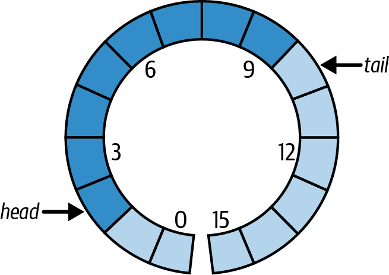

### How does blocking behavior work in Java queues, and which Queue interface supports it?
<details><summary>Show questions</summary>

Many queue implementations support **blocking operations**, where producers or consumers wait
until conditions are suitable (for example, space becoming available or an element arriving).
These are typically provided by _blocking queues_.


This blocking behavior is defined by the `BlockingQueue<E>` interface, 
which is designed primarily for producer-consumer scenarios.

</details>

### What functionality is provided by the `BlockingQueue` API?
<details><summary>Show questions</summary>

#### Blocking operations that wait until the queue’s state allows the operation to proceed
`BlockingQueue` - A `Queue` that additionally supports operations that:
- wait for the queue to become non-empty when retrieving an element, and 
- wait for space to become available in the queue when storing an element

|         | Throws exception | Special value | Blocks indefinitely  | Times out            |
|:--------|:-----------------|:--------------|:---------------------|:---------------------|
| Insert  | add(e)           | offer(e)      | put(e)               | offer(e, time, unit) |
| Remove  | remove()         | poll()        | take()               | poll(time, unit)     |
| Examine | element()        | peek()        | not applicable       | not applicable       |

#### Inspecting queue state and transferring currently available elements:
- `int drainTo(Collection<? super E> c)` - clear the queue into c
- `int drainTo(Collection<? super E> c, int maxElements)` - clear at most the specified number of elements into c
- `int remainingCapacity()` - return the number of elements that would be accepted without blocking,
  or `Integer.MAX_VALUE` if unbounded

</details>

### What happens when you try to add an element to a bounded blocking queue that has reached its capacity?
<details><summary>Show questions</summary>

The blocking methods are more patient:
- `offer(e, time, unit)` waits for a time specified using `java.util.concurrent.TimeUnit`
- `put(e)` will block indefinitely.

Timed methods such as `poll(long timeout, TimeUnit unit)` and `offer(E e, long timeout, TimeUnit unit)`
do not throw an exception when the timeout expires because
their design prioritizes indicating success or failure through their return value.

The methods `add(e)` and `offer(e)`, which are inherited from the Queue interface, 
fail immediately when a bounded blocking queue is at capacity:
- `add(e)` throws an exception (typically `IllegalStateException`)
- `offer(e)` returns false to indicate failure

The blocking methods provided by `BlockingQueue` are more patient:
- `offer(e, timeout, unit)` waits up to the specified time for space to become available
- `put(e)` blocks indefinitely until the element can be inserted

Timed methods such as:
- `poll(long timeout, TimeUnit unit)` and 
- `offer(E e, long timeout, TimeUnit unit)`

do not throw an exception when the timeout expires. 
Instead, their design favors communicating success or failure through their return value, 
allowing the caller to handle timeouts without exception-based control flow.

</details>

### What happens when you try to retrieve and remove the head of an empty blocking queue?
<details><summary>Show questions</summary>

Use:
- `remove()` / `poll()` when immediate failure is acceptable
- `poll(timeout, unit)` when bounded waiting and retry logic are required
- `take()` when threads are expected to wait indefinitely for work, with proper coordination and lifecycle management

</details>

### How do blocking queues manage multiple blocked threads?
<details><summary>Show questions</summary>

Some BlockingQueue implementations allow configuring a **fairness policy** that determines how the queue 
handles **multiple blocked threads**.


Blocked requests occur when multiple threads try to remove elements from an empty queue or add elements 
to a full bounded queue. When the queue becomes able to proceed, it must decide **which waiting thread to unblock**.


Two approaches are possible:
- **Fair scheduling**, where the queue services the thread that has been waiting the longest
- **Unfair scheduling**, where the implementation may choose any waiting thread

Fair scheduling prevents **starvation** by ensuring that no thread waits indefinitely. 
However, maintaining this guarantee requires additional synchronization, 
which can significantly reduce performance under contention.


As a result, most blocking queues default to unfair scheduling, favoring higher throughput, 
while fairness remains an optional trade‑off when predictability is more important than performance.

Example of such an argument: `fair` in `ArrayBlockingQueue` constructor:
`ArrayBlockingQueue(int capacity, boolean fair)`

</details>

### What thread‑safety guarantees and limitations apply when using `BlockingQueue` methods?
<details><summary>Show questions</summary>


`BlockingQueue` guarantees that its **queue operations** are thread-safe and atomic.


However, this guarantee **does not extend to bulk operations** inherited from `Collection`, such as
`addAll`, `containsAll`, `retainAll`, and `removeAll`, unless an individual implementation explicitly provides it.


As a result, bulk operations may behave partially: 
for example, `addAll` can throw an exception after **adding only some elements** from the collection.

</details>

### What are `BlockingQueue` implementations?
<details><summary>Show questions</summary>

1. `LinkedBlockingQueue` - A FIFO queue backed by linked nodes, optionally bounded by a specified capacity.
2. `ArrayBlockingQueue` - A bounded FIFO queue backed by a fixed‑size circular array.
3. `PriorityBlockingQueue` - An unbounded blocking queue that orders elements according to their natural ordering 
    or a provided comparator.
4. `DelayQueue` - A blocking queue of delayed elements, 
   ordered by their remaining delay, where elements become available only after their delay expires.
5. `SynchronousQueue` - A zero‑capacity queue that transfers elements directly between producer and consumer threads 
   without internal storage.

</details>

### What is the underlying data structure used by `ArrayBlockingQueue`?
<details><summary>Show questions</summary>

`ArrayBlockingQueue` is implemented using a **circular array**, 
a linear array structure where the first and last positions are treated as logically adjacent.

The queue maintains two indices: 
- **head**, pointing to the next element to be removed, and 
- **tail**, indicating where the next element will be inserted. 

Each removal advances the head index, and each insertion advances the tail index. 
When either index reaches the end of the array, it wraps around to 0.

If the head and tail indices become equal, the queue may be either full or empty, 
so the implementation keeps a separate element count to distinguish between these states.




</details>

### What should you be careful about when using `PriorityBlockingQueue`?
<details><summary>Show questions</summary>

`PriorityBlockingQueue` iterators are weakly consistent: 
they are thread‑safe, do not throw `ConcurrentModificationException`, and may reflect concurrent modifications, 
but they provide no ordering or snapshot guarantees.


If a stable or consistent view of the queue is required for iteration, 
the recommended approach is to transfer the queue’s contents to an array and iterate over that snapshot instead.

</details>

### Which `Queue` implementation supports ordering based on delay time?
<details><summary>Show questions</summary>

`DelayQueue` orders elements by their remaining delay, making them available only after the delay has expired.

If all elements have a positive delay (that is, none of their delays has expired), calls to `poll()` return null.

Once one or more elements have expired delays, 
the element whose delay expired earliest is positioned at the head of the queue and becomes available for retrieval.

</details>

### What options are available for exchanging information between a producer and a consumer without extra capacity?
<details><summary>Show questions</summary>

You need to exchange information between threads in a thread-safe manner. You have 2 options.

1. Using a Shared Variable (`AtomicInteger` for instance) and `CountDownLatch` for coordinating processing:
    ```java
    ExecutorService executor = Executors.newFixedThreadPool(2);
    AtomicInteger sharedState = new AtomicInteger();
    CountDownLatch countDownLatch = new CountDownLatch(1);
    
    Runnable producer = () -> {
      Integer producedElement = ThreadLocalRandom
        .current()
        .nextInt();
      sharedState.set(producedElement);
      countDownLatch.countDown();
    };
    
    Runnable consumer = () -> {
      try {
        countDownLatch.await();
        Integer consumedElement = sharedState.get();
      } catch (InterruptedException ex) {
        ex.printStackTrace();
      }
    };
    ...
    executor.execute(producer);
    executor.execute(consumer);
    
    executor.awaitTermination(500, TimeUnit.MILLISECONDS);
    executor.shutdown();
    assertEquals(countDownLatch.getCount(), 0);
    ```
   As a result we use a lot of code to implement such a simple functionality as exchanging an element between two threads
2. Using the SynchronousQueue:
    ```java
    ExecutorService executor = Executors.newFixedThreadPool(2);
    SynchronousQueue<Integer> queue = new SynchronousQueue<>();
    
    Runnable producer = () -> {
      Integer producedElement = ThreadLocalRandom
        .current()
        .nextInt();
      try {
        queue.put(producedElement);
      } catch (InterruptedException ex) {
        ex.printStackTrace();
      }
    };
    
    Runnable consumer = () -> {
      try {
        Integer consumedElement = queue.take();
      } catch (InterruptedException ex) {
        ex.printStackTrace();
      }
    };
    ...
    executor.execute(producer);
    executor.execute(consumer);
    
    executor.awaitTermination(500, TimeUnit.MILLISECONDS);
    executor.shutdown();
    assertEquals(queue.size(), 0);
    ```

- With the 1st solution, based on `AtomicInteger` shared variable and `CountDownLatch`
  you must coordinate data putting and getting with both variables.
- With `SynchronousQueue`-based solution you only manage to put and get data from the queue.

</details>

### What is the purpose of `SynchronousQueue`?
<details><summary>Show questions</summary>

SynchronousQueue is designed for **direct handoff** between a producer and a consumer, 
without storing elements internally. 

It has **no capacity at all** — every insert must be paired with a simultaneous removal.

A thread attempting to put an element into a `SynchronousQueue` blocks until another thread is ready to take it, 
and vice versa. This means elements are never enqueued: they are transferred directly from one thread to another.


In work‑sharing systems, it is often guaranteed that **consumer threads are already available** to process tasks. 
In such designs, buffering provides little value and only adds overhead. 
`SynchronousQueue` enables task transfer **without the cost of enqueueing and dequeueing**, 
while still providing full thread‑safety and coordination.


Instead of acting as a container, `SynchronousQueue` acts as a `synchronization point` between threads.

</details>

### How can a producer–consumer system support both direct handoff of messages and asynchronous buffered delivery, depending on the situation?
<details><summary>Show questions</summary>

A `TransferQueue` extends the producer–consumer model by letting the producer choose the delivery semantics 
at the moment of sending. 

It introduces methods that explicitly express intent:
- “Just enqueue this message if no consumer is available.”
- “Do not return until a consumer has actually taken this message.”

This allows a **single coordination mechanism** to support:
- asynchronous buffering when decoupling is desired, and
- synchronous handoff when coordination or backpressure is required.

In other words, the producer controls whether delivery is **fire‑and‑forget** or **hand‑to‑hand**.

How this works in practice:
1. **Asynchronous buffered delivery** - the producer submits a message and continues immediately.
   - If consumers are present, one may take the message right away.
   - If not, the message is stored until a consumer arrives.
  
   This is equivalent to standard queue‑based communication.

2. **Direct handoff (synchronous transfer)** - the producer submits a message and **waits** until a consumer receives it.
   - If a consumer is already waiting, the transfer happens immediately.
   - If not, the producer blocks until one arrives.

   This creates a **rendezvous** between producer and consumer, 
   guaranteeing that the message has been accepted before the producer proceeds.

</details>

### How does the `TransferQueue` API fit together to support both synchronous and asynchronous message delivery?
<details><summary>Show questions</summary>

**Synchronous transfer (handoff) methods** - provide **direct producer–consumer handoff**, 
where the producer may wait until a consumer receives the element:
- `void transfer(E e)` Transfers the element to a consumer, blocking until it is taken.
- `boolean tryTransfer(E e)` Transfers the element only if a consumer is already waiting.
- `boolean tryTransfer(E e, long timeout, TimeUnit unit)` Attempts to transfer the element, 
  waiting up to the specified timeout.

**Consumer‑availability probes** - expose **approximate information about waiting consumers**:
- `boolean hasWaitingConsumer()` - Returns true if at least one consumer is waiting.
- `int getWaitingConsumerCount()` - Returns an estimate of the number of waiting consumers.

How these pieces fit together:
- **enqueue elements asynchronously** using standard BlockingQueue methods,
- **perform synchronous handoff** when coordination or confirmation is required,
- **choose behavior dynamically**, based on consumer availability or system state.

**This dual model is exactly what distinguishes TransferQueue from**:
- `BlockingQueue` (always asynchronous)
- `SynchronousQueue` (always synchronous)

</details>

### What implementations of TransferQueue are provided by the Java API?
<details><summary>Show questions</summary>

`LinkedTransferQueue` is the standard implementation of `TransferQueue` in the Java concurrent library.

Key characteristics:
- It is unbounded and non‑blocking internally, designed for high throughput.
- It supports both modes without separate queues or coordination mechanisms.
- It allows producers and consumers to pair up dynamically at runtime.

Crucially, producers can:
- enqueue work when consumers are busy or absent, or
- block until handoff when immediate delivery or feedback is required — all using the same queue instance.

</details>


### Why might a producer–consumer system need to support both direct message handoff and asynchronous buffered delivery?
<details><summary>Show questions</summary>

**The core tension**

In producer–consumer systems there are two competing needs:
- **Throughput and decoupling**
  - Producers should be able to keep working even if consumers are busy.
  - This argues for **asynchronous buffering**.
- **Coordination and feedback**
  - Sometimes producers must know that a consumer has actually accepted the work.
  - This argues for direct (synchronous) handoff.


**Why always buffering is not enough**

Buffered queues solve throughput, but they hide important information:
- Has any consumer actually seen my message?
- Is the system overloaded or just temporarily slow?
- Am I producing work faster than it can ever be consumed?

**Example: backpressure**

Imagine a system where:
- tasks are expensive
- producing too many tasks can exhaust memory or external resources

If producers always enqueue:
- the queue grows
- latency explodes
- failures happen far away from the cause

Sometimes a producer must wait: “Do not let me proceed until a consumer is ready.”

That’s **direct handoff**.

**Why always synchronous handoff is not enough**

**Example: bursty production**

Imagine:
- a producer generates tasks in bursts
- consumers can lag briefly, but catch up quickly

With pure handoff:
- producers block frequently
- throughput collapses
- threads are wasted waiting unnecessarily

Here you want: “If consumers are busy, just queue it and move on.”

That’s **asynchronous buffering**.

</details>

### In which real‑world scenarios is it necessary to support both direct message handoff and asynchronous buffering?
<details><summary>Show questions</summary>

1. **Mixed‑importance tasks**

   - High‑priority control messages:
     - must be processed now
     - producer should wait if no consumer is ready
   - Low‑priority background tasks:
     - can be buffered
     - producer should not block

    Same producer. Same consumers. Different semantics.
2. **Load‑sensitive systems**
   A producer might say:
   - “If a consumer is ready right now, hand this off immediately.”
   - “If not, queue it — but only then.”
   This lets the system:
   - exploit idle consumers
   - avoid unnecessary blocking
   - still apply backpressure when needed
3. **Thread pool task submission**
   This is a _classic_ motivation.

   A task submitter might want:
   - immediate execution if a worker is free
   - otherwise enqueue the task
   Why?
   - Immediate handoff reduces latency
   - Queueing avoids throwing work away
   - Blocking is avoided unless truly necessary

   Pure queue or pure handoff alone can’t express this policy.

</details>

### How can a BlockingQueue be safely shared between producers and consumers in a multithreaded environment?
<details><summary>Show questions</summary>


1. You could pass a shared queue into a producer/consumer:
    ```java
    class Producer implements Runnable {
      private final BlockingQueue<Object> queue;
    
      public Producer(BlockingQueue<Object> queue) {
        this.queue = queue;
      }
    }
    ```
    ```java
    class Consumer implements Runnable {
      private final BlockingQueue<Object> queue;
    
      public Consumer(BlockingQueue<Object> queue) {
        this.queue = queue;
      }
    }
    ```
    ```java
    BlockingQueue<Object> queue = new LinkedBlockingQueue<>(10);
    
    var producer = new Producer(queue);
    var consumer = new Consumer(queue);
    ```
2. Wrap a queue by a concurrent task manager, that will control the state and expose its API
   [`StoppableTaskQueue`](src/main/java/com/savdev/collections/queues/StoppableTaskQueue.java)

</details>

### Does using a thread‑safe blocking queue make a multithreaded system safe?
<details><summary>Show questions</summary>

A thread‑safe (and blocking) queue correctly handles concurrent access by multiple threads, 
ensuring that adding and removing elements is safe and well‑coordinated.


However, this guarantee applies **only to the queue itself**. 
When such a queue is used as part of a larger multithreaded system, 
additional concerns arise that the queue alone does not solve.


In particular, real systems must be able to **shut down gracefully** — for example, 
stopping worker threads or daily task processing without losing queued tasks, duplicating work, 
or leaving threads permanently blocked.

Graceful shutdown requires explicit coordination beyond thread‑safe collections, such as signaling consumers to stop, 
ensuring all queued tasks are processed or persisted, and managing thread lifecycles correctly. 
As a result, achieving a clean shutdown remains one of the **harder problems in concurrent system design**, 
even when thread‑safe queues are used correctly.

[`StoppableTaskQueue` solves the problem of providing an orderly shutdown mechanism.](/src/main/java/com/savdev/collections/queues/StoppableTaskQueue.java)

</details>
