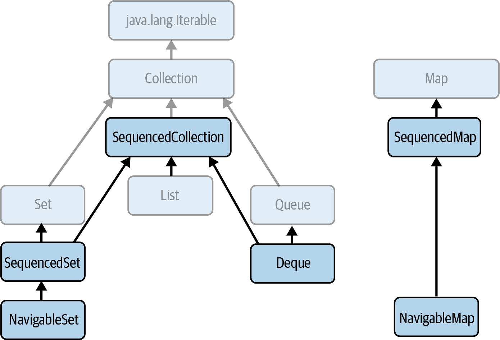

### Deque, compare with Queue, its purpose

Show questions

A Deque (pronounced “deck”) is a double-ended queue that can both accept and yield up elements at either end.
A Deque, like a Queue, can be used as a conduit of information between producers and consumers.
The ability to remove elements from the tail facilitates work stealing,
a load-balancing technique in which idle threads “steal” tasks from busier threads to maximize parallel efficiency.
Deques can also be used to store the state of an object, if updates to the state require operations at either end.

`Deque` extends both `Queue` and `SequencedCollection` interfaces:

### What functionality does `Deque` interface methods offer?

Show questions

The Deque interface extends Queue with methods symmetric with respect to the head and tail.
For clarity of naming, the Queue methods that implicitly refer to one end of the queue
acquire a synonym that makes their behavior explicit for `Deque`.

#### Collection-like methods

- `boolean removeFirstOccurrence(Object o)` remove the first occurrence of o
- `boolean removeLastOccurrence(Object o)` remove the last occurrence of o
  These methods similar to `Collection::removeIf`

#### Methods inherited from `SequencedCollection`
Of the seven methods of `SequencedCollection`, six are in fact promoted from `Deque`:
throw an exception for a full deque:
- `void addFirst(E e)` insert e at the head if there is enough space
- `void addLast(E e)` insert e at the tail if there is enough space
  throw an exception for an empty deque:
- `E getFirst()` retrieve but do not remove the first element (a synonym for `Queue.element`)
- `E getLast()` retrieve but do not remove the last element
- `E removeFirst()` retrieve and remove the first element (a synonym for `Queue.remove`)
- `E removeLast()` retrieve and remove the last element

#### Queue-like methods
- `boolean offerFirst(E e)` insert e at the head if the deque has space
- `boolean offerLast(E e)` insert e at the tail if the deque has space (a synonym for `Queue.offer`)
  return null for an empty deque:
- `E peekFirst()` retrieve but do not remove the first element (a synonym for `Queue.peek`)
- `E peekLast()` retrieve but do not remove the last element
- `E pollFirst()` retrieve and remove the first element (a synonym for `Queue.poll`)
- `E pollLast()` retrieve and remove the last element

#### Stack-like methods
- `void push(E e)` insert e at the head if there is enough space (a synonym for `Deque.addFirst` provided for stack use)
- `E pop()` retrieve and remove the first element (a synonym for `Deque.removeFirst` provided for stack use)

#### Methods that return elements in revers order:
- `Iterator<E> descendingIterator()` get an iterator, returning deque elements in reverse order
- `Deque<E> reversed()` return a reverse-ordered view of this `Deque` -
  a covariant override of the `SequencedCollection` method, returning a `Deque`

### Deque Implementations

Show questions

- [`ArrayDeque`](#arraydeque-is-purpose)
- [`LinkedList`](#linkedlist-as-implementation-of-deque)

### `ArrayDeque`, its purpose

Show questions

It fills a gap among `Queue` classes;
previously, if you wanted a FIFO queue to use in a single-threaded environment,
you would have had to use the class `LinkedList`,
or else pay an unnecessary overhead for thread safety with
one of the concurrent classes `ArrayBlockingQueue` or `LinkedBlockingQueue`.

`ArrayDeque` is instead the general-purpose implementation of choice, for both deques and FIFO queues.

### `ArrayDeque`, based data structure, why?

Show questions

`ArrayDeque`, based on _a circular array_ like that of `ArrayBlockingQueue`.
A circular array in which the head and tail can be continuously advanced in this way is better
as a deque implementation than a noncircular one
in which removing the head element requires changing the position of all the remaining elements
so that the new head is at position 0.

### `ArrayDeque` performance characteristics and its iterators

Show questions

It has the performance characteristics of a _circular array_:
adding or removing elements at the head or tail takes constant time.

The iterators are fail-fast.

### `LinkedList` as implementation of `Deque`

Show questions

As an implementation of `Deque`, `LinkedList` is not popular.
Its main advantage, that of constant-time enqueueing and dequeueing,
is rivaled for queues and deques by the otherwise superior `ArrayDeque`.
The only reason for using `LinkedList` as a queue or deque implementation would be that,
besides the usual head and tail operations, you also need to add or remove elements from the middle of the list -
an unusual requirement.

With `LinkedList`, even that comes at a high price;
the position of such elements has to be reached by linear traversal, with a time complexity of `O(N)`.
[_Avoid LinkedList_](todo) explains why in general you should avoid using this class.

Its iterators are fail-fast.

### What functionality does `BlockingDeque` interface methods offer?

Show questions

`BlockingQueue` adds four methods to the `Queue` interface,
enabling enqueueing or dequeueing an element either indefinitely or until a fixed timeout has elapsed.
`BlockingDeque` provides two new methods for each of those four,
to allow for the operation to be applied either to the head or the tail of the `Deque`.

`BlockingDeque` adds:
- `void putFirst(E e)` add e to the head of the Deque, waiting as long as necessary
- `void putLast(E e)` add e to the tail of the Deque, waiting as long as necessary

### `BlockingDeque` implementations and its characteristics

Show questions

`BlockingDeque` has only one implementation in the JDK: `LinkedBlockingDeque`.

`LinkedBlockingDeque` uses a doubly linked list structure like that of `LinkedList`.
It can optionally be bounded, so, besides the two standard constructors,
it provides a third that can be used to specify its capacity.

It has similar performance characteristics to `LinkedBlockingQueue` - queue insertion and removal take constant time,
and operations such as contains, which require traversal of the queue, take linear time.
The iterators are weakly consistent.

