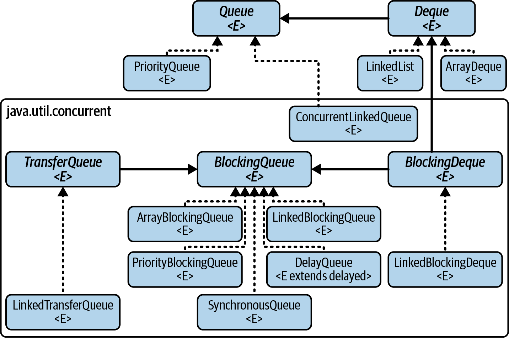

### [FAQ on `Queue`](faq.queues.md)

### [Interface `Queue<E>`, Oracle official docs](https://docs.oracle.com/javase/8/docs/api/java/util/Queue.html)

### [Interface `BlockingQueue<E>`, Oracle official docs](https://docs.oracle.com/javase/8/docs/api/java/util/concurrent/BlockingQueue.html)

### Implementations of Queue in the Collections Framework:

### Comparative performance of different Queue and Deque implementations: 
[Comparative performance of different Queue and Deque implementations](todo)