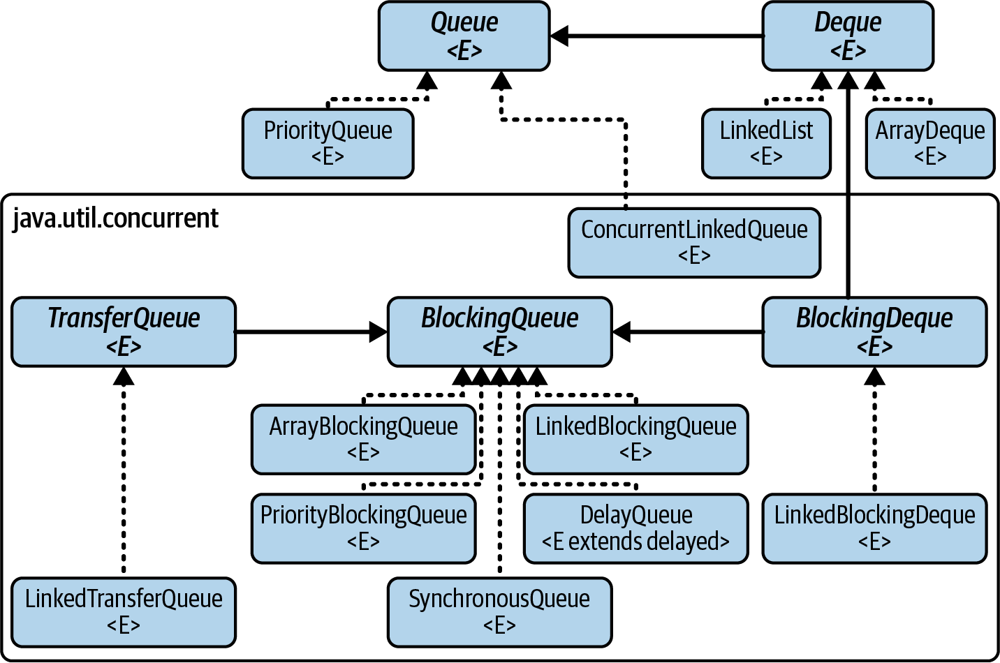
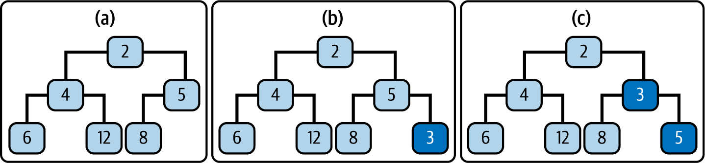
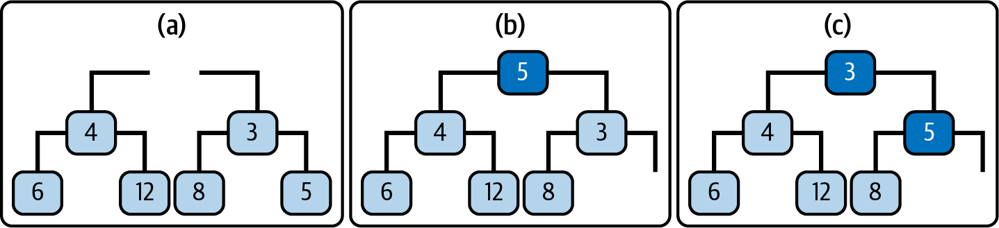
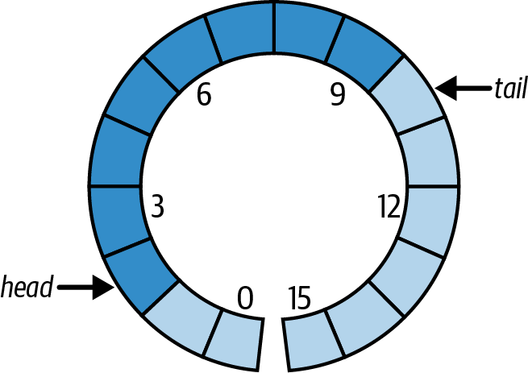
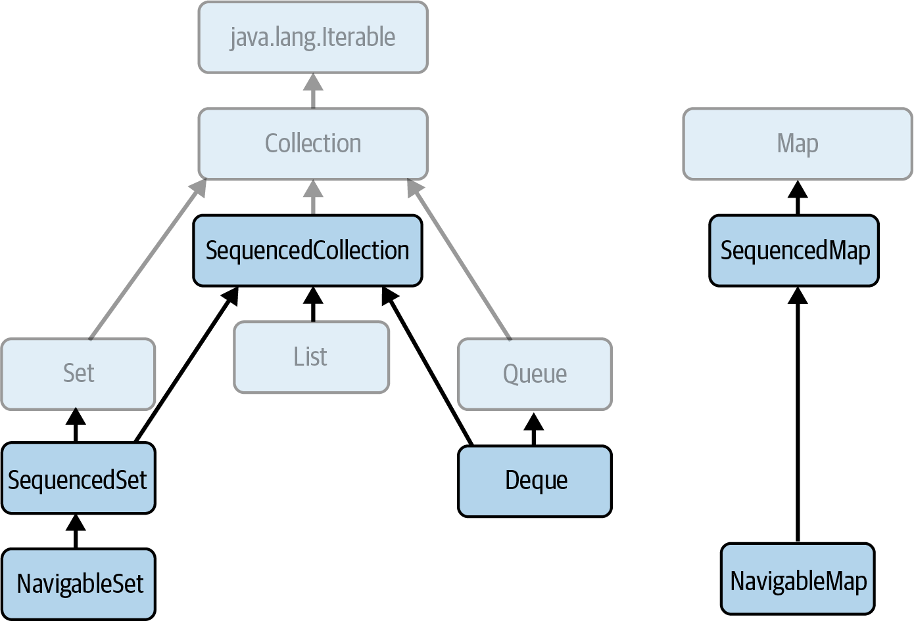

## Queue
- [Queue, its purpose](#queue-its-purpose)
- [What is specific about queues among other Java collections?](#what-is-specific-about-queues-among-other-java-collections)
- [Hierarchy of `Queue` in the Collections Framework](#hierarchy-of-queue-in-the-collections-framework)
- [`Queue` vs `List`](#queue-vs-list)
- [Queue implementations, the main difference](#what-is-the-main-difference-in-queue-implementations)
- [Queue orders examples](#queue-orders-examples)
- [Queue Implementation Options. What does affect the choice?](#queue-implementation-options-what-does-affect-the-choice)
- [Queue attributes (properties)](#queue-attributes-properties)
- [What functionality does `Queue` interface methods offer?](#what-functionality-does-queue-interface-methods-offer)
- [What must you remember about when use `Queue` interface methods](#queue-interface-methods-what-must-you-remember-about)
- [Adding an Element to a Queue, what must you care about?](#adding-an-element-to-a-queue)
- [Retrieving an Element from a Queue](#retrieving-an-element-from-a-queue)
- [Bounded/unbounded `Queue` implementations](#boundedunbounded-queue-implementations)
- [`Queue` implementations that support priority ordering](#queue-implementations-that-supports-priority-ordering)
- [What must you care about when use `PriorityQueue`, its alternatives](#what-must-you-care-about-when-use-priorityqueue-its-alternatives)
- [How are `PriorityQueue` implemented? What data structure is behind?](#how-are-priorityqueue-usually-implemented-what-data-structure-is-behind)
- [`Queue` implementation that is thread-safe but without blocking facility](#queue-implementation-that-is-thread-safe-but-without-blocking-facility)
- [How is `ConcurrentLinkedQueue` implemented? What data structure is behind?](#how-is-concurrentlinkedqueue-implemented-what-data-structure-is-behind)
- [Concurrent algorithm used by `ConcurrentLinkedQueue`](#concurrent-algorithm-used-by-concurrentlinkedqueue)

## Blocking Queue
- [Queue blocking facilities](#queue-blocking-facilities)
- [What functionality does `BlockingQueue` interface methods offer?](#what-functionality-does-blockingqueue-interface-methods-offer)
- [How it works if you add an element into a bounded blocking queue that has reached capacity](#how-it-works-if-you-add-an-element-into-a-bounded-blocking-queue-that-has-reached-capacity)
- [Retrieving and removing the head of an empty blocking queue](#retrieving-and-removing-the-head-of-an-empty-blocking-queue)
- [How do blocking queues manage blocked requests? What is the issue with it?](#how-do-blocking-queues-manage-blocked-requests-what-is-the-issue-with-it)
- [What must you care about when use methods of `BlockingQueue`?](#what-must-you-care-about-when-use-methods-of-blockingqueue)
- [`BlockingQueue` Implementations](#blockingqueue-implementations)
- [`ArrayBlockingQueue`, based on what data structure is it implemented?](#arrayblockingqueue-based-on-what-data-structure-is-it-implemented)
- [`PriorityBlockingQueue`, what must you care about?](#priorityblockingqueue-what-must-you-care-about)
- [`Queue` implementation that supports ordering based on the delay time](#queue-implementation-that-supports-ordering-based-on-the-delay-time)
- [You want to exchange information between a producer and a consumer. What options are available?](#you-want-to-exchange-information-between-a-producer-and-a-consumer-what-options-are-available)
- [Purpose of `SynchronousQueue`](#purpose-of-synchronousqueue)
- [You want to use both synchronous and asynchronous messages in producer/consumer scenarios](#you-want-to-use-both-synchronous-and-asynchronous-messages-in-producerconsumer-scenarios)
- [How to share a blocking queue in multithreaded contexts between producers and consumers?](#how-to-share-a-blocking-queue-in-multithreaded-contexts-between-producers-and-consumers)
- [You use a thread-safe, blocking queue in multithreaded contexts. Are you safe?](#you-use-a-thread-safe-blocking-queue-in-multithreaded-contexts-are-you-safe)

## Deque
- [Deque, compare with Queue, its purpose](#deque-compare-with-queue-its-purpose)
- [What functionality does `Deque` interface methods offer?](#what-functionality-does-deque-interface-methods-offer)
- [Deque Implementations](#deque-implementations)
- [`ArrayDeque`, its purpose](#arraydeque-its-purpose)
- [`ArrayDeque`, based data structure, why?](#arraydeque-based-data-structure-why)
- [`ArrayDeque` performance characteristics and its iterators](#arraydeque-performance-characteristics-and-its-iterators)
- [`LinkedList` as implementation of `Deque`](#linkedlist-as-implementation-of-deque)

## Blocking Deque
- [What functionality does `BlockingDeque` interface methods offer?](#what-functionality-does-blockingdeque-interface-methods-offer)
- [`BlockingDeque` implementations and its characteristics](#blockingdeque-implementations-and-its-characteristics)

## Queue implementation choice
- [Comparative performance of different Queue and Deque implementations](#comparative-performance-of-different-queue-and-deque-implementations)
- [First question to ask to choose the right implementation](#first-question-to-ask-to-choose-the-right-implementation)
- [Queue implementations that do not need concurrent access](#queue-implementations-that-do-not-need-concurrent-access)
- [Your application does demand thread safety. What is the next question to ask?](#your-application-does-demand-thread-safety-what-is-the-next-question-to-ask)
- [Queue implementations that demand thread safety](#queue-implementations-that-demand-thread-safety)
- [Queue implementations that demand thread safety and FIFO ordering](#queue-implementations-that-demand-thread-safety-and-fifo-ordering)
- [Blocking Queue implementations that demand thread safety and FIFO ordering](#blocking-queue-implementations-that-demand-thread-safety-and-fifo-ordering)
- [`LinkedBlockingQueue` vs `ArrayBlockingQueue`](#linkedblockingqueue-vs-arrayblockingqueue)

### Queue, its purpose

```text
A queue is a collection designed to hold elements for processing, yielding them up in the order in which they are to be processed. 
```

"yielding them up" - giving the elements out when someone asks for them.

### What is specific about queues among other Java collections?

Queue is different in kind from the other collections. 
Sets, lists, and maps are typically 
["owned" by another object and form part of its state](../faq.collections.md#respect-the-ownership-of-collections).


By contrast, queues are not usually owned by a single object, 
but are used for transmission of values from producers to consumers. 

A queue can have multiple producers and multiple consumers; these can be objects, or threads, or processes.

### Hierarchy of `Queue` in the Collections Framework


### `Queue` vs `List`

The methods of `Queue` are useful to us only if the head element is actually one that we want. 

For example, it might help to know something about all the outstanding tasks before you choose the next one.
Otherwise, in a situation of limited time with an entirely queue-based to-do manager,
you might end up going for coffee until the meeting starts.

As an alternative, you could consider using `List` interface, which provides more flexible means 
of accessing its elements but has the drawback that its implementations provide much less support for multithread use.

Note: True, the class `PriorityQueue` allows us to provide a comparator that will order the queue elements
so that the one we want is at the head, but that may not be a particularly good way of expressing the algorithm
for choosing the next task.

### What is the main difference in `Queue<>` implementations

`ordering` - in choosing a Queue implementation, you’re also choosing the ordering of elements (tasks) processing.
Different implementations embodying different rules about what the order should be in which elements are to be processed.

### Queue orders examples

- FIFO (first in, first out) - the rule that tasks are to be processed in the order in which they were submitted. 
  Examples: `ArrayDeque`, `LinkedBlockingQueue`
- LIFO (last in, first out, also known as stacks)
- priority queues order elements according to a supplied comparator - `PriorityQueue`
- hold elements until their delay has expired - `DelayQueue`

### Queue Implementation Options. What does affect the choice?

- [order](#queue-orders-examples) 
- thread-safe - most of them are thread-safe
  (except `PriorityQueue`, `ArrayDeque`, `LinkedList` - the ones that are not located under `java.util.concurrent`)
- blocking facilities (that is, operations that wait for conditions to be right for them to execute) - most of them 
  are blocking queues (except `PriorityQueue`, `ConcurrentLinkedQueue`)
- a synchronization facility [see `SynchronousQueue`](#blockingqueue-implementations)

### Queue attributes (properties)

- `tail` - each time task (queue element) is added to the queue, it joins the tail of the queue 
- `head` - each added task (element) waits until it reaches the queue head, 
   when the tasks are assigned to the next consumer who becomes free.
- `bound` - a maximum size of a queue (only if it is a bounded - queue - capacity-restricted) 

### What functionality does `Queue` interface methods offer?

1. add an element to the tail of the queue
2. inspect the element at its head (only to retrieve)
3. remove the element at its head (retrieve and remove)

### Queue Interface Methods, what must you remember about

Each of Queue operations comes in two forms:
- one that returns either null or false, depending on the operation to indicate failure
- one that throws an exception.

### Adding an Element to a Queue

When you add an element you must think about:
- If you use a bounded queue, you must think about how to handle the case, when queue is full.
- Adding `null` as a queue element. Because methods that return/remove element and return null to
  signify that the queue is empty, you should avoid using `null` as a queue element.
  In general, the use of `null` as a queue element is discouraged by `Queue` interface;
  in the JDK, the only implementation that allows it is the legacy class `LinkedList`.

Adding an Element to a Queue:
- `boolean add(E e)` - returns true upon success and throws `IllegalStateException` if no space is currently available.
- `boolean offer(E e)` - returns true if the element was added to this queue, else false

When using a capacity-restricted queue, `offer(E e)` is generally preferable to `add(E e)`,
which can fail to insert an element only by throwing an exception.

Note: reaching capacity is an exceptional situation, as a result I suppose `add(E e)` is more preferable.

### Retrieving an Element from a Queue

Throws exception:
- `E element()` retrieve but do not remove the head element
- `E remove()` retrieve and remove the head element

The methods that return null for an empty queue are:
- `E peek()` retrieve but do not remove the head element
- `E poll()` retrieve and remove the head element

### Bounded/unbounded `Queue` implementations

Unbounded:
- `ArrayDeque` (FIFO), `ConcurrentLinkedQueue` (FIFO)
Bounded:
- `LinkedBlockingQueue` (FIFO)

### `Queue` implementations that supports priority ordering

- `PriorityQueue` - not thread-safe, nor does it provide blocking behavior
- `PriorityBlockingQueue` thread-safe version of `PriorityQueue`

### What must you care about when use `PriorityQueue`, its alternatives

`PriorityQueue` is not designed primarily for concurrent use.
It is not thread-safe, nor does it provide blocking behavior (`PriorityBlockingQueue` - thread-safe alternative).

`PriorityQueue` gives up its elements for processing according to an ordering:
1. either the natural order of its elements if they implement `Comparable`,
2. or the ordering imposed by a `Comparator` supplied when the `PriorityQueue` is constructed.

`PriorityQueue` vs `NavigableSet`
- if it needs to examine and manipulate the set of waiting tasks, use `NavigableSet` (and uniqueness via `equal`);
- if its main requirement is efficient access to the next task to be performed, use `PriorityQueue` (accommodates duplicates).

`PriorityQueue` gives no guarantee of how it presents multiple elements with the same value.
So if several tasks are tied for the highest priority in the queue,
it will choose one of them arbitrarily as the head element.

### How are `PriorityQueue` usually implemented? What data structure is behind?

Priority queues are usually efficiently implemented by `priority heaps`.
A priority heap is a binary tree somewhat like `TreeSet`, but with two differences:
1. the only ordering constraint is that each node in the tree should be ordered with respect to its children:
    - either smaller, in the case of a min heap (which is Java’s default for naturally ordered elements),
    - or larger, in the case of a max heap.
2. the tree should be complete at every level except possibly the lowest;
   if the lowest level is incomplete, the nodes it contains must be grouped together at the left.



To add a new element to a priority heap, it is first attached at the leftmost vacant position.
Then it is repeatedly exchanged with its parent until it reaches a parent that has higher priority -
that is, has a smaller value.



Getting the highest-priority element from a priority heap is trivial: it is the root of the tree.
But when that has been removed, the two separate trees that result must be reorganized into a priority heap again.
This is done by first placing the rightmost element from the bottom row into the root position.
Then - in the reverse of the procedure for adding an element - it is repeatedly exchanged
with the smaller of its children until it has a higher priority than either, or until it has become a leaf.

### `Queue` implementation that is thread-safe but without blocking facility

`ConcurrentLinkedQueue` - an unbounded, thread-safe, FIFO-ordered queue.

### How is `ConcurrentLinkedQueue` implemented? What data structure is behind?

It uses a linked structure, similar to the one in `ConcurrentSkipListSet` as the basis for skip lists
and in `HashSet` for hash table overflow chaining.

One of the main attractions of linked structures is that the insertion and removal operations implemented by
pointer rearrangements are performed in constant time.
This makes them especially useful as FIFO queue implementations,
where these operations are always required on nodes at the ends of the structure -
that is, nodes that do not need to be located using the slow sequential search of linked structures.

### Concurrent algorithm used by `ConcurrentLinkedQueue`

`ConcurrentLinkedQueue` uses a `CAS`-based wait-free algorithm—that is, one that guarantees that every thread
will make progress over time, regardless of the state of other threads accessing the queue.
It executes queue insertion and removal operations in constant time, but requires linear time to execute size.
This is because the algorithm, which relies on cooperation between threads for insertion and removal,
does not keep track of the queue size and has to iterate over the queue to calculate it when it is required.

### Queue blocking facilities

`BlockingQueue<E>` - is designed primarily for use in producer/consumer scenarios.

Blocking facilities - that is, operations that wait for conditions to be right for them to execute.

### What functionality does `BlockingQueue` interface methods offer?

`BlockingQueue` - A `Queue` that additionally supports operations that wait for the queue
to become non-empty when retrieving an element, and wait for space to become available
in the queue when storing an element.

|         | Throws exception | Special value | Blocks indefinitely  | Times out            |
|:--------|:-----------------|:--------------|:---------------------|:---------------------|
| Insert  | add(e)           | offer(e)      | put(e)               | offer(e, time, unit) |
| Remove  | remove()         | poll()        | take()               | poll(time, unit)     |
| Examine | element()        | peek()        | not applicable       | not applicable       |

#### Retrieving or querying the contents of the blocking queue:
- `int drainTo(Collection<? super E> c)` - clear the queue into c
- `int drainTo(Collection<? super E> c, int maxElements)` - clear at most the specified number of elements into c
- `int remainingCapacity()` - return the number of elements that would be accepted without blocking,
  or `Integer.MAX_VALUE` if unbounded

### How it works if you add an element into a bounded blocking queue that has reached capacity

`add(e)` and `offer(e)` - the methods inherited from `Queue` - fail immediately:
- `add` by throwing an exception,
- `offer` by returning false

The blocking methods are more patient:
- `offer(e, time, unit)` waits for a time specified using `java.util.concurrent.TimeUnit`
- `put(e)` will block indefinitely.

Timed methods such as `poll(long timeout, TimeUnit unit)` and `offer(E e, long timeout, TimeUnit unit)`
do not throw an exception when the timeout expires because
their design prioritizes indicating success or failure through their return value.

### Retrieving and removing the head of an empty blocking queue

You have:
- `remove()` and `poll()` are inherited from `Queue` and fail immediately, might not be the best choice
- `poll(time, unit)` waits for time out and returns value, you need to implement, how to retrigger retrieving logic again
- `put(e)` blocks until the queue is not empty,
  but you need to make sure that you do not have multiple threads that invoke this method and are blocked.
  You could use `Semaphore` for this check.

### How do blocking queues manage blocked requests? What is the issue with it?

Some blocking queue implementations allow an argument to control how the queue will handle multiple blocked requests.
These will occur when multiple threads attempt to remove items from an empty queue or add items to a full one.

When the queue becomes able to service one of these requests, which one should it choose?

The alternatives are to provide a guarantee that the queue will choose the request that has been waiting longest -
that is, to implement a fair scheduling policy - or to allow the implementation to choose one.

Fair scheduling sounds like the better alternative, since it avoids the possibility that an unlucky thread
might be delayed indefinitely, but in practice, the benefits it provides are rarely important enough to
justify incurring the large overhead that it imposes on a queue’s operation.

Example of such an argument: `fair` in `ArrayBlockingQueue` constructor:
`ArrayBlockingQueue(int capacity, boolean fair)`

### What must you care about when use methods of `BlockingQueue`?

`BlockingQueue` guarantees that the queue operations of its implementations will be thread-safe and atomic. 


But this guarantee doesn’t extend to the bulk operations inherited from Collection - 
`addAll`, `containsAll`, `retainAll`, and `removeAll` - unless the individual implementation provides it. 
So it is possible, for example, for `addAll` to fail, throwing an exception, 
after adding only some of the elements in a collection.

### `BlockingQueue` Implementations

1. `LinkedBlockingQueue` - FIFO-ordered queue, based on a linked node structure. Not bounded, but you can set capacity.
2. `ArrayBlockingQueue` - FIFO-ordered, bounded queue, based on a circular array -
   a linear structure in which the first and last elements are logically adjacent.
3. `PriorityBlockingQueue` - a thread-safe, blocking version of `PriorityQueue`
4. `DelayQueue` - a specialized priority queue, in which the ordering is based on the delay time for each element
5. `SynchronousQueue` - a mechanism for synchronizing two threads. In work-sharing systems in which the design ensures
   that there are enough consumer threads to guarantee that producer threads can hand tasks over without having to wait.
   In this situation, it allows safe transfer of task data between threads without incurring the BlockingQueue
   overhead of enqueuing, then dequeuing, each task being transferred.

### `ArrayBlockingQueue`, based on what data structure is it implemented?

`ArrayBlockingQueue` - is based on a circular array -
a linear structure in which the first and last elements are logically adjacent.



The position labeled “head” indicates the head of the queue; each time the head element is removed from the queue,
the head index is advanced.
Similarly, each new element is added at the tail position, resulting in that index being advanced.
When either index needs to be advanced past the last element of the array, it gets the value 0.
If the two indices have the same value, the queue is either full or empty,
so an implementation must separately keep track of the count of elements in the queue.

### `PriorityBlockingQueue`, what must you care about?

`PriorityBlockingQueue` - its iterators are fail-fast, so they throw `ConcurrentModificationException`
under multithread access; only if the queue is quiescent will they succeed.
To iterate safely over a `PriorityBlockingQueue`, transfer the elements to an array and iterate over that instead.

### `Queue` implementation that supports ordering based on the delay time

`DelayQueue` - is a specialized priority queue, in which the ordering is based on the delay time for each element -
the time remaining before the element will be ready to be taken from the queue.

If all elements have a positive delay time - that is, none of their associated delay times has expired -
an attempt to poll the queue will return null.

If one or more elements has an expired delay time, the one with the longest-expired delay time will be
at the head of the queue.

### You want to exchange information between a producer and a consumer. What options are available?

You need to exchange information between threads in a thread-safe manner. You have 2 options.

1. Using a Shared Variable (`AtomicInteger` for instance) and `CountDownLatch` for coordinating processing:
    ```java
    ExecutorService executor = Executors.newFixedThreadPool(2);
    AtomicInteger sharedState = new AtomicInteger();
    CountDownLatch countDownLatch = new CountDownLatch(1);
    
    Runnable producer = () -> {
      Integer producedElement = ThreadLocalRandom
        .current()
        .nextInt();
      sharedState.set(producedElement);
      countDownLatch.countDown();
    };
    
    Runnable consumer = () -> {
      try {
        countDownLatch.await();
        Integer consumedElement = sharedState.get();
      } catch (InterruptedException ex) {
        ex.printStackTrace();
      }
    };
    ...
    executor.execute(producer);
    executor.execute(consumer);
    
    executor.awaitTermination(500, TimeUnit.MILLISECONDS);
    executor.shutdown();
    assertEquals(countDownLatch.getCount(), 0);
    ```
    As a result we use a lot of code to implement such a simple functionality as exchanging an element between two threads
2. Using the SynchronousQueue:
    ```java
    ExecutorService executor = Executors.newFixedThreadPool(2);
    SynchronousQueue<Integer> queue = new SynchronousQueue<>();
    
    Runnable producer = () -> {
      Integer producedElement = ThreadLocalRandom
        .current()
        .nextInt();
      try {
        queue.put(producedElement);
      } catch (InterruptedException ex) {
        ex.printStackTrace();
      }
    };
    
    Runnable consumer = () -> {
      try {
        Integer consumedElement = queue.take();
      } catch (InterruptedException ex) {
        ex.printStackTrace();
      }
    };
    ...
    executor.execute(producer);
    executor.execute(consumer);
    
    executor.awaitTermination(500, TimeUnit.MILLISECONDS);
    executor.shutdown();
    assertEquals(queue.size(), 0);
    ```

- With the 1st solution, based on `AtomicInteger` shared variable and `CountDownLatch`
  you must coordinate data putting and getting with both variables. 
- With `SynchronousQueue`-based solution you only manage to put and get data from the queue.

### Purpose of `SynchronousQueue`

See also: [A Guide to Java `SynchronousQueue`](https://www.baeldung.com/java-synchronous-queue)

Note: A common application for `SynchronousQueue` is in work-sharing systems in which the design ensures that 
there are enough consumer threads to guarantee that producer threads can hand tasks over without having to wait. 
In this situation, it allows safe transfer of task data between threads without incurring 
the `BlockingQueue` overhead of enqueuing, then dequeuing, each task being transferred.

A thread that wants to add an element to a `SynchronousQueue` must wait until another thread is ready 
to simultaneously take it off, and the same is true — in reverse - for a thread that wants to 
take an element off the queue. So `SynchronousQueue` has the function that its name suggests: 
that of a rendezvous - a mechanism for synchronizing two threads.

### You want to use both synchronous and asynchronous messages in producer/consumer scenarios.

`TransferQueue<E>` - provides producers with a way of choosing between enqueuing data synchronously and asynchronously.

1. As an extension of `BlockingQueue`, it provides a system with the ability to throttle production by 
    blocking producers from adding indefinitely to a bounded queue.
2. In addition, however, it exposes a new method, `transfer`, which a producer can call if it wishes to block 
    until the enqueued element has been taken by a consumer - 
    a synchronous handshake like that provided by `SynchronousQueue`.

- `void transfer(E e)` - transfer the element to a consumer, waiting as long as necessary
- `boolean tryTransfer(E e);` - transfer the element to a consumer if possible
- `boolean tryTransfer(E e, long timeout, TimeUnit unit)` - transfer the element to a consumer, waiting up to the timeout.

It also exposes two helper methods that provide a rough metric of the waiting consumer count:
- `boolean hasWaitingConsumer();` - return true if there is at least one waiting consumer
- `int getWaitingConsumerCount();` - return an estimate of the number of waiting consumers

The JDK offers one implementation of `TransferQueue`, `LinkedTransferQueue`. This is an unbounded FIFO queue, 
with some interesting properties: it is lock-free, like `ConcurrentLinkedQueue` but with 
the blocking methods that that class lacks; it supports the transfer methods of its interface via a `dual queue` 
whose nodes can represent either enqueued data or outstanding deque requests; 
and, unusually among concurrent classes, it provides fairness without degrading performance. 
In fact, it outperforms `SynchronousQueue` even in the latter’s `nonfair` mode.

### How to share a blocking queue in multithreaded contexts between producers and consumers?

1. You could pass a shared queue into a producer/consumer:
    ```java
    class Producer implements Runnable {
      private final BlockingQueue<Object> queue;
    
      public Producer(BlockingQueue<Object> queue) {
        this.queue = queue;
      }
    }
    ```
    ```java
    class Consumer implements Runnable {
      private final BlockingQueue<Object> queue;
    
      public Consumer(BlockingQueue<Object> queue) {
        this.queue = queue;
      }
    }
    ```
    ```java
    BlockingQueue<Object> queue = new LinkedBlockingQueue<>(10);
    
    var producer = new Producer(queue);
    var consumer = new Consumer(queue);
    ```
2. Wrap a queue by a concurrent task manager, that will control the state and expose its API
    [`StoppableTaskQueue`](src/main/java/com/savdev/collections/queues/StoppableTaskQueue.java)

### You use a thread-safe, blocking queue in multithreaded contexts. Are you safe?

The thread-safe (and blocking) collection itself takes care of the problems arising 
from the interaction of different threads in adding items to or removing them from the queue.

But when we go on to use the queues in a larger system, we will need to be able to stop daily task queues 
without losing task information.

Achieving graceful shutdown can often be a problem in concurrent systems.

[`StoppableTaskQueue` solves the problem of providing an orderly shutdown mechanism.](/src/main/java/com/savdev/collections/queues/StoppableTaskQueue.java)

### Deque, compare with Queue, its purpose

A Deque (pronounced “deck”) is a double-ended queue that can both accept and yield up elements at either end.
A Deque, like a Queue, can be used as a conduit of information between producers and consumers.
The ability to remove elements from the tail facilitates work stealing,
a load-balancing technique in which idle threads “steal” tasks from busier threads to maximize parallel efficiency.
Deques can also be used to store the state of an object, if updates to the state require operations at either end.

`Deque` extends both `Queue` and `SequencedCollection` interfaces:



### What functionality does `Deque` interface methods offer?

The Deque interface extends Queue with methods symmetric with respect to the head and tail. 
For clarity of naming, the Queue methods that implicitly refer to one end of the queue 
acquire a synonym that makes their behavior explicit for `Deque`.

#### Collection-like methods

- `boolean removeFirstOccurrence(Object o)` remove the first occurrence of o
- `boolean removeLastOccurrence(Object o)` remove the last occurrence of o
These methods similar to `Collection::removeIf`

#### Methods inherited from `SequencedCollection`
Of the seven methods of `SequencedCollection`, six are in fact promoted from `Deque`:
throw an exception for a full deque:
- `void addFirst(E e)` insert e at the head if there is enough space
- `void addLast(E e)` insert e at the tail if there is enough space
  throw an exception for an empty deque:
- `E getFirst()` retrieve but do not remove the first element (a synonym for `Queue.element`)
- `E getLast()` retrieve but do not remove the last element
- `E removeFirst()` retrieve and remove the first element (a synonym for `Queue.remove`)
- `E removeLast()` retrieve and remove the last element

#### Queue-like methods
- `boolean offerFirst(E e)` insert e at the head if the deque has space
- `boolean offerLast(E e)` insert e at the tail if the deque has space (a synonym for `Queue.offer`)
return null for an empty deque:
- `E peekFirst()` retrieve but do not remove the first element (a synonym for `Queue.peek`)
- `E peekLast()` retrieve but do not remove the last element
- `E pollFirst()` retrieve and remove the first element (a synonym for `Queue.poll`)
- `E pollLast()` retrieve and remove the last element

#### Stack-like methods
- `void push(E e)` insert e at the head if there is enough space (a synonym for `Deque.addFirst` provided for stack use)
- `E pop()` retrieve and remove the first element (a synonym for `Deque.removeFirst` provided for stack use)

#### Methods that return elements in revers order:
- `Iterator<E> descendingIterator()` get an iterator, returning deque elements in reverse order
- `Deque<E> reversed()` return a reverse-ordered view of this `Deque` - 
  a covariant override of the `SequencedCollection` method, returning a `Deque`

### Deque Implementations

- [`ArrayDeque`](#arraydeque-is-purpose)
- [`LinkedList`](#linkedlist-as-implementation-of-deque)

### `ArrayDeque`, its purpose

It fills a gap among `Queue` classes;
previously, if you wanted a FIFO queue to use in a single-threaded environment,
you would have had to use the class `LinkedList`,
or else pay an unnecessary overhead for thread safety with
one of the concurrent classes `ArrayBlockingQueue` or `LinkedBlockingQueue`.

`ArrayDeque` is instead the general-purpose implementation of choice, for both deques and FIFO queues.

### `ArrayDeque`, based data structure, why?

`ArrayDeque`, based on _a circular array_ like that of `ArrayBlockingQueue`.
A circular array in which the head and tail can be continuously advanced in this way is better 
as a deque implementation than a noncircular one 
in which removing the head element requires changing the position of all the remaining elements 
so that the new head is at position 0.

### `ArrayDeque` performance characteristics and its iterators
It has the performance characteristics of a _circular array_: 
adding or removing elements at the head or tail takes constant time.

The iterators are fail-fast.

### `LinkedList` as implementation of `Deque`

As an implementation of `Deque`, `LinkedList` is not popular. 
Its main advantage, that of constant-time enqueueing and dequeueing, 
is rivaled for queues and deques by the otherwise superior `ArrayDeque`. 
The only reason for using `LinkedList` as a queue or deque implementation would be that, 
besides the usual head and tail operations, you also need to add or remove elements from the middle of the list - 
an unusual requirement.

With `LinkedList`, even that comes at a high price; 
the position of such elements has to be reached by linear traversal, with a time complexity of `O(N)`. 
[_Avoid LinkedList_](todo) explains why in general you should avoid using this class.

Its iterators are fail-fast.

### What functionality does `BlockingDeque` interface methods offer?

`BlockingQueue` adds four methods to the `Queue` interface, 
enabling enqueueing or dequeueing an element either indefinitely or until a fixed timeout has elapsed. 
`BlockingDeque` provides two new methods for each of those four, 
to allow for the operation to be applied either to the head or the tail of the `Deque`.

`BlockingDeque` adds:
- `void putFirst(E e)` add e to the head of the Deque, waiting as long as necessary
- `void putLast(E e)` add e to the tail of the Deque, waiting as long as necessary

### `BlockingDeque` implementations and its characteristics

`BlockingDeque` has only one implementation in the JDK: `LinkedBlockingDeque`.


`LinkedBlockingDeque` uses a doubly linked list structure like that of `LinkedList`. 
It can optionally be bounded, so, besides the two standard constructors, 
it provides a third that can be used to specify its capacity.


It has similar performance characteristics to `LinkedBlockingQueue` - queue insertion and removal take constant time, 
and operations such as contains, which require traversal of the queue, take linear time. 
The iterators are weakly consistent.

### Comparative performance of different Queue and Deque implementations

|                       | offer    | peek | poll     | size |
|:----------------------|:---------|:-----|:---------|:-----|
| PriorityQueue         | O(log N) | O(1) | O(log N) | O(1) |
| ConcurrentLinkedQueue | O(1)     | O(1) | O(1)     | O(N) |
| ArrayBlockingQueue    | O(1)     | O(1) | O(1)     | O(1) |
| LinkedBlockingQueue   | O(1)     | O(1) | O(1)     | O(1) |
| PriorityBlockingQueue | O(log N) | O(1) | O(log N) | O(1) |
| DelayQueue            | O(log N) | O(1) | O(log N) | O(1) |
| LinkedTransferQueue   | O(1)     | O(1) | O(1)     | O(N) |
| LinkedList            | O(1)     | O(1) | O(1)     | O(1) |
| ArrayDeque            | O(1)     | O(1) | O(1)     | O(1) |
| LinkedBlockingDeque   | O(1)     | O(1) | O(1)     | O(1) |

### First question to ask to choose the right implementation

the first question to ask is whether the implementation you choose needs to support concurrent access.

### Queue implementations that do not need concurrent access

- `ArrayDeque` - for FIFO ordering
- `PriorityQueue` - for priority ordering

### Your application does demand thread safety. What is the next question to ask?

If your application does demand thread safety, you next need to consider ordering.

### Queue implementations that demand thread safety

- `PriorityBlockingQueue` - priority ordering
- `DelayQueue` - delay ordering
- [for FIFO ordering, you need consider several options](#queue-implementations-that-demand-thread-safety-and-fifo-ordering)

### Queue implementations that demand thread safety and FIFO ordering

If FIFO ordering is acceptable, the third question is whether you need blocking methods, 
as you usually will for producer/consumer problems 
(either because the consumers must handle an empty queue by waiting, 
or because you want to constrain demand on them by bounding the queue, and then producers must sometimes wait). 

- `ConcurrentLinkedQueue` - wait-free implementation - if you don’t need blocking methods or a bound on the queue size.
- [If you do need a blocking queue, consider additional options](#blocking-queue-implementations-that-demand-thread-safety-and-fifo-ordering)

### Blocking Queue implementations that demand thread safety and FIFO ordering

If you do need a blocking queue, because your application requires support for producer/consumer cooperation, 
**pause to consider whether you really need to buffer data**, 
or whether all you need is a safe hand-off of data between the threads. 

If you can do without buffering 
(usually because you are confident that there will be enough consumers to prevent data from piling up), 
then `SynchronousQueue` is an efficient alternative to the remaining FIFO-blocking implementations, 
`LinkedBlockingQueue` and `ArrayBlockingQueue`.

### `LinkedBlockingQueue` vs `ArrayBlockingQueue`

If you cannot fix a realistic upper bound for the queue size, 
then you must choose `LinkedBlockingQueue`, as `ArrayBlockingQueue` is always bounded. 

For bounded use, you will choose between the two on the basis of performance. 
Their performance characteristics are the same, but these are only the formulas for sequential access; 
how they perform in concurrent use is a different question. 

A number of factors combine to influence their relative performance:
- Having separate locks on the head and the tail means that producer and consumer threads 
  do not need to contend with each other for `LinkedBlockingQueue`. 
  `ArrayBlockingQueue` uses a single lock.
- An upside of the bounded nature of `ArrayBlockingQueue` is that its use of memory is predictable: 
  it never allocates, unlike `LinkedBlockingQueue`. 
  On the other hand, preallocation means that it may be using more memory than it needs, unlike `LinkedBlockingQueue`, 
  whose allocation will more or less match the queue size.
- Conversely, an `ArrayBlockingQueue` does not have to allocate new objects with each insertion, 
  unlike a `LinkedBlockingQueue`.
- Linked data structures generally have much worse cache behavior than array-based ones. 
  As we saw in [_Memory_](todo), cache misses can be the dominant factor in an algorithm’s performance.
