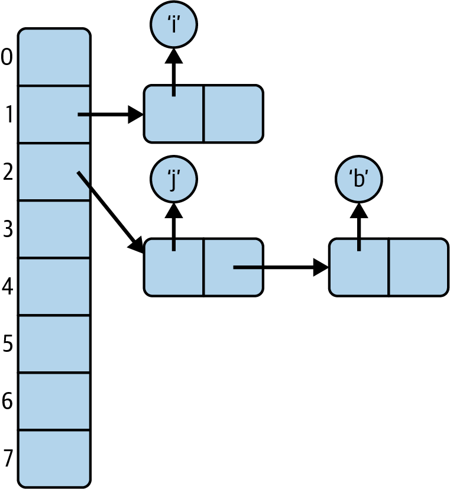
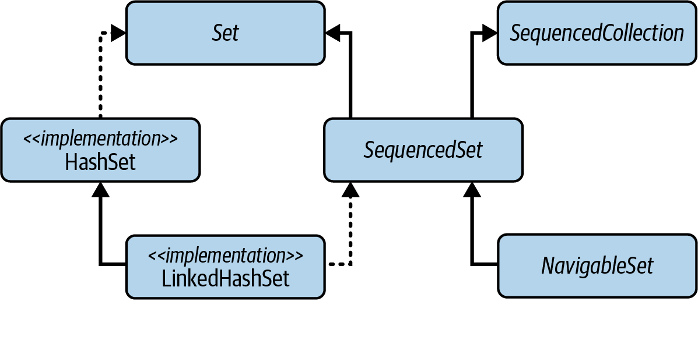

### Sets, its purpose
<details><summary>Show answer</summary>

A _set_ is a collection of items that cannot contain duplicates;
adding an item that is already present in the set has no effect.

</details>

### What defines a duplicate in sets?
<details><summary>Show answer</summary>


In different set implementation, duplicates are determined differently using:
#### _equivalence relation_

`HashSet`, for which the equivalence relation is the `equals` method
and two objects are duplicates if and only if the `equals` method,
called on one with the other as its argument, returns `true`.

#### _identity relation_

Duplicates are defined by reference equality (a == b).
Only objects that are literally the same instance are considered duplicates; 
all other instances, even if equal in content, are stored separately.

[Set implementations examples](#which-set-implementations-use-the-_identity-relation_-for-equality).

#### _ordering relation_

`NavigableSet` - maintains its elements in sorted order using an ordering relation
provided by either its natural order or a `Comparator`.

It defines two objects as equivalent if, using it, they compare as equal -
that is, if the comparison method returns 0 - regardless of whether they satisfy the equality relation.

</details>

### Which set implementations use the _identity relation_ for equality?
<details><summary>Show answer</summary>

- `EnumSet` since enums are singletons, the result of the `equals` method matches
  the result of the identity relation for all comparisons
- the set view of the keys of an `IdentityHashMap`
- any set created from an `IdentityHashMap` using the `Collections.newSetFromMap` method:
    ```java
    Set<Integer> concurrentIntegerSet = Collections.newSetFromMap(new IdentityHashMap<Integer,Boolean>());
    ```

</details>

### What are the consequences of using different equivalence relations?
<details><summary>Show answer</summary>

- sets may contain duplicate elements that satisfy `equals` or, conversely,
  that they may elide occurrences of ones that don’t.
- to determine whether two sets A and B are equal,
  A must test each member of B to discover whether it is equivalent to a member of A.
  If the roles are reversed, and if A and B are using different equivalence relations,
  the results may be different, so set equality loses symmetry.

</details>

### Is it possible for a set to contain multiple objects that all return true when compared with each other using `equals()`?
<details><summary>Show answer</summary>

It is possible for:
- `NavigableSet` that uses _ordering relation_ 
- `EmumSet` that uses identity relation 

</details>

### How to determine that 2 sets with equivalence relation are equal?
<details><summary>Show answer</summary>

The `equals` method is overridden:
the `Set` contract states that a `Set` can only ever be equal to another `Set`,
and then only if:
- they are the same size and
- contain equal elements.

The `hashCode` method is also overridden, as should always be the case when equals is overridden.
The hash code of a Set is the sum of the hash codes of its elements.

</details>

### `Set` direct implementations
<details><summary>Show answer</summary>

- [`HashSet`](#hashset)
- [`CopyOnWriteArraySet`](./03_Concurrency%20and%20Set%20Implementations.md/#copyonwritearrayset-its-operations-compare-with-hashset)
- [`EnumSet`](#enumset)

</details>

### `HashSet`
<details><summary>Show answer</summary>

`HashSet` - the most commonly used, implemented by a _hash table_,
an array in which elements are stored at a position derived from their contents

`HashSet` is unsychronized and not thread-safe; its iterators are fail-fast.

</details>

### Hash table data structure
<details><summary>Show answer</summary>

A hash table stores elements in an array of buckets, selecting a bucket using the hash code of the element.

</details>

### How are hash functions designed? 
<details><summary>Show answer</summary>

Hash functions are designed to produce, as far as possible, 
an even distribution of hash codes across the range of element values that may be stored.

</details>

### How does a hash table handle cases where multiple values hash to the same bucket?
<details><summary>Show answer</summary>

Unless a hash table has more buckets than the number of possible values that might be stored, 
it is inevitable that some distinct values will hash to the same location in the table. 
This situation is called a _collision_. 
A good hash function can reduce how often _collisions_ occur by spreading values as evenly as possible across the table, 
but _collisions_ cannot be avoided entirely.


When _collisions_ do occur, the table needs a way to store multiple elements in the same location, or bucket. 
A common approach is to keep the colliding elements in a linked structure, 
such as a list or a tree, stored within that bucket:



</details>

### How would a set behave if hashCode() returned 1 for all elements?
<details><summary>Show answer</summary>

If `hashCode()` returns `1` for all elements in a set, then every element ends up in the same bucket 
of the underlying hash table. The set will still work correctly because duplicates are ultimately detected using 
`equals()`, but all operations degrade to linear time. 
Adding, searching, and removing elements becomes `O(N)` instead of `O(1)` because the set must scan 
through the entire list of elements stored in that single bucket.

</details>

### `HashSet` advantages and disadvantages
<details><summary>Show answer</summary>

Advantages: the constant-time performance (for lightly loaded tables and with a good hash function)
of the basic operations of `add`, `remove`, `contains`, and `size`

Its main performance disadvantages are:
- the poor performance of heavily loaded tables and
- the iteration performance: iterating through the table involves examining every bucket,
  so the cost includes a factor attributable to the table length, regardless of the size of the set it contains.

</details>

### Creation of `HashSet`
<details><summary>Show answer</summary>

Besides the no‑argument constructor, `HashSet` provides two additional constructors:
- `HashSet(int initialCapacity)`
- `HashSet(int initialCapacity, float loadFactor)`

Both create an empty set but allow you to influence the size of the underlying hash table by specifying 
an initial capacity and, optionally, a load factor. These constructors can be used to pre‑allocate enough 
space for the expected number of elements and avoid costly resizing.


In practice, however, these constructors often cause confusion. The `initialCapacity` parameter is frequently 
mistaken for the expected number of elements, even though it is actually used to compute the internal table size. 
Correctly calculating the parameter from the expected maximum number of entries is 
**implementation‑dependent** and **error‑prone**.


To address this, Java 19 introduced static factory methods that take only the _expected maximum number of elements_. 
These methods are simpler to use and independent of internal implementation details.


For `HashSet`, the recommended factory method is: `HashSet.newHashSet(int expectedSize)`.

</details>

### `EnumSet`
<details><summary>Show answer</summary>

`EnumSet` should always be preferred over other Set implementations when storing enum values.


It exists to take advantage of two properties of enum types:
- the set of possible elements is fixed, and
- each element has a unique, stable index

In Java, both conditions are guaranteed by the structure of enum classes:

the number of possible keys is defined by the enum constants, and each constant has a unique `ordinal` value. 
These `ordinals` form a compact range starting at zero, making them ideal for use as array indices or, 
as in the standard `EnumSet` implementation, positions in a bit vector.


Because of these properties, `EnumSet` can represent sets of enum values extremely efficiently — 
in both memory usage and performance — compared to general-purpose set implementations.

</details>

### What is an `UnmodifiableSet` and how is it created?
<details><summary>Show answer</summary>

There is no public type named `UnmodifiableSet<E>` in the Collections Framework.

The name refers informally to a group of _package‑private_ classes used internally 
to implement unmodifiable sets returned by:
- `Set.of(...)`
- `Set.copyOf(...)`

Client code cannot reference these classes directly. 
Instead, you obtain an unmodifiable set through the factory methods:
```java
JavaSet<String> s1 = Set.of("A", "B", "C");
Set<String> s2 = Set.copyOf(existingSet);
```
These factory methods return highly optimized, unmodifiable set implementations.

</details>


### Properties of unmodifiable sets
<details><summary>Show answer</summary>

- **Unmodifiable** - Any mutating operation throws `UnsupportedOperationException`.
- **Null‑hostile** - Passing null to `Set.of` or `Set.copyOf` causes a `NullPointerException`.
- **Duplicate‑rejecting** - If duplicate elements are provided during creation, an IllegalArgumentException is thrown.
- **Fixed size** - Internally backed by fixed‑length arrays rather than resizable hash tables.

</details>


### What are Advantages and disadvantages of using of unmodifiable sets
<details><summary>Show answer</summary>

Advantages:
- Very compact representation
  - They use fixed‑length arrays without empty hash buckets or overflow chains.
  - This typically requires much less memory than hash‑based sets.
- Efficient iteration
  - Iteration is extremely fast and cache‑friendly because elements are stored contiguously, improving spatial locality.
- Immutable - safer for concurrent or defensive programming since the contents cannot change.

Disadvantage:

Because unmodifiable sets use an array instead of a hash structure, `contains()` must scan the array linearly, 
making membership checks `O(n)` rather than the `O(1)` average time provided by HashSet.


This is the main trade‑off: 

**fast iteration and low memory usage versus slower `contains()` performance**.

</details>

### How can I obtain a set with specialized behavior that the standard Set classes don’t support?
<details><summary>Show answer</summary>

**Set views provided by maps can solve this.**

If the standard Set implementations do not support a particular behavior — such as identity‑based equality, 
concurrent access semantics, or other special properties — you can create a set backed by a map using 
`Collections.newSetFromMap(...)`.


This technique allows you to reuse the behavior of a specific `Map` implementation while 
exposing it as a `Set` interface. 

Examples include:
- identity‑based sets using IdentityHashMap
- concurrent sets using ConcurrentHashMap
- insertion‑ordered, sorted, or otherwise specialized sets backed by custom map types

This approach provides a flexible way to obtain set behavior that is not available directly 
through existing `Set` classes.

</details>

### How to create a set of items with identity relation?
<details><summary>Show answer</summary>

```java
Set<Integer> concurrentIntegerSet = Collections.newSetFromMap(new IdentityHashMap<Integer,Boolean>());
```

</details>

### Which Java Set types should I use if I need ordering or element navigation?
<details><summary>Show answer</summary>

- [`SequencedSet`](#what-problem-does-sequencedset-solve)
- [`NavigableSet`](#what-problem-does-navigableset-solve)

</details>

### What problem does `SequencedSet` solve?
<details><summary>Show answer</summary>


A `SequencedSet` represents a Set with a guaranteed encounter order and supports the sequencing operations 
defined in `SequencedCollection` (such as accessing the first or last element, or iterating in reverse).


Its only additional contribution is a covariant override of the `reversed()` method, 
so calling `reversed()` on a `SequencedSet` produces another `SequencedSet`, preserving type‑safety and fluent usage.




</details>

### `SequencedSet` direct implementations
<details><summary>Show answer</summary>

- [`LinkedHashSet`](#what-is-the-main-idea-behind-linkedhashset-and-how-does-it-differ-from-hashset)


</details>

### What is the main idea behind `LinkedHashSet`, and how does it differ from `HashSet`?
<details><summary>Show answer</summary>

`LinkedHashSet` implements `SequencedSet` by maintaining a linked list of its elements.
This guarantees that its iterators return elements in **insertion order**.

The linked structure also improves iteration performance: 

moving to the next element is `O(1)` because the linked list directly connects entries.


In contrast, iterating over a `HashSet` requires scanning all hash table buckets, 
including empty ones, which makes iteration less efficient.

This class is unsychronized and not thread-safe; its iterators are fail-fast.

</details>

### What problem does `NavigableSet` solve?
<details><summary>Show answer</summary>

`NavigableSet` extends the `SequencedSet` contract by guaranteeing that iteration always proceeds in 
**ascending element order**. It also introduces navigation methods that allow you to 
efficiently find elements adjacent to a given value, such as `lower()`, `higher()`, `floor()`, and `ceiling()`.


Unlike `LinkedHashSet`, which preserves insertion order, a `NavigableSet` orders its elements 
**by their natural ordering or by a provided `Comparator`**. 
This means the ordering is defined by element comparison, not by the sequence of insertion.


</details>

### What interface did Java provide before NavigableSet, and what is the current recommendation regarding its usage?
<details><summary>Show answer</summary>

Before `NavigableSet` was introduced, the main ordered‑set abstraction in Java was `SortedSet`. 
It guaranteed that iteration followed the sorted order of elements, 
but it did not provide closest‑match navigation methods like `lower()`, `higher()`, `floor()`, or `ceiling()`.


`SortedSet` still exists in the JDK: it extends `SequencedSet` and is itself extended by `NavigableSet`. 
However, it is no longer particularly relevant, since the platform provides **no direct implementations** of `SortedSet`, 
and `NavigableSet` fully supersedes it with richer functionality.

</details>

### What methods exist for using a NavigableSet as a queue, and how do these approaches differ?
<details><summary>Show answer</summary>


#### `NavigableSet` vs `Deque`
`E pollFirst()` and `E pollLast()` - are analogous to the methods of the same names in `Deque`
and help to support the use of NavigableSet in applications that require queue functionality.

#### `NavigableSet` vs `PriorityQueue`
- if it needs to examine and manipulate the set of waiting tasks, use `NavigableSet`
  (and uniqueness via `equal` - todo, not sure if it is a right statement);
- if its main requirement is efficient access to the next task to be performed,
  use `PriorityQueue` (accommodates duplicates).

</details>

### In what way can we think about or view the elements of a `NavigableSet`?
<details><summary>Show answer</summary>

When working with an ordered set of values, a useful way to think about them is as a **range**.


For example, if you have a set of timestamped events, you may want to examine only those 
that occurred within a specific time window.

Similarly, in the case of `PriorityTask` objects, you might want to process only the tasks 
whose priorities fall within a certain band — for instance, high and medium.


Any changes made through such a view — including structural modifications — are reflected directly in the underlying set.

</details>

### `SequencedSet` vs `NavigableSet`
<details><summary>Show answer</summary>


- A `SequencedSet` is an externally or internally ordered Set that also exposes the methods of SequencedCollection.
- A `NavigableSet` is an internally ordered SequencedSet that therefore also automatically sorts its elements,
  and provides additional methods to find elements adjacent to a target value.

</details>

### Implementations of `NavigableSet`
<details><summary>Show answer</summary>

- [`java.util.TreeSet`](#treeset-its-purpose)
- [`ConcurrentSkipListSet`](./03_Concurrency%20and%20Set%20Implementations.md#concurrentskiplistset)

</details>

### `TreeSet`, its purpose
<details><summary>Show answer</summary>

Trees are an ideal data structure when an application requires fast insertion and lookup of individual elements, 
while also needing those elements to be retrieved in sorted order.


`TreeSet` is built on exactly this kind of tree‑based structure (a balanced Red‑Black tree), 
which allows it to maintain elements in sorted order while providing efficient operations.


TreeSet is unsychronized and not thread-safe; its iterators are fail-fast.

</details>
