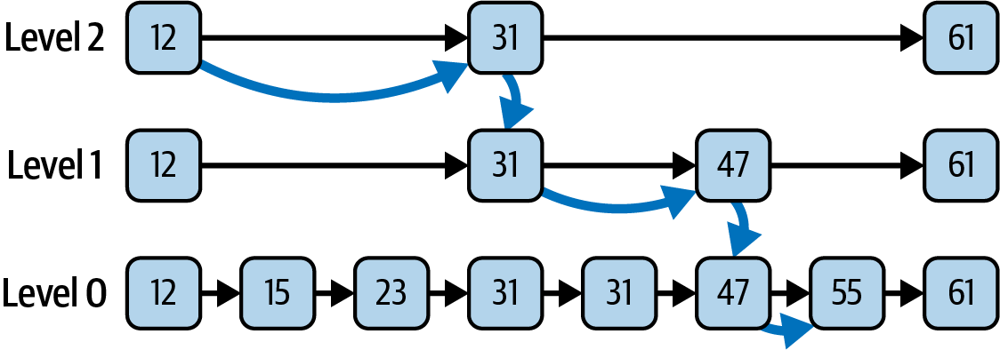

### Sets creation for multithreaded context
<details><summary>Show answer</summary>


- [`CopyOnWriteArraySet`](#copyonwritearrayset-its-operations-compare-with-hashset)
- [`ConcurrentSkipListSet`](#concurrentskiplistset)
- [Concurrent set from a concurrent map](#concurrent-set-from-a-concurrent-map)


</details>

### `CopyOnWriteArraySet`, its operations, compare with `HashSet`
<details><summary>Show answer</summary>


The functional specification of `CopyOnWriteArraySet` is again straightforwardly derived from the `Set` contract,
but with quite different performance characteristics from `HashSet`.

This class is implemented as a thin wrapper around an instance of `CopyOnWriteArrayList`,
which in turn is backed by an array.
The array is treated as immutable;
any modification of the set results in the creation of an entirely new array.

- `add` has complexity O(N), as does `contains`, which has to be implemented by a linear search.
- iteration costs O(1) per element


</details>

### In which context `CopyOnWriteArraySet` can be used?
<details><summary>Show answer</summary>


Clearly, you wouldn’t use `CopyOnWriteArraySet` in a context where you were expecting many searches or insertions.
But the array implementation means that iteration costs O(1) per element - faster than HashSet -
and it has one advantage that is really compelling in some applications:
it provides thread safety without adding to the cost of read operations (using `copy-on-write` algorithm).


One common situation is managing shared configuration in a multithreaded environment.
For example, a server application might maintain a global configuration set of allowed IP addresses
that multiple threads frequently read but that is only rarely updated.
The process of updating can’t be allowed to interfere with read operations;
with a locking set implementation, read and write operations share the overhead necessary to ensure this,
whereas with `CopyOnWriteArraySet` the overhead is carried entirely by write operations.

This makes sense in a scenario in which **read operations occur much more frequently than changes**
to the server configuration.


</details>

### `copy-on-write` thread safety vs locking-based thread safety
<details><summary>Show answer</summary>


Implementation of `CopyOnWriteArraySet` provides thread safety without adding to the cost of read operations.
This is in contrast to those collections that use locking to achieve thread safety for all operations
(for example, the synchronized collections).

Locking operations are always a potential bottleneck in multithreaded applications.
By contrast, read operations on copy-on-write collections are implemented on the backing array,
and thanks to its immutability they can be used by any thread without danger of interference
from a concurrent write operation.


</details>

### Concurrent set from a concurrent map
<details><summary>Show answer</summary>


```java
Set<Integer> concurrentIntegerSet = Collections.newSetFromMap(new ConcurrentHashMap<Integer,Boolean>());
```


</details>

### Concurrent implementation of NavigableSet
<details><summary>Show answer</summary>


[`ConcurrentSkipListSet`](#concurrentskiplistset)


</details>

### `ConcurrentSkipListSet`
<details><summary>Show answer</summary>


It is backed by a skip list, a modern alternative to the binary trees of the previous section.
A skip list for a set is a series of linked lists, each of which is a chain of cells consisting of two fields:
one to hold a value, and one to hold a reference to the next cell.
Elements are inserted into and removed from a linked list in constant time by pointer rearrangement.

The iterators of ConcurrentSkipListSet are weakly consistent.


</details>

### Searching a skip list
<details><summary>Show answer</summary>


a skip list consisting of three linked lists, labeled levels 0, 1, and 2.
The first linked list of the collection (level 0 in the figure) contains the elements of the set,
sorted according to their natural order or by the comparator of the set.
Each list above level 0 contains a subset of the list below, chosen randomly according to a fixed probability.
For this example, let’s suppose that the probability is 0.5;
on average, each list will contain half the elements of the list below it.
Navigating between links takes a fixed time,
so the quickest way to find an element is to start at the beginning (the lefthand end)
of the top list and to go as far as possible in each list before dropping to the one below it.




</details>

### Inserting an element into a skip list
<details><summary>Show answer</summary>


Inserting an element into a skip list always involves at least inserting it at level 0.
When that has been done, should it also be inserted at level 1?
If level 1 contains, on average, half of the elements at level 0, then we should toss a coin
(that is, randomly choose with probability 0.5) to decide whether it should be inserted at level 1 as well.
If the coin toss does result in it being inserted at level 1, then the process is repeated for level 2, and so on.
When we remove an element from a skip list, it is removed from each level in which it occurs.

If the coin tossing goes badly, we could end up with every list above level 0 empty—or full, which would be just as bad.
These outcomes have very low probability, however, and analysis shows that, in fact,
the probability is very high that skip lists will give performance comparable to binary trees:
search, insertion, and removal all have complexity of O(log N).
Their compelling advantage for concurrent use is that they have efficient lock-free insertion and deletion algorithms,
whereas there are none known for binary trees.


</details>

### `Collections.newSetFromMap` vs. `CopyOnWriteArraySet` vs. `ConcurrentSkipListSet`
<details><summary>Show answer</summary>


- `ConcurrentSkipListSet` - the second supports the methods of NavigableSet
- `CopyOnWriteArraySet` don’t use it in a context where you were expecting many searches or insertions.
  But iteration costs O(1) per element, and it provides thread safety without adding to the cost of read operations
  (using `copy-on-write` algorithm)
- the set view provided by `Collections::newSetFromMap` with `ConcurrentHashMap` - the default choice,
  on efficiency grounds

</details>
