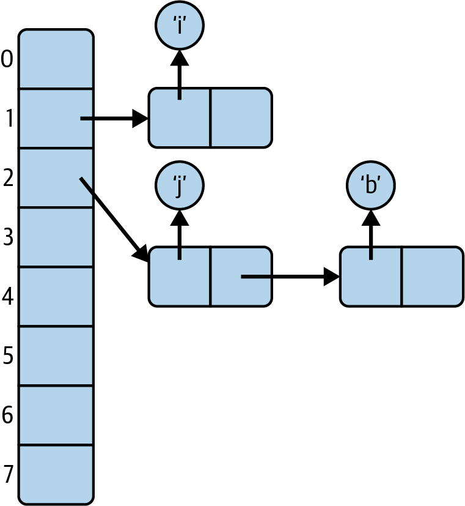
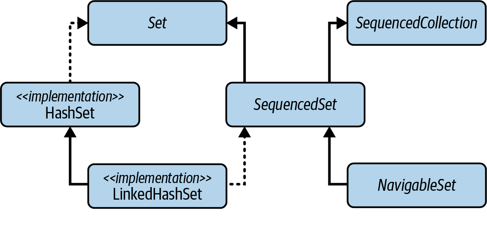
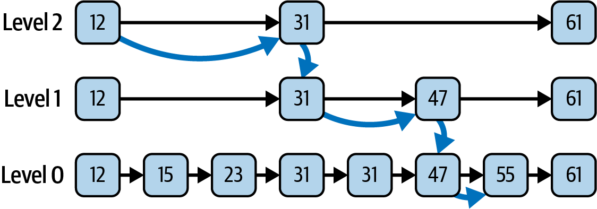

- [Sets](#sets)
- [todo Hierarchy of Sets](todo)
- [When two sets are equal?](#when-two-sets-are-equal)
- [What does define a duplicate in sets?](#what-does-define-a-duplicate-in-sets)
- [What are consequences of using different equivalence relations?](#what-are-consequences-of-using-different-equivalence-relations)
- [Containing by set multiple objects, that return true when compared to each other by `equals`?](#containing-by-set-multiple-objects-that-return-true-when-compared-to-each-other-by-equals)
- [`Set` direct implementations](#set-direct-implementations)
- [`HashSet`](#hashset)
- [Elements position in a hash table](#elements-position-in-a-hash-table)
- [Which operations and what complexity do hash tables have?](#which-operations-and-what-complexity-do-hash-tables-have)
- [Which operations and what complexity do hash tables have?](#elements-position-in-a-hash-table)
- [The probability of a collision](#the-probability-of-a-collision)
- [How it works if a collision does take place](#how-it-works-if-a-collision-takes-place)
- [Iterating over a hash table](#iterating-over-a-hash-table)
- [`HashSet` advantages and disadvantages](#hashset-advantages-and-disadvantages)
- [`HashSet` constructors, when should you use them and why?](#hashset-constructors-when-should-you-use-them-and-why)
- [`CopyOnWriteArraySet`, its operations, compare with `HashSet`](#copyonwritearrayset-its-operations-compare-with-hashset)
- [In which context `CopyOnWriteArraySet` can be used?](#in-which-context-copyonwritearrayset-can-be-used)
- [`copy-on-write` thread safety vs locking-based thread safety](#copy-on-write-thread-safety-vs-locking-based-thread-safety)
- [`EnumSet`](#enumset)
- [`EnumSet` operations complexity](#enumset-operations-complexity)
- [`UnmodifiableSet`](#unmodifiableset)
- [Set Views of Maps](#set-views-of-maps)
- [How to create a set of items with identity relation?](#how-to-create-a-set-of-items-with-identity-relation)
- [How to create a concurrent set?](#how-to-create-a-concurrent-set)
- [`Collections.newSetFromMap` vs. `CopyOnWriteArraySet`](#collectionsnewsetfrommap-vs-copyonwritearrayset)
- [`SequencedSet`](#sequencedset)
- [`SequencedSet` direct implementation](#sequencedset-direct-implementation)
- [`LinkedHashSet` idea, compare with `HashSet`](#linkedhashset-idea-compare-with-hashset)
- [Calling `addFirst` or `addLast` on an element that is already present in `LinkedHashSet`](#calling-addfirst-or-addlast-on-an-element-that-is-already-present-in-linkedhashset)
- [`NavigableSet`](#navigableset)
- [What other `Set` interface does guarantee iteration order? Recommendations on using it.](#what-other-set-interface-does-guarantee-iteration-order-recommendations-on-using-it)
- [Calling `addFirst` or `addLast` on an element that is already present in `NavigableSet`](#calling-addfirst-or-addlast-on-an-element-that-is-already-present-in-navigableset)
- [The Methods of `NavigableSet`](#the-methods-of-navigableset)
- [Using `NavigableSet` as a queue, compare them](#using-navigableset-as-a-queue-compare-them)
- [`NavigableSet`, how could its elements viewed?](#navigableset-how-could-its-elements-viewed)
- [`NavigableSet` API methods to work with range views](#navigableset-api-methods-to-work-with-range-views)
- [Types of intervals in a range](#types-of-intervals-in-a-range)
- [Navigating the set in reverse order](#navigating-the-set-in-reverse-order)
- [`SequencedSet` methods compared with their `NavigableSet` equivalents](#sequencedset-methods-compared-with-their-navigableset-equivalents)
- [`SequencedSet` vs `NavigableSet`](#sequencedset-vs-navigableset)
- [Implementation of `NavigableSet`](#implementation-of-navigableset)
- [`TreeSet`](#treeset)
- [What data structure is backed by `TreeSet`? Its properties.](#what-data-structure-is-backed-by-treeset-its-properties)
- [A tree vs. a hash table vs. a list](#a-tree-vs-a-hash-table-vs-a-list)
- [Cost of insertion into a binary tree](#cost-of-insertion-into-a-binary-tree)
- [How deep is a tree that contains N elements?](#how-deep-is-a-tree-that-contains-n-elements)
- [Checking if an element is contained, a tree vs a hash table vs a list](#checking-if-an-element-is-contained-a-tree-vs-a-hash-table-vs-a-list)
- [Trees performance, what might affect it, how it could be solved?](#trees-performance-what-might-affect-it-how-it-could-be-solved)
- [`ConcurrentSkipListSet`](#concurrentskiplistset)
- [Searching a skip list](#searching-a-skip-list)
- [Inserting an element into a skip list](#inserting-an-element-into-a-skip-list)
- [Comparing Set Implementations](#comparing-set-implementations)
- [Sets implementation choice](#sets-implementation-choice)

### Sets

A _set_ is a collection of items that cannot contain duplicates; 
adding an item that is already present in the set has no effect.

### When two sets are equal?

The `equals` method is overridden: 
the `Set` contract states that a `Set` can only ever be equal to another `Set`, 
and then only if:
- they are the same size and 
- contain equal elements. 

The `hashCode` method is also overridden, as should always be the case when equals is overridden. 
The hash code of a Set is the sum of the hash codes of its elements.

### What does define a duplicate in sets?

It depends on implementations
#### Objects equality with _equivalence relation_

`HashSet`, for which the equivalence relation is the `equals` method 
and two objects are duplicates if and only if the `equals` method, 
called on one with the other as its argument, returns `true`.

#### Objects equality with _identity relation_

A set using that relation will contain a reference to every unique object that has been added to it.
Examples:
- `EnumSet` since enums are singletons, the result of the `equals` method matches 
   the result of the identity relation for all comparisons
- the set view of the keys of an `IdentityHashMap`
- any set created from an `IdentityHashMap` using the `Collections.newSetFromMap` method 
- Explicitly create set view from identity map:
    ```java
    Set<Integer> concurrentIntegerSet = Collections.newSetFromMap(new IdentityHashMap<Integer,Boolean>());
    ```

#### Objects equality with _ordering relation_

`NavigableSet` - maintains its elements in sorted order using an ordering relation 
provided by either its natural order or a `Comparator`.

It defines two objects as equivalent if, using it, they compare as equal - 
that is, if the comparison method returns 0 - regardless of whether they satisfy the equality relation.

### What are consequences of using different equivalence relations?

- sets may contain duplicate elements that satisfy `equals` or, conversely, 
  that they may elide occurrences of ones that don’t.
- to determine whether two sets A and B are equal, 
  A must test each member of B to discover whether it is equivalent to a member of A. 
  If the roles are reversed, and if A and B are using different equivalence relations, 
  the results may be different, so set equality loses symmetry.

### Containing by set multiple objects, that return true when compared to each other by `equals`?

It is possible for `NavigableSet` that uses _ordering relation_ to check equality.

### `Set` direct implementations

- [`HashSet`](#hashset)
- [`CopyOnWriteArraySet`](#copyonwritearrayset-its-operations-compare-with-hashset)
- [`EnumSet`](#enumset)

### `HashSet`

`HashSet` - the most commonly used, implemented by a _hash table_,
an array in which elements are stored at a position derived from their contents

`HashSet` is unsychronized and not thread-safe; its iterators are fail-fast.

### Elements position in a hash table

An element’s position in a hash table is calculated by a hash function of its contents. 
Hash functions are designed to give, as far as possible, an even spread of results (hash codes) 
from the element values that might be stored.

Unless your table has more locations than there are values that might be stored in it, 
sometimes two distinct values will hash to the same location in the hash table (this is called a _collision_).
We can minimize the problem with a good hash function - one that spreads the elements out equally in the table - but, 
when collisions do occur, we need to have a way of keeping the colliding elements 
at the same table location, or _bucket_. 
This is often done by storing them in a linked structure - a list or a tree:



### Which operations and what complexity do hash tables have?

As long as there are no _collisions_, the cost of inserting or retrieving an element is **constant**.

### The probability of a collision

As the hash table fills, collisions become more likely; 
assuming a good hash function, the probability of a collision in a lightly loaded table is proportional to its load, 
defined as the number of elements in the table divided by its capacity (the number of _buckets_). 

### How it works if a collision takes place

If a collision does take place, an overflow structure - a linked list or tree - has to be created 
and subsequently traversed, adding an extra cost to insertion.

The overflow structure used is normally a linear list, 
but if for a given bucket the list grows in length past a certain threshold, 
it is converted to a red-black binary tree.

If the size of the hash table is fixed, performance will worsen as more elements are added and the load increases. 
To prevent this from happening, the table size is increased by rehashing - 
copying all elements to a newly allocated, larger table - when the load reaches a specified threshold (its load factor).

### Iterating over a hash table

Iterating over a hash table requires each bucket to be examined to see whether it is occupied and 
therefore requires an execution count proportional to the capacity of the hash table 
plus the number of elements it contains. 

Since the iterator examines each bucket in turn, the order in which elements are returned depends on their hash codes, 
so there is no guarantee as to the order in which the elements will be returned.

`LinkedHashSet`, a variant of `HashSet` implementation with an iterator that 
instead returns elements in their insertion order.

### `HashSet` advantages and disadvantages

Advantages: the constant-time performance (for lightly loaded tables and with a good hash function) 
of the basic operations of `add`, `remove`, `contains`, and `size`

Its main performance disadvantages are: 
- the poor performance of heavily loaded tables and 
- the iteration performance: iterating through the table involves examining every bucket, 
  so the cost includes a factor attributable to the table length, regardless of the size of the set it contains.

### `HashSet` constructors, when should you use them and why?

Additional `HashSet` constructors: 
- `HashSet(int initialCapacity)`
- `HashSet(int initialCapacity, float loadFactor)`

Both of these constructors create an empty set but allow some control over the size of the underlying table, 
creating one at least as large as the supplied capacity and, optionally, with the desired load factor.

You can use these constructors to create a table large enough to store all the elements you expect it to hold 
without requiring expensive resizing operations.

In practice, however, they have proved confusing and difficult to use - confusing because their int parameter, 
often misunderstood to be the expected number of entries, 
is in fact used to compute the table size, and difficult to use because 
computing the argument correctly from the expected maximum number of entries 
is implementation-dependent and error-prone.

So Java 19 added static factory methods, which take only a parameter signifying the expected maximum number of entries. 
These methods are recommended as being easier to use and less subject to implementation changes. 
The factory method for `HashSet` is `newHashSet`:

```java
public class HashSet<E> implements Set<E> {
  static <T> HashSet<T> newHashSet(int numElements) {
    
  }
}
```

### `CopyOnWriteArraySet`, its operations, compare with `HashSet`

The functional specification of `CopyOnWriteArraySet` is again straightforwardly derived from the `Set` contract, 
but with quite different performance characteristics from `HashSet`.

This class is implemented as a thin wrapper around an instance of `CopyOnWriteArrayList`, 
which in turn is backed by an array. 
The array is treated as immutable; 
any modification of the set results in the creation of an entirely new array.

- `add` has complexity O(N), as does `contains`, which has to be implemented by a linear search.
- iteration costs O(1) per element

### In which context `CopyOnWriteArraySet` can be used?

Clearly, you wouldn’t use `CopyOnWriteArraySet` in a context where you were expecting many searches or insertions. 
But the array implementation means that iteration costs O(1) per element - faster than HashSet - 
and it has one advantage that is really compelling in some applications: 
it provides thread safety without adding to the cost of read operations (using `copy-on-write` algorithm).


One common situation is managing shared configuration in a multithreaded environment. 
For example, a server application might maintain a global configuration set of allowed IP addresses 
that multiple threads frequently read but that is only rarely updated. 
The process of updating can’t be allowed to interfere with read operations; 
with a locking set implementation, read and write operations share the overhead necessary to ensure this, 
whereas with `CopyOnWriteArraySet` the overhead is carried entirely by write operations. 

This makes sense in a scenario in which **read operations occur much more frequently than changes** 
to the server configuration.

### `copy-on-write` thread safety vs locking-based thread safety

Implementation of `CopyOnWriteArraySet` provides thread safety without adding to the cost of read operations.
This is in contrast to those collections that use locking to achieve thread safety for all operations
(for example, the synchronized collections).

Locking operations are always a potential bottleneck in multithreaded applications.
By contrast, read operations on copy-on-write collections are implemented on the backing array,
and thanks to its immutability they can be used by any thread without danger of interference
from a concurrent write operation.

### `EnumSet`

`EnumSet` should always be preferred over any other Set implementation when we are storing enum values.

This class exists to take advantage of the efficient implementations that are possible when:
- the maximum number of possible elements is fixed and 
- a unique index can be assigned to each

These two conditions hold for a set of elements of the same Enum class; 
the number of keys is fixed by the constants of the enumerated type, 
and the `ordinal` method returns values that are guaranteed to be unique to each constant. 
In addition, the values that `ordinal` returns form a compact range, starting from zero - 
ideal, in fact, for use as array indices or, in the standard implementation, indices of a bit vector.

### `EnumSet` operations complexity

`add`, `remove`, and `contains` are implemented as bit manipulations, with constant-time performance. 
Bit manipulation on a single word is extremely fast, and a long value can be used to represent 
EnumSets over enum types with up to 64 values

### `UnmodifiableSet`

You won’t find any reference to the name `UnmodifiableSet<E>` in the Javadoc or 
in the code of the Collections Framework. 
It’s a name invented for a family of package-private classes that client programmers can never access by name, 
but that are important because they provide the implementation of the unmodifiable sets obtained 
from the various overloads of the factory methods `Set.of` and `Set.copyOf`. 

The properties of the members of this family are described in the Javadoc for Set:
- They are unmodifiable: elements cannot be added or removed. 
  Calling any mutator method will always cause UnsupportedOperationException to be thrown.
- They are null-hostile. Attempts to create them with null elements result in `NullPointerException`.
- They reject duplicate elements at creation time. 
  Duplicate elements passed to a factory method result in an `IllegalArgumentException`.

Advantages:
- The classes that make up `UnmodifiableSet` use fixed-length arrays as the backing structures.
  Without the overhead of empty table buckets or linked overflow structures, 
  these implementations _require much less space_ than a hashed structure.
- Iteration is also correspondingly more efficient, with the added benefit of improved spatial locality

Disadvantage:
The trade-off for faster iteration is that containment can only be determined by a linear search, O(N) in complexity.

### Set Views of Maps

In the Collections Framework, many sets are implemented as wrappers around a corresponding map, 
although the maps are encapsulated and invisible to the client.
However, the converse does not hold: some maps do not have a corresponding set:
`WeakHashMap`, `IdentityHashMap`, and `ConcurrentHashMap`. 

To obtain a set for one of these (weak references, identity-equality based, concurrency) with the same 
ordering, concurrency, and performance characteristics as the backing map, 
you can call the method `Collections::newSetFromMap` on an empty map with a type `Map<E,Boolean>`, 
where `E` is the element type of the set that you want to create. 

For example, to create a concurrent set of `Integer`, you could write:

```java
Set<Integer> concurrentIntegerSet = Collections.newSetFromMap(new ConcurrentHashMap<Integer,Boolean>());
```

This idiom guarantees that no direct access to the backing map can take place after the set view is created, 
as required by the specification of `newSetFromMap`.

### How to create a set of items with identity relation?
```java
Set<Integer> concurrentIntegerSet = Collections.newSetFromMap(new IdentityHashMap<Integer,Boolean>());
```

### How to create a concurrent set?

#### using `CopyOnWriteArraySet`

todo example

#### using `ConcurrentSkipListSet`

[See `ConcurrentSkipListSet`](#concurrentskiplistset)

#### To get the 
```java
Set<Integer> concurrentIntegerSet = Collections.newSetFromMap(new ConcurrentHashMap<Integer,Boolean>());
```

### `Collections.newSetFromMap` vs. `CopyOnWriteArraySet` vs. `ConcurrentSkipListSet`

todo

### `SequencedSet`

A SequencedSet is an externally or internally ordered Set that also exposes the methods of SequencedCollection. 
It combines the methods of these two interfaces, adding to them in only one respect: 
it provides a covariant override of the method `reversed` of `SequencedCollection` 
in order to return a value of type `SequencedSet`



### `SequencedSet` direct implementation

`LinkedHashSet`

### `LinkedHashSet` idea, compare with `HashSet`

`LinkedHashSet` implements `SequencedSet` by maintaining a linked list of its elements.
The iterators of a `LinkedHashSet` return their elements in insertion order.


The linked structure also has a useful consequence in terms of improved performance for iteration: 
next executes in constant time, as the linked list can be used to visit each element in turn. 
This is in contrast to `HashSet`, for which every bucket in the hash table must be visited, 
whether it is occupied or not.

This class is unsychronized and not thread-safe; its iterators are fail-fast.

### Calling `addFirst` or `addLast` on an element that is already present in `LinkedHashSet`

Calling these methods will reposition an element as the first or last one.

### `NavigableSet`

The interface `NavigableSet` adds to the `SequencedSet` contract a guarantee that its iterator will 
traverse the set in ascending element order, and adds further methods to find the elements adjacent to a target value. 
Unlike `LinkedHashSet`, its elements are ordered internally by 
the comparison method of its natural order or of its comparator.

### What other `Set` interface does guarantee iteration order? Recommendations on using it.

Prior to the introduction of `NavigableSet`, the only subinterface of `Set` was an interface called `SortedSet`, 
which guarantees iteration order but does not expose the closest-match methods. 
`SortedSet` is still in the JDK - it extends `SequencedSet` and is in turn extended by `NavigableSet` - 
but it is no longer of any great interest, since it has no direct implementations in the platform.

### Calling `addFirst` or `addLast` on an element that is already present in `NavigableSet`

`addFirst` and `addLast` cannot fulfill their contract, and accordingly throw `UnsupportedOperationException`.

### The Methods of `NavigableSet`

#### Retrieving the comparator

`Comparator<? super E> comparator()` - This is the method to retrieve the set’s comparator, 
if it has been given one at construction time. 
If the set uses the natural ordering of its elements, this method returns null.

#### Inspecting the first and last elements
- `E first()`
- `E last()`
If the set is empty, these operations throw `NoSuchElementException`.

#### Removing the first and last elements
- `E pollFirst()` - retrieve and remove the first (lowest) element, or return null if this set is empty
- `E pollLast()` - retrieve and remove the last (highest) element, or return null if this set is empty

#### Getting range views
- `subSet`
- `headSet`
- `tailSet`

#### Getting closest matches
- `E ceiling(E e)` 
  return the least element x in this set such that x≥e, or null if there is no such element
- `E floor(E e)` 
  return the greatest element x in this set such that x≤e, or null if there is no such element
- `E higher(E e)` 
  return the least element x in this set such that x>e, or null if there is no such element
- `E lower(E e)` 
  return the greatest element x in this set such that x<e, or null if there is no such element

These methods are useful for short-distance navigation.

### Using `NavigableSet` as a queue, compare them

`E pollFirst()` and `E pollLast()` - are analogous to the methods of the same names in `Deque` 
and help to support the use of NavigableSet in applications that require queue functionality.

`PriorityQueue` vs `NavigableSet`
- if it needs to examine and manipulate the set of waiting tasks, use `NavigableSet` 
  (and uniqueness via `equal` - todo, not sure if it is a right statement);
- if its main requirement is efficient access to the next task to be performed, 
  use `PriorityQueue` (accommodates duplicates).

### `NavigableSet`, how could its elements viewed?

When you have to work with an ordered set of values, a useful way to view them is as a range.
For example, given a set of timestamped events, you might like to inspect all those
that happened within a certain time period.
In the case of PriorityTasks, we might want to process all those that fall within a range of priorities -
high and medium, say.

Changes in the view - including structural changes - are reflected in the underlying set.

### `NavigableSet` API methods to work with range views

Each of the methods in this group appears in two overloads, 
one inherited from `SortedSet` that returns a _half-open_ `SortedSet` view, 
and one defined in `NavigableSet` returning a `NavigableSet` view that can be _open_, _half-open_, or _closed_ 
according to the user’s choice:

- `SortedSet<E> subSet(E fromValue, E toValue)` 
  return a view of the portion of this set ranging from fromValue, inclusive, to toValue, exclusive 
- `SortedSet<E> headSet(E toValue)` 
  return a view of the portion of this set up to but excluding toValue 
- `SortedSet<E> tailSet(E fromValue)` 
  return a view of the portion of this set whose elements are greater than or equal to fromValue
- `NavigableSet<E> subSet(E fromValue, boolean fromInclusive, E toValue, boolean toInclusive)`	
  return a view of the portion of this set ranging from fromValue to toValue
- `NavigableSet<E> headSet(E toValue, boolean inclusive)` - return a view of the portion of this set up to toValue
- `NavigableSet<E> tailSet(E fromValue, boolean inclusive)` - return a view of the portion of this set from fromValue

### Types of intervals in a range

An interval such as a range view can be open, half-open, or closed, 
depending on how many of its limit points it contains. 

For example, the range of numbers x for which `0 ≤ x ≤ 1` is closed, because it contains both limit points 0 and 1. 
The ranges `0 ≤ x <` 1 and `0 < x ≤ 1` are half-open because they contain only one of the limit points, 
and the range `0 < x < 1` is open because it contains neither.

### Navigating the set in reverse order
- `NavigableSet<E> descendingSet()` 
  return a reverse-order view of the elements in this set
- `Iterator<E> descendingIterator()` 
  return a reverse-order iterator

Methods of this group make traversing a NavigableSet equally easy in the descending (that is, reverse) ordering.

### `SequencedSet` methods compared with their `NavigableSet` equivalents

Although NavigableSet has been retrofitted to extend SequencedSet, 
none of the new methods provide any different functionality; 
they are just renamed versions of existing methods.

| SequencedSet |                     NavigableSet                      |
|:------------:|:-----------------------------------------------------:|
|   getFirst   |           first (inherited from SortedSet)            |
|   getLast    |            last (inherited from SortedSet)            |
| removeFirst  |                       pollFirst                       |
|  removeLast  |                       pollLast                        |
|   addFirst   | Unsupported method for internally ordered collections |
|   addLast    | Unsupported method for internally ordered collections |
|   reversed   |                     descendingSet                     |

The reason for the duplication between methods of `SequencedSet` and `NavigableSet` is that 
the first six `SequencedSet` methods were copied from Deque.

Prior to the introduction of SequencedSet in Java 21, 
`SortedSet` and `NavigableSet` had several methods that were similar to the `Deque` methods, 
but with different names and somewhat different behavior:
- `NavigableSet::first` and `NavigableSet::last`, inherited from `SortedSet`, are the same as 
  `SequencedSet::getFirst` and `SequencedSet::getLast`, throwing `NoSuchElementException` if the collection is empty.
- `NavigableSet::pollFirst` and `NavigableSet::pollLast` remove and return the respective element. 
  However, they differ from `SequencedSet::removeFirst` and `SequencedSet::removeLast` in that the poll methods 
  return null on an empty collection instead of throwing `NoSuchElementException`.

### `SequencedSet` vs `NavigableSet`

A SequencedSet is an externally or internally ordered Set that also exposes the methods of SequencedCollection. 
A NavigableSet is an internally ordered SequencedSet that therefore also automatically sorts its elements, 
and provides additional methods to find elements adjacent to a target value.

### Implementation of `NavigableSet`

`java.util.TreeSet`

### `TreeSet`

Trees are the data structure you would choose for an application that needs 
fast insertion and retrieval of individual elements, 
but which also requires that elements can be retrieved in sorted order.

TreeSet is unsychronized and not thread-safe; its iterators are fail-fast.

### What data structure is backed by `TreeSet`? Its properties.

It is backed by a tree. 

A tree is a branching structure that represents hierarchy.
An important class of tree often used in computing is a binary tree - 
one in which each node can have at most two children.

TODO binary tree property

### A tree vs. a hash table vs. a list

- A hash table can’t return its elements in sorted order.
- A list can’t retrieve its elements quickly by their content.
- A tree can do both.

### Cost of insertion into a binary tree

The cost of retrieving or inserting an element is proportional to the depth of the tree.

### How deep is a tree that contains N elements?

The complete binary tree with two levels has three elements (that’s `2^2 – 1`), 
and the one with three levels has seven elements (`2^3 – 1`). 
In general, a binary tree with N complete levels will have 2^N – 1 elements, 
and the depth of a tree with N elements will be bounded by `log N` (since 2^(log N) = N). 

### Checking if an element is contained, a tree vs a hash table vs a list

The cost of retrieving or inserting an element is proportional to the depth of the tree.
The depth of a tree with N elements will be bounded by `log N`.
Just as `N` grows much more slowly than `2^N`, `log N` grows much more slowly than `N`, 
so `contains` on a large tree is much faster than on a list containing the same elements. 


It’s still not as fast as a hash table - whose operations can ideally work in constant time - 
but a tree has the big advantage over a hash table in that its iterator can return its elements in sorted order.

### Trees performance, what might affect it, how it could be solved?

Not all binary trees will have this nice performance, though.
A balanced binary tree—one in which each node has an equal number of descendants (or as near as possible) on each side. 
An unbalanced tree can give much worse performance—in the worst case, as bad as a linked list. 
TreeSet uses a data type called a red-black tree, 
which has the advantage that if it becomes unbalanced through insertion or removal of an element, 
it can always be rebalanced in O(log N) time.

### `ConcurrentSkipListSet`

It is backed by a skip list, a modern alternative to the binary trees of the previous section. 
A skip list for a set is a series of linked lists, each of which is a chain of cells consisting of two fields: 
one to hold a value, and one to hold a reference to the next cell. 
Elements are inserted into and removed from a linked list in constant time by pointer rearrangement.

The iterators of ConcurrentSkipListSet are weakly consistent.

### Searching a skip list

a skip list consisting of three linked lists, labeled levels 0, 1, and 2. 
The first linked list of the collection (level 0 in the figure) contains the elements of the set, 
sorted according to their natural order or by the comparator of the set. 
Each list above level 0 contains a subset of the list below, chosen randomly according to a fixed probability. 
For this example, let’s suppose that the probability is 0.5; 
on average, each list will contain half the elements of the list below it. 
Navigating between links takes a fixed time, 
so the quickest way to find an element is to start at the beginning (the lefthand end) 
of the top list and to go as far as possible in each list before dropping to the one below it.



### Inserting an element into a skip list

Inserting an element into a skip list always involves at least inserting it at level 0. 
When that has been done, should it also be inserted at level 1? 
If level 1 contains, on average, half of the elements at level 0, then we should toss a coin 
(that is, randomly choose with probability 0.5) to decide whether it should be inserted at level 1 as well. 
If the coin toss does result in it being inserted at level 1, then the process is repeated for level 2, and so on. 
When we remove an element from a skip list, it is removed from each level in which it occurs.

If the coin tossing goes badly, we could end up with every list above level 0 empty—or full, which would be just as bad. 
These outcomes have very low probability, however, and analysis shows that, in fact, 
the probability is very high that skip lists will give performance comparable to binary trees: 
search, insertion, and removal all have complexity of O(log N). 
Their compelling advantage for concurrent use is that they have efficient lock-free insertion and deletion algorithms, 
whereas there are none known for binary trees.

### Comparing Set Implementations

|                         | `add`    | `contains` | `next`   | Notes                   |
|:------------------------|:---------|:-----------|:---------|:------------------------|
| `HashSet`               | O(1)     | O(1)       | O(h/N)   | h is the table capacity |
| `LinkedHashSet`         | O(1)     | O(1)       | O(1)     |                         |
| `CopyOnWriteArraySet`   | O(N)     | O(N)       | O(1)     |                         |
| `EnumSet`               | O(1)     | O(1)       | O(1)     |                         |
| `TreeSet`               | O(log N) | O(log N)   | O(log N) |                         |
| `ConcurrentSkipListSet` | O(log N) | O(log N)   | O(1)     |                         |


In the EnumSet implementation for enum types with more than 64 values, 
next has worst-case complexity of O(log m), where m is the number of elements in the enumeration.

### Sets implementation choice

That leaves the general-purpose implementations: 
HashSet, LinkedHashSet, TreeSet, ConcurrentSkipListSet, and the set view of ConcurrentHashMap obtained by newSetFromMap.

The first three are mainly for use in single-threaded applications. 
They are not thread-safe, so they can only be used in multithreaded code either in conjunction with client-side locking 
or wrapped in Collection.synchronizedSet. 
When there is no requirement for the set to be sorted, your choice is between HashSet and LinkedHashSet. 
If your application will be frequently iterating over the set, 
LinkedHashSet is the implementation of choice. 
If the set needs to support the methods of NavigableSet, use TreeSet.

In a multithreaded environment, the choice is between 
the set view provided by ConcurrentHashMap::newSetFromMap, 
and ConcurrentSkipListSet. 
The first of these is the default choice, on efficiency grounds, but the second supports the methods of NavigableSet.