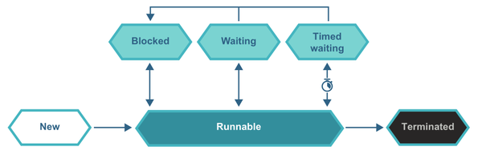

### What is atomicity?
<details><summary>Show answer</summary>

An operation is **atomic** when it happens in one step — no other thread can see it half-done.

Applied to a single operation, this is what mutual exclusion gives you:
the operation is indivisible, so a reader gets either the before or the after, never a mix.

</details>

### When does atomicity break?
<details><summary>Show answer</summary>

Two ways — the operation is too many steps, or the type is too wide to move in one:

- **The operation is multi-step** — a [read-modify-write like `i++`](#which-operation-isnt-atomic-on-its-own)
  is three steps, so two threads interleave them and one update is lost.
- **Several fields must change together** — the object goes from one good state to another,
  but a thread can read it mid-change and see a mix that never should exist (one field updated, the other not yet).
- **The type is too wide** — [`long` and `double` can be read or written in two halves](#how-do-you-make-reads-and-writes-atomic),
  so a reader can catch a mix of old and new even on a single read or write.

</details>

### Which operation isn't atomic on its own?
<details><summary>Show answer</summary>

Any **read-modify-write** — read the value, change it, write it back.
`i++`, `i--`, `i += 1`, `x = x + 1` are all this shape.
Each is three steps, so two threads can read the same value, both change it, and both write back — one update is lost.

Making the type atomic does not help: `volatile int` fixes visibility but the three steps can still interleave.
Use an atomic type instead, whose increment is one indivisible step:

```java
AtomicInteger count = new AtomicInteger();
count.incrementAndGet();   // read-modify-write done atomically
```

</details>

### How do you make reads and writes atomic?
<details><summary>Show answer</summary>

Most types are already atomic — a single read or write of any type
**except** `long` and `double` cannot be seen half-done, even without synchronization.

`long` and `double` are 64-bit and may be read or written in two halves, so a reader can catch a mix of old and new.
To make those atomic, guard them with synchronization or declare them `volatile`.

</details>

### What is synchronization?
<details><summary>Show answer</summary>

The `synchronized` keyword lets only one thread run a method or block at a time. 
A thread must take the lock to enter; others wait until it leaves.

Two forms:

```java
synchronized void update() { ... }        // locks on `this` for the whole method

void update() {
  synchronized (lock) { ... }             // locks on a chosen object, for just this block
}
```

The method form locks on the object itself; 
the block form locks on whatever object you name, and guards only the lines inside.

</details>

### What does synchronization guarantee?
<details><summary>Show answer</summary>

- **Mutual exclusion** — one thread at a time, so no thread sees the object half-changed while another is writing it.
  Applied to a single operation, this is atomicity.
- **Visibility** — a thread taking the lock sees every earlier change made under that same lock. 
  Without it, one thread's writes may never reach another.

Synchronization is not only for keeping threads apart, it is also how one thread's changes reliably reach another.

</details>

### Which problems need synchronization?
<details><summary>Show answer</summary>

Three situations where a lock is the fix:

- **Read-modify-write on shared data** — `i++`, or check-then-act. Two threads interleave the steps and one
  update is lost. The whole action must be indivisible, so you lock it. *(atomicity)*
- **A write that never reaches another thread** — one thread writes, another keeps reading a stale copy forever.
  The lock forces the write out and makes the reader pick it up. *(visibility)*
- **A multi-step change across several fields** — the object must move from one good state to another with no
  thread seeing the middle. More than one variable, so an atomic type can't cover it — you lock the whole change.
  *(atomicity across a block)*

</details>

### What does visibility mean?
<details><summary>Show answer</summary>

That a change one thread makes to shared data reliably reaches another thread. 
Without it, one thread writes a field and another keeps reading the old value — no error, no crash, just a stale read.

The reason is hardware. Threads run on different cores at the same moment, and each core keeps its own **cache**
of the data it works on, for speed. When thread A writes a field, that write can sit in A's core cache and never
reach main memory. Thread B, reading from its own cache or from main memory, sees the old value — A's change is
simply not visible to it yet.

```java
// A, on one core:            flag = true;   // may stay in A's cache
// B, on another core:        while (!flag) { }   // reads its own stale copy — can loop forever
```

So "visibility" is a memory-propagation guarantee: it forces A's write out to main memory and makes B read the
fresh value, instead of each core trusting its own cached copy.

Handle: visibility means a write actually crosses from one thread to another — needed because each core caches
its own copy and a write may never leave that cache on its own.

</details>

### What does a lock do to memory on entry and exit?
<details><summary>Show answer</summary>

A synchronized block is a memory checkpoint on both ends:

- **On acquire** (entering) — the thread refreshes its view from main memory, so it starts the section seeing the
  latest values, not its stale cached copy.
- **On release** (exiting) — every change the thread made is flushed out to main memory before the lock is let
  go, so it is there for the next thread.

```java
synchronized (lock) {   // acquire: read fresh state IN from main memory
  balance += amount;    // work on up-to-date values
}                       // release: flush changes OUT to main memory before unlocking
```

So the lock does two memory jobs, not just mutual exclusion: re-read in on the way in, write-back out on the way
out. That pairing is what carries one thread's changes to the next.

Handle: acquire pulls the latest view in, release pushes your changes out — a synchronized block refreshes on
entry and flushes on exit.

</details>

### How to guarantee visibility with a lock?
<details><summary>Show answer</summary>

Both threads must use the **same** lock. The visibility guarantee is a pairing rule: releasing a lock is
guaranteed visible only to a thread that later acquires that same lock. Different locks give no such promise.

Walk it through. Thread A writes under lock `L`, thread B reads under lock `M`:

```java
// Thread A
synchronized (L) { data = 42; }   // flush happens on releasing L

// Thread B
synchronized (M) { read(data); }  // acquires a DIFFERENT lock
```

Mechanically, releasing *any* lock flushes A's cache toward main memory, and acquiring *any* lock refreshes B's
view — so it may *look* like B should see `42`. But the memory model only draws its "this-happened-before-that"
line between an unlock and the next lock **of the same monitor**. A released `L`; B acquired `M`; no line
connects them. Without that line, the compiler and CPU are free to reorder and cache in ways that let B read the
old value.

The danger is the failure mode: with different locks it is not *guaranteed to fail* — it is *unspecified*. It
often works in testing and then reads stale in production, intermittently. That is worse than an obvious bug.

Fix: both threads synchronize on the same lock, so the release-then-acquire pairing draws the line and B is
guaranteed to see A's write:

```java
synchronized (L) { data = 42; }   // A
synchronized (L) { read(data); }  // B — same lock, guaranteed to see 42
```

Handle: visibility is guaranteed only across the *same* lock — different locks each touch memory but with no
ordering promise between them, so the read may be stale.

</details>

### What does volatile guarantee?
<details><summary>Show answer</summary>

Visibility on a single field, without any lock:

- Every **read** re-reads the value from main memory before use — never a stale cached copy.
- Every **write** is flushed to main memory before the instruction completes — so other threads can see it.

Two separate things can otherwise make a change invisible, and `volatile` blocks both: a write sitting in one
core's cache and never reaching another core (caching), and the compiler or CPU reordering independent writes so
they land in a different order than written (reordering). `volatile` forces the fresh read/write *and* stops
reordering across the access.

It is the same visibility mechanism as a synchronized block's entry and exit, but applied to one access instead
of a whole block, and with no mutual exclusion. Works on object references and primitives alike.

Handle: `volatile` = always-fresh reads and always-published writes on one field, with no reordering across it —
the visibility half of a lock, without the lock.

</details>

### volatile vs synchronized?
<details><summary>Show answer</summary>

- **volatile** — one operation (a single read *or* a single write), flushed to memory, no lock. Gives visibility
  only.
- **synchronized** — a whole block of many reads and writes, held under a lock as one indivisible unit, flushed
  on exit. Gives visibility *and* mutual exclusion.

The common "volatile is a tiny synchronized block" line is misleading: there is no lock in `volatile`, so it
cannot make a group of operations indivisible — it only makes each single access fresh.

Handle: `volatile` publishes one access; `synchronized` locks a whole block. Visibility both, mutual exclusion
only `synchronized`.

</details>

### When is volatile safe to use?
<details><summary>Show answer</summary>

Only when a write does **not** depend on the field's current value. `volatile` guarantees one operation is fresh
— a single read or a single write — but nothing more.

`i++` is the classic broken case. It looks like one step but is three: read `i`, add 1, write `i` back. `volatile`
makes each read and write fresh, but another thread can slip in between the read and the write, and one update is
lost:

```java
volatile int count;
count++;          // read-modify-write: NOT atomic, updates still lost
```

Safe uses are writes that don't read the old value — a status flag, a one-way switch, publishing a reference:

```java
volatile boolean running = true;   // one thread sets false, others see it — no dependence on old value
```

When the new value depends on the old, you need a lock or an atomic type (`AtomicInteger`), not `volatile`.

Handle: `volatile` is safe when the write ignores the current value; the moment it's read-modify-write (`i++`,
check-then-act), it's a lock or an atomic, not `volatile`.

</details>

### Can volatile deadlock?
<details><summary>Show answer</summary>

No. `volatile` uses no lock, and a deadlock needs threads holding and waiting on locks. With no lock, none of the
deadlock conditions can arise — only `synchronized` (or explicit locks) can deadlock.

Handle: no lock, no deadlock — `volatile` can't deadlock because there's nothing to hold or wait for.

</details>

### How does one volatile field publish the others?
<details><summary>Show answer</summary>

A `volatile` write carries the plain writes made before it. Marking one flag `volatile` makes the ordinary fields
written before it visible too — you don't have to mark them all.

The setup: two writes, a reader gated on the flag.

```java
int counter = 0;            // plain
volatile boolean ready;     // one volatile flag

void write() {
  counter = 42;             // plain write
  ready = true;             // volatile write — the barrier
}
void read() {
  if (ready)                // volatile read
    System.out.println(counter);   // guaranteed to see 42, never 0
}
```

Without `volatile`, `read()` can print `0` for two independent reasons: `counter = 42` may sit in the writer's
cache (caching), or the CPU/compiler may reorder the two writes so `ready = true` lands first (reordering) — the
reader sees `ready` true while `counter` is still `0`.

The `volatile` write inserts a **memory barrier** that fixes both:

- **No reordering across it** — `counter = 42` cannot move after `ready = true`; the plain write provably happens
  first.
- **Flush everything before it** — writing `ready` pushes *all* prior writes, `counter` included, out to main
  memory. Reading `ready` refreshes the reader's whole view from main memory.

So once the reader sees `ready == true`, `counter = 42` provably happened before it and was published with it —
`ready == true` with `counter == 0` is impossible. This is the **happens-before** rule: a volatile write
happens-before a later read of that same field, and everything the writer did before the write becomes visible to
the reader after the read.

Handle: a volatile write is a one-way gate — it flushes and orders every plain write before it, so one volatile
flag publishes the fields it guards.

</details>

### Volatile guarantees visibility — so mark all fields volatile?
<details><summary>Show answer</summary>

No, on two counts.

**It wouldn't make the class safe.** `volatile` only makes each single read and each single write fresh. It does
nothing for compound actions — `count++`, or an invariant spanning two fields. Marking every field `volatile`
leaves every read-modify-write and every multi-field update still broken:

```java
volatile int count;
count++;            // still a lost update — three steps, not one
```

**It costs on every access.** A plain field can be read from a register or a core cache. A `volatile` field forces
a fresh read from main memory on every read and a flush on every write — a memory barrier each time. Making all
fields `volatile` pays that on every access, whether or not the field is shared.

Use `volatile` only on the specific field that needs cross-thread visibility with no dependence on its old value —
a flag, a published reference. For anything else, a lock or an atomic type.

Handle: `volatile` everywhere buys neither safety (compound actions still break) nor speed (a barrier per access)
— it's a targeted tool for one flag, not a blanket setting.

</details>

### Where does a synchronized method's lock live?
<details><summary>Show answer</summary>

Not in the bytecode. A synchronized *block* compiles to explicit `monitorenter` / `monitorexit` opcodes. A
synchronized *method* has none of those — the modifier becomes a flag on the method, `ACC_SYNCHRONIZED`, in the
method's metadata.

```text
// synchronized block:   monitorenter ... monitorexit  (visible opcodes)
// synchronized method:  no monitor opcodes — flag ACC_SYNCHRONIZED on the method
```

When the interpreter runs an `invoke`, it checks that flag first: if set, it takes a different path that acquires
the lock before the body; if not, it just runs the body. Same lock, same effect as wrapping the whole body in
`synchronized(this)` — the mechanism is just recorded as a flag instead of opcodes.

Handle: a synchronized method carries no monitor opcodes — it's the `ACC_SYNCHRONIZED` flag, checked by the
interpreter at call time.

</details>

### Does volatile show up in bytecode?
<details><summary>Show answer</summary>

No. `volatile` appears only in the field's definition — the accesses use the ordinary `getfield` / `putfield`
opcodes, exactly like a plain field.

```text
// putfield #2   // Field shutdown:Z   — same opcode whether or not it's volatile
```

The difference is in the interpreter: `getfield`/`putfield` take a separate code path for a volatile field —
reading and writing straight to main memory instead of trusting the cache, and adding the memory barrier. So the
volatile behavior is real, it's just not visible in the opcode stream — only in the field flag the opcode acts on.

Handle: `volatile` is invisible in the opcodes — same `getfield`/`putfield` as a plain field; the interpreter
takes a different path based on the field's flag.

</details>

### Are reads safe without synchronization?
<details><summary>Show answer</summary>

No — this is the common beginner error ("only writes need locking; reads are safe"). An unsynchronized read can
catch the object *between* two writes and return a value that never truly existed.

Take a withdraw that debits the amount, then applies a fee — two separate writes to `balance`:

```java
synchronized (this) {
  balance = balance - amount;              // write 1
  if (withFee) balance = balance - fee;    // write 2
}
```

An unsynchronized `getBalance()` can run *between* write 1 and write 2 — it reads the balance with the amount
taken out but the fee not yet applied. That is a **nonrepeatable read**: a value that matches no real, settled
state of the account, like reading partway through a database transaction.

The read must take the same lock too. Synchronizing only the writes leaves the reader free to see a half-finished
change.

Handle: reads need the lock as much as writes — an unsynchronized read can land mid-change and return a state
that never really existed.

</details>

### Which tool gives atomicity, and when?
<details><summary>Show answer</summary>

Each problem has its own light tool; the synchronized block is the fallback, not the first choice:

- **Single read/write of a wide type** — a `long` or `double` can be torn in halves. Reach for `volatile`.
- **Read-modify-write on one variable** — `i++`, check-then-act. Reach for an atomic type like `AtomicInteger`.
- **Check-then-act on a collection** — get-then-put, "add only if absent". A concurrent collection folds it into
  one atomic call like `putIfAbsent` or `computeIfAbsent`.

A synchronized block can solve all of these too, but on such a small, isolated problem it's too heavy —
it holds other threads back for something a lighter tool covers for free.

Where it has no alternative:

- **A multi-step change across several fields** — the object must move from one good state to another with no
  thread seeing the middle. More than one variable, so no atomic type reaches it. Only a synchronized block makes
  the whole change indivisible.

</details>

### Synchronization — what must you take care of?
<details><summary>Show answer</summary>

- **Right tool** — for one wide read/write or one read-modify-write,
  [a lighter tool does the job](#which-tool-gives-atomicity-and-when); 
  a synchronized block there is too heavy.
- **Correctness** — never call code you don't control from inside the lock, or it can
  [deadlock or corrupt state](../3_Liveness_Performance_Testing/3.1_Liveness_Problems.md#synchronized-block--how-to-avoid-liveness-problems).
- **Performance** — 
  - every other thread [waits while you hold the lock](../3_Liveness_Performance_Testing/3.2_Performance_&_Scalability.md#what-does-synchronization-cost-in-performance),
  - so [keep the guarded part small](../3_Liveness_Performance_Testing/3.2_Performance_&_Scalability.md#reducing-synchronizations-performance-cost).

</details>

### What happens when a thread re-takes its own lock?
<details><summary>Show answer</summary>

It succeeds — the thread already owns the lock, so taking it again is free and it doesn't block.

This comes up when a thread holds the lock and, still inside the guarded region, calls a method that takes the
same lock — a synchronized method calling another synchronized method on the same object. The second take would
block forever if the thread had to wait for a lock it itself holds.

A lock that lets the same thread take it again is a **reentrant** lock. Java's `synchronized` locks are reentrant.

</details>

### Why is reentrancy useful?
<details><summary>Show answer</summary>

It stops a thread from deadlocking against itself. A synchronized method that calls another synchronized method
on the same object would otherwise block forever — waiting for a lock it already holds.

```java
class Counter {
  private int count;
  synchronized void incrementBy(int n) {
    for (int i = 0; i < n; i++)
      increment();          // takes the same lock this thread already holds
  }
  synchronized void increment() {
    count++;
  }
}
```

`incrementBy` holds the lock, then calls `increment`, which takes the same lock. Reentrancy lets the second take
succeed; without it the thread would freeze against itself. This pattern is common in object-oriented code, so
reentrancy is what makes locks usable there at all.

</details>


### What can and cannot hold a lock?
<details><summary>Show answer</summary>

Only an object — every object has an intrinsic lock (its monitor). 
A primitive has no monitor, so `synchronized(anInt)` does not compile.

</details>

### Locking an array and its elements?
<details><summary>Show answer</summary>

No. The array is one object with its own monitor. 
Locking it locks the array, not the objects it holds — each element has its own separate monitor.

</details>

### What is a synchronized method equivalent to?
<details><summary>Show answer</summary>

```java
synchronized void update() {
  // body
}
```

is equivalent to:

```java
void update() {
  synchronized (this) {
    // body
  }
}
```

Same lock (`this`), same scope. Behaves the same, but the two compile to different bytecode.

</details>

### What does a static synchronized method lock?
<details><summary>Show answer</summary>

```java
static synchronized void update() {
  // body
}
```

is equivalent to:

```java
static void update() {
  synchronized (MyClass.class) {
    // body
  }
}
```

The `Class` object — there is no instance to lock on, so the lock is on `MyClass.class`.

</details>

### How to lock on a Class object?
<details><summary>Show answer</summary>

Lock on `Foo.class`, and be careful choosing between `Foo.class` and `getClass()` — 
they lock different objects in a subclass.

```java
class Base {
  void f() {
    synchronized (Base.class) { ... }   // always the same lock, every instance
  }
  void g() {
    synchronized (getClass()) { ... }   // the runtime class: Base for a Base, Sub for a Sub
  }
}
class Sub extends Base { }
```

`Base.class` is fixed at compile time — every instance locks the same object. `getClass()` returns the runtime
class, so a `Sub` instance locks `Sub.class` while a `Base` instance locks `Base.class` — two different locks
for the same method. A `Base` and a `Sub` running `g()` do not exclude each other.

Handle: `getClass()` splits the lock per subclass; `Foo.class` keeps one lock for all. Pick `Foo.class` unless
you deliberately want each subclass to lock separately.

</details>

### synchronized and inheritance?
<details><summary>Show answer</summary>

`synchronized` is part of the method body, not the method's contract — it does not inherit and is invisible to callers.

- Parent synchronized, child does not override → inherited as-is, stays synchronized.
- Parent synchronized, child overrides without the keyword → the override is **not** synchronized. 
  The lock is silently dropped, no warning.
- Parent plain, child adds `synchronized` → legal, but a caller using a parent-typed reference cannot know or
  rely on it.

Handle: a subclass can silently drop a superclass's locking, so put thread-safety in documented policy or a
private lock, never in a keyword the override can leave off.

</details>

### synchronized in an inner class?
<details><summary>Show answer</summary>

It locks the inner instance, not the outer one — they are two separate objects with two separate monitors.

```java
class Outer {
  synchronized void a() { ... }        // locks the Outer instance

  class Inner {
    synchronized void b() { ... }      // locks the Inner instance, NOT Outer.this
  }
}
```

The inner object holds a hidden reference to `Outer.this`, but that reference is not the lock. 
`a()` and `b()` lock different monitors, so one thread in `a()` does not block another thread in `b()`.

Handle: an inner instance is its own object with its own lock — 
to guard outer state from inside, lock `Outer.this` explicitly, not the inner method.

</details>

### synchronized on an interface method?
<details><summary>Show answer</summary>

Not allowed. `synchronized` is not part of the method signature — it's an implementation detail of a body — 
so it cannot appear on a method declaration in an interface. The implementing class decides its own locking.

</details>

### The state model of a Java thread?
<details><summary>Show answer</summary>

Six states in `Thread.State`, a layer over the OS view:

- **NEW** — object created, no OS thread yet. `start()` signals the OS to make one.
- **RUNNABLE** — the whole scheduling cycle: waiting in the run queue, running on a core, placed back. 
  Not the same as "running right now."
- **WAITING** — stepped off the core voluntarily via `wait()`, indefinitely, until `notify()`.
- **TIMED_WAITING** — stepped off voluntarily via `sleep()`, until a timer expires.
- **BLOCKED** — forced off: waiting for a lock another thread holds, or on I/O.
- **TERMINATED** — the OS thread has ceased.



Spine: 
- NEW (no OS thread) → 
- RUNNABLE (in the queue or on a core) → 
- leave the core three ways — two voluntary (`wait()`, `sleep()`), 
- one forced (`BLOCKED` on a lock or I/O) → 
- TERMINATED.

</details>

### The NEW thread state?
<details><summary>Show answer</summary>

Object created, but no OS thread exists yet — and may never. 
`start()` is what signals the OS to create the execution thread.

</details>

### The RUNNABLE thread state?
<details><summary>Show answer</summary>

Not "running on a core." 
It covers the whole scheduling cycle: 
- waiting in the run queue, 
- running, and 
- being placed back to await the next time slice. 


A RUNNABLE thread may not be executing right now.

</details>

### WAITING vs TIMED_WAITING?
<details><summary>Show answer</summary>

Both step off the core voluntarily; they differ in what wakes them.

- **WAITING** — `Object.wait()`, waits indefinitely, wakes only on `notify()` from another thread.
- **TIMED_WAITING** — `Thread.sleep()`, the OS sets a timer, wakes on its own when the timer expires.

Handle: WAITING needs another thread to wake it; TIMED_WAITING wakes itself on a clock.

</details>

### The BLOCKED thread state?
<details><summary>Show answer</summary>

Forced off the core, not voluntary: the thread wants a lock another thread holds, or is waiting on I/O. 
It did not choose to step off — it is stuck on something external.

</details>

### The TERMINATED thread state?
<details><summary>Show answer</summary>

The OS thread behind the Java `Thread` object has ceased execution. The object is done; it cannot run again.

</details>

### What are the ways for a thread off the core?
<details><summary>Show answer</summary>

Two voluntary, one forced.

- **Voluntary** — the thread chooses to step off: `wait()` → WAITING, `sleep()` → TIMED_WAITING.
- **Forced** — the thread is stuck on something external: waiting for a lock or on I/O → BLOCKED.

Handle: WAITING and TIMED_WAITING are the thread choosing to leave; BLOCKED is the thread forced to wait.

</details>

### Why can't you safely force-stop a thread?
<details><summary>Show answer</summary>

Because only the thread itself knows when it is safe to stop. From outside, you cannot know where it is in its
code — it may be mid-update, holding a lock, inside a `finally` that must finish. Killing it there leaves objects
half-changed and locks released over broken state.

So Java has no safe force-stop. The only safe model is **cooperative**: you *ask* the thread to stop (interrupt),
and the thread checks for that request at points where it knows stopping is safe, and winds down itself.

Spine: outside code can't know a thread's safe stopping points, so stopping is a request the thread honors, not a
command — everything else here (the interrupt flag, its traps, the deprecated `stop`/`suspend`) follows from that.

</details>

### Does interrupt() stop a thread?
<details><summary>Show answer</summary>

No. `interrupt()` only sets a flag on the thread. It does not stop it, pause it, or throw anything on its own. The
thread keeps running unless its own code checks the flag and decides to stop.

```java
var t = new Thread(() -> { while (true); });  // never checks the flag
t.start();
t.interrupt();   // sets the flag — ignored
t.join();        // blocks forever; the loop runs on
```

Two ways a thread notices: it checks the flag itself (`Thread.interrupted()` / `isInterrupted()`), or it calls a
blocking method (`sleep`, `wait`, `join`, blocking I/O) that checks the flag and throws `InterruptedException`.
The busy `while(true)` does neither, so it never stops:

```java
var t = new Thread(() -> { while (!Thread.interrupted()); });  // now checks — exits on interrupt
```

Handle: `interrupt()` is a request, not a kill — it sets a flag that only the thread's own checks can act on.

</details>

### interrupted() vs isInterrupted()?
<details><summary>Show answer</summary>

Both read the interrupt flag; they differ in whether they clear it.

- **`Thread.interrupted()`** — static, checks the *current* thread, and **clears** the flag as it reads it.
- **`isInterrupted()`** — instance method on a thread, checks it and **leaves it set**.

The trap: throwing `InterruptedException` also clears the flag — it's considered handled once thrown. So after
catching it, the flag is already gone:

```java
try {
  Thread.sleep(1000);
} catch (InterruptedException e) {
  // interrupt flag is now FALSE here — cleared by the throw
}
if (Thread.currentThread().isInterrupted()) { ... }   // won't fire — flag was cleared
```

Handle: `interrupted()` clears, `isInterrupted()` doesn't, and catching `InterruptedException` clears too — so
after the catch the thread no longer looks interrupted.

</details>

### What to do in an InterruptedException catch?
<details><summary>Show answer</summary>

Don't swallow it. Catching `InterruptedException` clears the interrupt flag, so if you catch and do nothing, code
higher up the stack can never tell the thread was interrupted — the stop request is lost.

Two correct responses:

- **Let it propagate** — declare `throws InterruptedException` and let the caller handle it. Best when you can.
- **Restore the flag** — if you must catch here, re-set the flag so callers still see the request:

```java
try {
  Thread.sleep(1000);
} catch (InterruptedException e) {
  Thread.currentThread().interrupt();   // restore the flag you just cleared
  // then stop your own work / return
}
```

The anti-pattern is an empty catch or one that only logs: it eats the interrupt and the thread keeps running as if
never asked to stop.

Handle: catching `InterruptedException` clears the flag — rethrow it, or restore it with
`Thread.currentThread().interrupt()`, never swallow it.

</details>

### Why are stop() and suspend() unsafe?
<details><summary>Show answer</summary>

Both are deprecated because they break other threads' safety, not just their own.

- **`stop()`** — kills the thread by throwing a `ThreadDeath` at whatever point it happens to be. That can be
  mid-update or inside a `finally` the developer assumed would finish. The stack unwinds and **all its locks are
  released**, exposing half-changed objects to every other thread. You cannot guard against it. The object is left
  corrupt.
- **`suspend()`** — freezes the thread **while it still holds its locks**. Any other thread that needs one of those
  locks blocks forever until the suspended thread is resumed — a liveness hazard (and an easy deadlock).

The safe replacement is cooperative interruption: ask the thread to stop and let it wind down at a point it knows
is safe.

Handle: `stop()` unlocks over broken state, `suspend()` freezes while holding locks — both hand other threads a
damaged or blocked world; use interruption instead.

</details>

### What happens to an exception in a thread?
<details><summary>Show answer</summary>

It dies with the thread, silently. An exception thrown from a `Runnable` ends that thread, but no other thread is
told — the rest of the program runs on unaware the worker crashed.

To observe it, set an uncaught-exception handler **before** starting the thread:

```java
var t = new Thread(() -> { throw new UnsupportedOperationException(); });
t.setUncaughtExceptionHandler((thread, e) ->
  System.err.println(thread.getName() + " died: " + e));
t.start();
```

The handler is a callback the JVM invokes when the thread dies from an uncaught exception — a thread pool uses it
to notice a dead worker and start a replacement. (Any exception thrown *inside* the handler is ignored by the
JVM.) Configure thread properties like name, daemon status, and this handler before `start()`, not after — some
throw once the thread is running.

Handle: an uncaught exception kills its thread quietly — set an uncaught-exception handler before `start()` to see
it, or the crash is invisible.

</details>