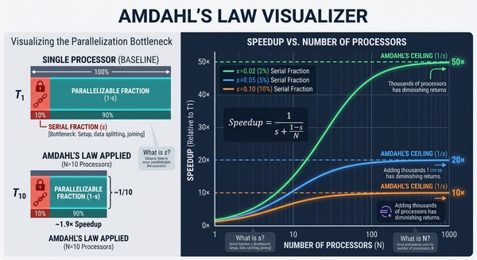

### Sequenced and splittable 60-minute task, 1000 processors — how fast?
<details><summary>Show answer</summary>

Naive guess: 1000 processors → 60 min / 1000 = 3.6 seconds. Wrong.

Splitting is not free. One part of the job stays serial — dividing the work up and joining the results back —
and no number of processors touches it. Call that serial fraction `s`. With a typical `s = 5%`, speedup can't
pass `1 / s = 20×`, so the time can't drop below 60 min / 20 = **3 minutes**.


That 3 minutes is a floor you approach, not a value you reach — it's the limit as the processor count grows very large. 
At 1000 processors you're already ~98% of the way to it, which is why adding more barely helps: 
the curve has flattened against the wall.


This is [Amdahl's law](#what-is-amdahls-law): speedup is capped at `1/s`, whatever the processor count.

</details>

### What is Amdahl's law?
<details><summary>Show answer</summary>

A model that calculates the theoretical maximum speedup of a task using multiple processors.

**Key insight:** every task has a "serial fraction" `s` (bottleneck work like data setup, coordination) that 
*cannot* be split. This sequential part takes the same absolute time, no matter how many parallel processors you add.

**Diminishing returns:** because that serial part always costs time, it creates an unavoidable ceiling.
- Rule of thumb: maximum speedup is `1 / s`.
- Example: if 5% of your work is sequential (`s = 0.05`), your speedup is capped at `1 / 0.05 = 20×`, even with
  thousands of processors.

**Speedup formula (S):** where `N` is the number of processors: `S = 1 / (s + (1 - s)/N)`.

As `N` grows, the right term `(1 - s)/N` becomes very small, making the curve flatten as it converges on the `1/s`
maximum.



This figure has two parts. The left panel shows a 10% serial part acting as a fixed floor:
with `N = 10` processors the parallel 90% shrinks by ~10× but the serial 10% doesn't move, 
so the whole job speeds up only ~1.9×, not 10×. 

The right graph plots speedup against processor count for three serial fractions (`s = 2%, 5%, 10%`): 
each curve rises, then flattens against its own `1/s` ceiling (50×, 20×, 10×) — past that point, 
adding thousands more processors buys almost nothing.

</details>

### Estimating speedup — what to keep in mind?
<details><summary>Show answer</summary>

The model is optimistic; reality is worse.

**The model (Amdahl):** it only counts the serial part, so its curve rises and *flattens* against `1/s`. It
assumes coordination between processors is free.

**Reality:** it isn't. The more processors you add, the more they must talk to each other to stay consistent
(locks, cache coherence, shared-state sync), and that cost grows with N. Past some point it outweighs the gain
from one more processor, so throughput **peaks and then declines** — adding processors makes the system slower,
not just no faster.

Handle: treat `1/s` as a ceiling you'll never quite reach, not a promise — real coordination cost bends the curve
back down. (The model that adds this crosstalk term: the Universal Scalability Law, USL.)

</details>

### What does synchronization cost in performance?
<details><summary>Show answer</summary>

Not what most people guess. The cost is **not** the CPU time to acquire the lock — that part is cheap on modern
JVMs. The real cost of holding locks more than you need — **oversynchronization** — is:

- **Lost parallelism.** While one thread holds the lock, every other thread that wants it sits idle. 
  On a multicore machine that's cores doing nothing — the whole point of multiple cores lost.
- **Context-switch overhead.** When threads fight for the lock and lose, the OS suspends them and later wakes them. 
  Putting a thread to sleep and waking it back up wastes thousands to tens of thousands of cycles.
- **Cache/memory-consistency traffic.** A lock forces every core to agree on one view of memory.
  To achieve this, cores must flush their lightning-fast local caches back to main memory and invalidate them 
  so others see the updated state, which is incredibly slow.
- **The VM can't optimize.** Synchronized code limits the reorderings and optimizations the JVM would otherwise apply, 
  so the code itself runs slower.

So the price isn't getting the lock — it's **contention**: 
threads competing for it, and the heavy coordination the lock forces underneath.

</details>

### What is false sharing, and how do you prevent it?
<details><summary>Show answer</summary>

CPUs don't move memory one variable at a time — they move fixed blocks called **cache lines** (usually 64 bytes).
When a core writes any byte in a line, every other core's copy of that whole line goes stale and must be re-fetched.

False sharing: two *unrelated* variables land in the same line. Thread A only writes `successfulRequests`, 
Thread B only writes `failedRequests` — no shared lock, no shared data — but they sit in one line, 
so each write invalidates the other core's copy. The line bounces between cores on every write and both threads crawl. 
The sharing is accidental (same line), not real (same data), and there's not a lock in sight.

Fix: give each hot field its own line. Java's `@Contended` pads a field with dead space so it can't share a line:

```java
public class Metrics {
  @jdk.internal.vm.annotation.Contended   // own cache line
  public volatile long successfulRequests;

  @jdk.internal.vm.annotation.Contended   // separate line — writes stop colliding
  public volatile long failedRequests;
}
```

But `@Contended` is JDK-internal: it needs the `-XX:-RestrictContended` flag (and `--add-exports` on Java 9+) to
work in your own code, so in practice you rarely apply it by hand — you use a structure that already did, like
`LongAdder` instead of a contended `AtomicLong`.

Handle: no lock and no shared data can still mean contention — hardware shares memory by the line, not the variable.

</details>

### How does a lock slow threads down?
<details><summary>Show answer</summary>

Four threads each need to update the same shared counter, guarded by one lock. Each update takes 10ms.

- Thread A takes the lock, works 10ms, releases. B, C, D wait.
- Thread B takes it, works 10ms, releases. C, D still waiting.
- Then C. Then D.

Total: **40ms**, run one after another — even though four cores were free the whole time. The lock forced the work
to be serial: only one thread inside at a time, so three cores sat idle waiting their turn.

Without the shared lock, the four could run at once and finish in **10ms**. The 30ms difference is the cost — not
CPU spent on the lock itself, but parallelism thrown away because threads had to line up for it.

</details>

### What work doesn't belong inside a lock?
<details><summary>Show answer</summary>

Do as little as possible while holding the lock: take it, touch the shared state, release it. 
Move anything slow — I/O, a long computation — outside the block.

While you hold the lock, every other thread that wants it waits. The less you do inside, the shorter that wait,
and the more threads get through.

</details>

### What techniques give higher concurrency under a lock?
<details><summary>Show answer</summary>

- **Lock splitting** — one lock guarding unrelated state becomes two locks, 
  so operations on different state don't block each other.
- **Lock striping** — split into many locks by key (e.g., per bucket), 
  so threads touching different segments run at once.
- **Read-Write Locks** — split locks by operation type. Multiple threads can read data simultaneously; 
  only write operations require an exclusive, blocking lock.
- **Optimistic Locking** — read state without blocking at all, 
  but verify the data hasn't been modified by another thread before applying your update.
- **Nonblocking concurrency** — while technically not a lock, this is a real solution that eliminates locking entirely. 
  It uses hardware-level atomic operations (like Compare-And-Swap) that retry instead of waiting.

The shared idea: replace a single coarse, exclusive lock with finer-grained control, access-based rules, 
or lock-free atomics so threads rarely wait on each other.

</details>

### What must be considered when splitting locks for performance?
<details><summary>Show answer</summary>

When you split a single coarse lock into multiple finer-grained locks, you are trading simplicity for concurrency.

- **The Benefit (Performance):** It increases throughput. By using separate locks for independent state, threads
  no longer wait on each other unnecessarily, allowing higher concurrency.
- [**The Risk (Liveness):**](5.1_Liveness_Problems.md#fix-one-coarse-lock) It introduces deadlock risks. 
  If a thread ever needs to acquire multiple locks at the same time to perform a combined operation, 
  you risk a "hold-and-wait" scenario where threads block each other indefinitely.

Resolving the liveness risk: If lock splitting causes deadlocks, reverting to a single coarse lock is one option
to guarantee liveness (as it makes hold-and-wait impossible). However, this is rarely the best option because it
destroys the performance gains you split the lock to achieve in the first place.

</details>

### Locking and unlocking inside a loop?
<details><summary>Show answer</summary>

If a thread takes and releases the *same* lock on every iteration of a tight loop, 
the JIT may merge them into one lock spanning the whole loop — the opposite of manual lock splitting. 
This is **lock coarsening**.

It does this to kill the per-iteration acquire/release overhead: 
thousands of lock operations collapse into one, with no change to correctness.

What you write — lock taken and released 10,000 times:

```java
public void addValues(int[] values) {
  for (int i = 0; i < values.length; i++) {
    synchronized (this) {   // acquired + released each iteration
      this.total += values[i];
    }
  }
}
```

What the JIT runs — lock hoisted outside the loop, taken once:

```java
public void addValues(int[] values) {
  synchronized (this) {     // acquired once
    for (int i = 0; i < values.length; i++) {
      this.total += values[i];
    }
  }
}
```

Handle: don't fight the JVM's own dynamic tuning with manual micro-optimizations.

</details>

### Should a mutable class synchronize itself?
<details><summary>Show answer</summary>

Two choices when you write a mutable class:

- **No internal synchronization** — leave it to the client to lock from outside if it needs concurrent use.
- **Internal synchronization** — the class locks itself and is thread-safe.

Pick internal only if it buys **significantly more concurrency** than the client locking the whole object would.
If internal sync gives no real gain over a client-side lock, don't build it in — it just adds cost every caller pays, 
even single-threaded ones.

</details>

### When must a class synchronize a static field itself?
<details><summary>Show answer</summary>

Whenever the static field is mutable and accessible by multiple threads.

Why client-side locking fails: A static field acts as global state. Completely unrelated clients calling the
method have no way to coordinate or share a single common lock. Since external callers cannot synchronize with
each other, the class must handle it internally.

</details>

### Should you synchronize a class when unsure?
<details><summary>Show answer</summary>

No. When in doubt, don't synchronize — but **document that the class isn't thread-safe**, so callers know they own
that job. The default is no synchronization: it's cost every caller pays, including the single-threaded common case.

History backs this — [classes that oversynchronized got replaced](#which-classes-were-replaced-for-oversynchronizing).

</details>

### Which classes were replaced for oversynchronizing?
<details><summary>Show answer</summary>

Classes that synchronized every method penalized the majority of use cases (which are single-threaded). 
They were supplanted by unsynchronized versions:

- **`StringBuffer` → `StringBuilder`:** `StringBuffer` locks internally, but string building is almost always
  confined to a single thread. `StringBuilder` is the exact same class without the locks.
- **`Vector` & `Hashtable` → `ArrayList` & `HashMap`:** The original Java collections synchronized every operation. 
  They were replaced by unsynchronized equivalents because single-threaded code paid a massive 
  performance tax for safety it didn't need.

(Note: `java.util.Random` was similarly supplemented by `ThreadLocalRandom`, but to solve a different issue —
eliminating atomic contention when heavily accessed by multiple threads.)

The lesson: Needless synchronization is a tax every caller pays, single-threaded ones included. 
Today, standard utility classes default to no synchronization.

</details>

### How should you size threads to minimize OS scheduler impact?
<details><summary>Show answer</summary>

Keep the average number of *runnable* threads close to the number of processors. 
Then the scheduler has almost no choice — it just runs each runnable thread until it blocks — 
so the program behaves the same under very different scheduling policies.

Runnable is not the same as total. A program can have many threads while few are runnable; 
threads that are waiting don't count. It's the runnable ones competing for CPU that scheduling decisions affect.

</details>

### Sizing pools and tasks for the right thread count?
<details><summary>Show answer</summary>

To keep the runnable thread count close to the optimal processor count, you tune two things:

- **Pool size:** Match the thread count to the hardware and workload type. (e.g., CPU-bound tasks need pools sized
  close to the core count; I/O-bound tasks need larger pools because threads spend more time waiting on external
  systems).
- **Task size:** Keep tasks short enough to allow fair load-balancing across the pool, but large enough that the
  overhead of dispatching the task doesn't outweigh the actual work.

</details>

### Mixing task types in one executor?
<details><summary>Show answer</summary>

It creates a severe risk of pool-induced starvation.

If a single thread pool processes both quick CPU tasks and slow I/O tasks (like database calls), 
a sudden burst of I/O tasks can occupy all available worker threads. 
While those threads sit blocked waiting on the network, the fast CPU tasks are trapped in the queue, 
stalling the entire application.

**The Fix:** Use the bulkhead pattern. 
Always isolate different workload types into their own dedicated thread pools 
(e.g., a small pool sized to the core count for CPU work, and a separate, larger pool for I/O work).

</details>

### Why avoid busy-waiting?
<details><summary>Show answer</summary>

Busy-waiting (looping repeatedly to check a shared value) keeps a thread constantly in the runnable state without
doing actual work. This causes two major problems:

- **CPU Waste:** It burns processor cycles, stealing CPU time from threads that have real work to do.
- **Scheduler Dependence:** It puts you at the mercy of the OS scheduler (e.g., if the busy-waiting thread has
  high priority, it might starve the very thread trying to update the condition).

**The Fix:** Block the thread until signaled. Use built-in coordination like a `BlockingQueue`, `CountDownLatch`,
or standard `wait()`/`notify()`.

</details>

### Fixing threads that don't get enough CPU?
<details><summary>Show answer</summary>

Restructure to reduce the number of concurrently runnable threads — that fixes the cause. Don't patch it with
[`Thread.yield`](#using-threadyield-to-fix-scheduling) or
[thread priorities](#using-thread-priorities-to-fix-scheduling); both only hide the problem, and unportably.

</details>

### Using `Thread.yield` to fix scheduling?
<details><summary>Show answer</summary>

Don't. `Thread.yield()` is merely a hint to the OS scheduler. 
It might help on one JVM, degrade performance on another, or do absolutely nothing.  
Any fix it gives is unportable — fix the runnable-thread count instead..

</details>

### Using thread priorities to fix scheduling?
<details><summary>Show answer</summary>

Thread priorities are among Java's least portable features. 
Fine to tune the responsiveness of an already-working program, sparingly — 
but never to rescue one that barely works: the underlying problem returns until you fix its cause.

</details>
