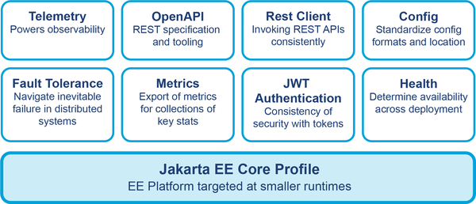

### What governs Java cloud standards?

Show answer

Two standardization efforts sit under the Java cloud stack, split along one axis: **scope of the standard**.

- Broad enterprise baseline → [Jakarta EE in the cloud stack](#where-does-jakarta-ee-sit-in-the-cloud-stack)
- Cloud-native, distributed slice → [MicroProfile in the cloud stack](#where-does-microprofile-sit-in-the-cloud-stack)
- One-axis contrast → [the two compared](#jakarta-ee-vs-microprofile-in-the-cloud)

Trigger: *one big enterprise bundle, one cloud-native decomposition of it.*

### Where does Jakarta EE sit in the cloud stack?

Show answer

It is the broad Enterprise Java standard — a large set of specs for enterprise applications, widely adopted. In the
cloud stack it is the general-purpose enterprise baseline, not a cloud-specific standard; the book treats it as
background and does not cover it in full.

### Where does MicroProfile sit in the cloud stack?

Show answer

It is the standard for distributed systems on a cloud native platform. From version 6.1 it effectively splits
Jakarta EE 10 into related but independent standardized components, so a service picks only the parts it needs.

### Jakarta EE vs MicroProfile in the cloud?

Show answer

Same axis: **how the standard is packaged for a cloud platform.**

|           | Jakarta EE                        | MicroProfile                                  |
|-----------|-----------------------------------|-----------------------------------------------|
| Target    | enterprise applications generally | distributed systems on cloud native platforms |
| Shape     | one broad bundle of specs         | independent components                        |
| Since 6.1 | the source bundle                 | a decomposition of Jakarta EE 10              |

Falls out of one sentence: *MicroProfile is Jakarta EE cut into pieces a cloud service can adopt separately.*

### Structure of the MicroProfile standard

Show answer

### What is the CNCF?

Show answer

The Cloud Native Computing Foundation — a vendor-neutral open source foundation that hosts and governs cloud native
projects (Kubernetes, Prometheus, OpenTelemetry among them).

Why it exists: cloud native tooling is built by companies that compete with each other. Without a neutral owner each
piece would be tied to one vendor's platform, and adopting it would mean locking yourself in. Neutral ownership makes
these projects common infrastructure anyone can use and contribute to — that is what "making cloud native computing
universal" means.

### How is the CNCF Landscape organized?

Show answer

As a set of categories, each covering one concern of running cloud native software. Five key ones, ordered as the
lifecycle of a workload:

1. **Application definition and deployment** — how the app is described and shipped.
2. **Orchestration and management** — how running instances are scheduled and kept alive.
3. **Runtime** — what the container actually executes on (engine, storage, network).
4. **Provisioning** — how the underlying infrastructure and images are prepared.
5. **Observability and analysis** — how the running system is watched.

Trigger: *define it, orchestrate it, run it, provision under it, observe it.*

### Which CNCF projects matter to Java?

Show answer

Three, and they fall out of one axis: **what part of a workload's life they own.**

- Run it → [Kubernetes](#what-is-kubernetes) — orchestrates containers across a cluster.
- Measure it → [Prometheus](#what-is-prometheus) — stores the numbers it emits.
- Ship the measurements → [OpenTelemetry](#what-is-opentelemetry) — collects and transports observability data out
  of the app.

Trigger: *run the app, record its numbers, get the data out.*

### What is Kubernetes?

Show answer

An open source container-orchestration system, often written K8s. It runs a cluster of compute nodes (hosts) so
operators and DevOps teams can deploy, scale, and coordinate distributed applications across that cluster.

Graduated project in CNCF since 2018.

### What is Prometheus?

Show answer

A metrics format plus a time series database that stores metrics data. Entered CNCF as an incubating project in May
2016, graduated in August 2018.

Widely used with Kubernetes applications, helped by strong first-mover advantage — though the metrics field is
changing fast, so its dominance is not fixed.

### What is OpenTelemetry?

Show answer

OTel — a set of standards, formats, and libraries for collecting, aggregating, and transporting observability data
from an application into an observability system. A CNCF project, developed on GitHub.

Deliberately cross-platform, not Java-specific: many projects exist across many languages, and Java is one of the
mature implementations. Still incubating at CNCF, but growing fast and already in production use.

### What does "cloud" mean — which axes?

Show answer

Two, and the word never says which:

- **Who operates the software** — self-host ↔ cloud means vendor-run (SaaS). 
  Here **IaaS is self-hosting**: renting a VM doesn't run the software for you.
- **Whose infrastructure** — your metal ↔ rented metal. Here **IaaS is cloud**: the hardware isn't yours. 

So "is IaaS cloud?" — yes on infrastructure, no on operator. Name the axis first.

Trigger: *cloud names either the operator or the metal.*

### What does cloud cost developers?

Show answer

You lose the hardware itself: what it is, and any way to reach it.

The cloud model is a data centre of identical machines nobody touches — every deployment, update, and investigation
is automated, hands never on the box. 

Trigger: *identical boxes nobody touches means you cannot pick yours, tune it, or reach it.*

This is the first trade-off the move to cloud imposes on Java developers and performance engineers: 
capacity and automation in exchange for control over the machine underneath the JVM.

### Why can't you reach the hardware in cloud?

Show answer

Because a hypervisor is in the way, by design.

Cloud sells one physical machine to many tenants, so no tenant can own it. The way to share it safely is to stop
every guest OS from touching hardware directly and route all access through one mediating layer. That layer is the
hypervisor — and it is the same layer that costs you control over the machine.

Trigger: *many tenants on one box forces a layer between you and it — that layer is virtualization.*

Detail: [what virtualization must satisfy](#what-defines-virtualization),
[what changes for the kernel](#what-changes-for-a-guest-os),
[what it costs you](#who-controls-virtualization-overhead).

### What defines virtualization?

Show answer

Three conditions, and each one exists to protect a different thing:

1. **Fidelity** — programs on a virtualized OS behave essentially as they would on bare metal. Protects correctness.
2. **Mediation** — a hypervisor handles all access to hardware resources; nothing gets through around it. Protects
   isolation.
3. **Low overhead** — the cost of virtualizing must stay a small fraction of execution time. Protects performance.

Trigger: *the guest must not notice, must not escape, must not pay much.*

### What changes for a guest OS?

Show answer

It loses the privilege it normally has.

Unvirtualized (your laptop): the kernel runs in a privileged mode and talks to hardware directly — that is what a
switch into kernel mode buys you.

Virtualized: direct hardware access by the guest OS is forbidden. The stack becomes host OS → hypervisor → guest OS →
your deployment (often containers). The hypervisor is the indirection layer that intercepts what the guest kernel
used to do itself.

### Who controls virtualization overhead?

Show answer

Mostly not you.

On public cloud your target is a virtual machine packaged with a hypervisor, so part of your performance is decided
by a layer you do not run. The old reputation of virtualization as slow is outdated — heavy cloud use has funded a
lot of work on cutting hypervisor overhead.

What you do control: providers offer different VM options, so **choosing the right virtual machine** becomes a real
performance lever for some workloads.

### How are cloud VM types categorized?

Show answer

By **which resource the workload leans on hardest** — providers pre-shape the ratio of CPU, memory, storage, and
accelerators, and you pick the shape that matches your profile.

| Type                       | Leans on           | Typical workload                                                           |
|----------------------------|--------------------|----------------------------------------------------------------------------|
| General purpose            | balanced           | starting point; spans tiny (1 vCPU / 4 GB) to bare metal (64 CPU / 256 GB) |
| Compute optimized          | CPU                | high CPU load                                                              |
| Memory optimized           | RAM                | large in-memory data sets — databases, caches, analytics                   |
| Accelerated computing      | special hardware   | graphics, heavy calculation, generative AI                                 |
| Storage optimized          | local disk I/O     | transactional databases, Spark-style jobs                                  |
| High-performance computing | scale + throughput | complex simulation, deep learning                                          |

Trigger: *start balanced, then name the resource you run out of first.*

Note: even one series spans a wide range — a "general purpose" family can go from a single-vCPU VM up to a bare
metal machine, so the category names a ratio, not a size.

### Which providers offer VM families?

Show answer

The three large public clouds, all with the same category idea under different names:

- **AWS (Amazon EC2)** — the widest option set; also rents **bare metal servers**, not only VMs.
- **Azure** — e.g. D-series for general purpose, L-series for storage optimized.
- **Google Cloud** — a comparable set: general purpose, ultra-high memory, compute intensive, and GPU-backed
  workloads.

Trigger: *same shapes everywhere, different letters.*

### What governs VM choice for a workload?

Show answer

Three goals: **cost, reliability, scalability** — and the VM type is the lever that sets all three at once.

- **Match the shape to the profile.** CPU-intensive work wants a compute-optimized VM, and so on. But the profile is
  a claim, not a fact: **measure it** in a production-like environment before committing, or you size for a guess.
- **You don't have to pick one platform.** Split the system — burst-scale, elastic processes on public cloud; core
  processing on bare metal where you keep mechanical sympathy and predictable performance.

Trigger: *fit the shape, prove it by measurement, and split the system if one shape can't serve both halves.*

