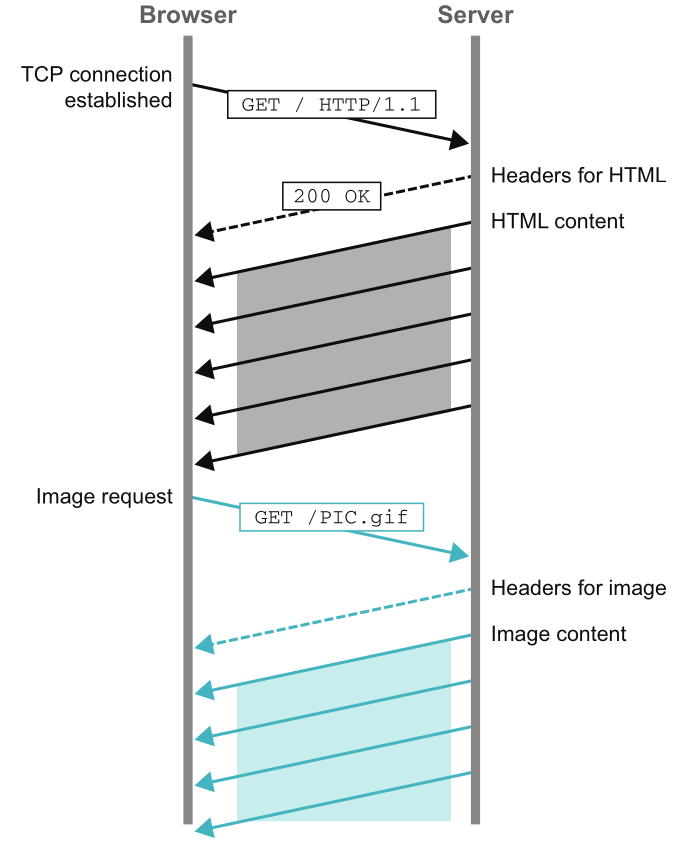
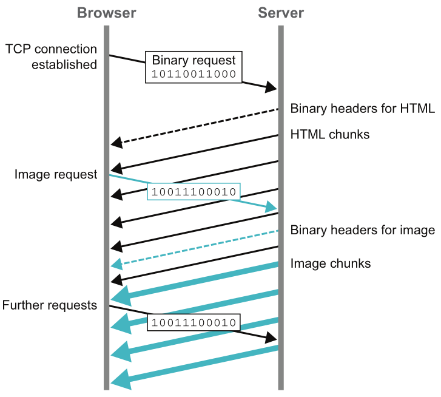

### The Java language description 

Java is 
- a relatively verbose, 
- garbage collected,
- class-based, 
- statically typed, 
- single dispatch, 
- object-oriented language with single implementation inheritance and multiple interface inheritance. 

### Java as the language and as the platform

- The Java language is the human-readable, statically typed, object-oriented language.
- The Java platform - The platform is the software that provides a runtime environment. 
  It’s the JVM that links and executes your code as provided to it in the form of (not human-readable) class files. 
  It doesn’t directly interpret Java language source files but instead requires them 
  to be converted to class files first.

### Java’s strengths

Its ability to build on a few core design decisions, which have proven to be very successful in the marketplace:
- Automatic management of the runtime environment (e.g., garbage collection, just-in-time compilation)
- A simple syntax and relatively few concepts in the core language
- A conservative approach to evolving the language
- Additional functionality and complexity in libraries
- Broad, open ecosystem

### Java weaknesses

### Java specs

One of the big reasons for the success of Java as a software system is that it’s a standard.
This means that it has specifications that describe how it’s supposed to work.
Standardization allows different vendors and project groups to produce implementations that should all,
in theory, work the same way.

Several separate specs govern the Java system - the most important are:
- the Java Language Specification (JLS) and
- the JVM Specification (VMSpec).

This separation is taken very seriously in modern Java;
in fact, the VMSpec no longer makes any reference whatsoever to the JLS directly.

### The full process by which Java code is produced and used

1. Java code starts life as human-readable Java source - `.java` file, 
2. It’s then compiled by `javac` into bytecode - a platform-independent `.class` file. 
3. It's then loaded into a JVM by class loader. 
   It’s common for `.class` classes to be manipulated and altered during the loading process. 
   Many of the most popular Java frameworks transform classes as they’re loaded to
   inject dynamic behavior such as instrumentation or alternative lookups for classes to load.
4. The JVM interprets the bytecode and executes it on the host machine.
5. Just-In-Time (JIT) compilation: 
   Frequently used bytecode is compiled into native machine code for better performance.

### `javac` compilation vs Just-In-Time (JIT) compilation

- `javac` - to get platform independence - converts Java source code (.java) into bytecode (.class).
  Result of this compilation process - platform-independent code that can run on any JVM.
- JIT - to optimize performance - converts bytecode into native machine code for the host OS
  during execution at runtime.

### Bytecode Interpretation vs Execution in JVM

1. After javac compiles your `.java` file into bytecode (`.class`), the JVM needs to run that bytecode.
   _Interpretation_ means the JVM reads each bytecode instruction line by line and 
   executes it by mapping it to the underlying machine instructions.
   This is similar to how a script interpreter works (like Python), but for Java bytecode.
   Pros:
   - Platform independence (same bytecode runs everywhere). 
   - No need to precompile to machine code.
   Cons:
   - Slower than native execution because every instruction is translated at runtime.
2. Bytecode execution can happen in two ways:
   - Pure Interpretation: JVM interprets every instruction at runtime.
   - JIT Compilation: JVM detects “hot spots” (frequently used code) 
     and compiles them into native machine code for faster execution.

So, _interpretation_ is one strategy for executing bytecode, but modern JVMs mostly use mixed mode:
- Start with interpretation (fast startup).
- Switch to JIT for performance.

### Is Java compiled or interpreted?

The real answer to "Is Java compiled or interpreted?" is "both".

### Some people describe the Java system as “dynamically compiled”. Meaning.

This emphasizes that the compilation that matters is the JIT compilation at runtime, 
not the creation of the class file during the build process.

The existence of the source code compiler, `javac`, 
leads many developers to think of Java as a static, compiled language. 

One of the big secrets is that at runtime, the Java environment is actually very dynamic - 
it’s just hidden a bit below the surface.

### Java release model

1. Before Java 9 (Java 1.0 – Java 8)
   Java had settled into a feature-driven release cycle,
   where a single marquee feature effectively defines the release (e.g., lambdas in Java 8 or modules in Java 9).
   Slow innovation cycle. It took too long to get new features.
2. After Java 9 (Starting 2017). 
   Time-driven model: A new Java version every 6 months (March & September).
   Example: Java 9 (2017), Java 10 (2018), Java 11 (2018), Java 12 (2019), etc.
   
   LTS model introduced:
   Every 3 years, one version is designated as LTS (Long-Term Support).
   Example: Java 11 (2018), Java 17 (2021), Java 21 (2023).

### JDK vendors

- Oracle’s JDK (OpenJDK)
- Eclipse Adoptium (previously AdoptOpenJDK) - a high-quality, free, and open source Java binary distribution
- Alibaba (Dragonwell)
- Amazon (Corretto)
- Azul Systems (Zulu)
- IBM, Microsoft, Red Hat, and SAP.

### What is used to make changes to the Java platform?

JSRs and JEPs - two main mechanisms are used to make changes to the Java platform:
- the Java Specification Request (JSR), which is specified by the Java Community Process (JCP).
  Defines what the feature is and how it should behave. 
- JEP (JDK Enhancement Proposal) - A lightweight proposal process used by the OpenJDK community to describe 
  enhancements or changes to the JDK implementation.
  Describes how the feature will be implemented in the JDK.

### Java 8 new features

### Java 11 new features
- [`var` keyword](faq.java.language.md#java-10---enhanced-type-inference-var-keyword)
- [Collections factories](faq.java.language.md#how-to-declare-collection-literals)
- [Removed enterprise modules](#enterprise-modules)
- [New HTTP client with HTTP/2 support](#http-2-support-by-java)
- [Single-file source code programs](#single-file-source-code-programs-jep-330)

Memory Trick.
Think of the phrase:
_"Single Var Collections HTTP Removed"_
(Sounds like a checklist: _Single → var → collections → HTTP → removed_.)

### Java 17 new features
- [Text blocks](faq.java.language.md#text-blocks)
- [Switch expressions](faq.java.language.md#switch-expressions)
- Records
- Sealed types

### Java 21 new features
- switch patterns: stable in Java 21
- Record patterns: stable in Java 21

### Enterprise modules

Over time, Java Standard Edition (aka Java SE) had a few modules added to it 
that were really part of Java Enterprise Edition (Java EE) such as:
- JAXB
- JAX-WS
- CORBA
- JTA

In Java 9, the following packages that implemented these technologies were moved into noncore modules 
and deprecated for removal:
- `java.activation` (JAF)
- `java.corba` (CORBA)
- `java.transaction` (JTA)
- `java.xml.bind` (JAXB)
- `java.xml.ws` (JAX-WS, plus some related technologies)
- `java.xml.ws.annotation` (Common Annotations)

In Java 11 these enterprise modules have been removed (JEP 320).
The following three related modules used for tooling and aggregation have also been removed from 
the core SE distribution:
- `java.se.ee` (aggregator module for the six modules above)
- `jdk.xml.ws` (tools for JAX-WS)
- `jdk.xml.bind` (tools for JAXB)

### Consequences of the enterprise modules deletion

Projects built on Java 11 and later that want to use these capabilities 
now require the inclusion of an explicit external dependency. 
This means that some programs that relied upon these APIs built cleanly under Java 8 
but require modifications to their build script to build under Java 11.

### HTTP 2 protocol

HTTP 1.1 limitations and problems:
- [Head-of-line blocking](#head-of-line-blocking)
- [Restricted connections to a single site](#restricted-connections)
- [Performance overhead of HTTP control headers](#http-headers-performance)

HTTP/2 is a transport-level update to the protocol focused on fixing these sorts of fundamental performance issues 
that don’t fit how the web really works today.
With its performance focus on how bytes flow between client and server, 
HTTP/2 actually doesn’t alter many of the familiar HTTP concepts—request/response, headers, status codes, 
response bodies - all of these remain semantically the same in HTTP/2 vs. HTTP 1.1.

### Head-of-line blocking

Communication in HTTP takes place over TCP sockets. 
Although HTTP 1.1 defaulted to reusing individual sockets to avoid repeating unnecessary setup costs, 
the protocol dictated that requests be returned in order, 
even when multiple requests shared a socket (known as pipelining). 
This means that a slow response from the server blocked subsequent requests, 
which theoretically could have been returned sooner. 
These effects are readily visible in places like browser rendering stalling on downloading assets. 
The same one-response-per-connection-at-a-time behavior can also limit JVM applications talking to HTTP-based services.



HTTP/2 is designed from the ground up to multiplex requests over the same connection.
Multiple streams between the client and server are always supported. 
It even allows for separately receiving the headers and the body of a single request.
This fundamentally changes assumptions that decades of HTTP 1.1 have made second nature to many developers. 
For instance, it’s long been accepted that returning lots of small assets 
on a website performed worse than making larger bundles. 
JavaScript, CSS, and images all have common techniques and tooling for smashing many smaller files together 
to return more efficiently. 
In HTTP/2, multiplexed responses mean your resources don’t get blocked behind other slow requests, 
and smaller responses may be more accurately cached, yielding a better experience overall.



### Restricted connections

The HTTP 1.1 specification recommends limiting to two connections to a server at a time. 
This is listed as a _should_ rather than a _must_, 
and modern web browsers often allow between six and eight connections per domain. 
This limit to concurrent downloads from a site has often led developers to serve sites 
from multiple domains or implement the sort of bundling - smashing many smaller files together.

HTTP/2 addresses this situation: 
each connection can effectively be used to make as many simultaneous requests as desired. 
Browsers open only one connection to a given domain 
but can perform many requests over that same connection at the same time.

In our JVM applications, where we might have pooled HTTP 1.1 connections to allow for more concurrent activity, 
HTTP/2 gives us another built-in way to squeeze out more requests.

### HTTP headers performance

A significant feature of HTTP is the ability to send headers alongside requests. 
Headers are a critical part of how the HTTP protocol itself is stateless, 
but our applications can maintain state between requests (such as the fact your user is logged in).

Although the body of HTTP 1.1 payloads may be compressed if the client and server can agree on the algorithm 
(typically gzip), headers don’t participate. 
As richer web applications make more and more requests, the repetition of increasingly large headers can be a problem, 
especially for larger websites.
HTTP/2 addresses this problem with a new binary format for headers. 
As a user of the protocol, you don’t have to think much about this - 
it’s simply built in to how headers are transmitted between client and server.

### HTTP 2 support by Java

HTTP 2 is supported since Java 11.
Within the JDK, this replaces (but doesn’t remove) `HttpURLConnection` 
while aiming to put a usable HTTP API "in the box", as it were, 
because many developers have reached for external libraries to fulfill their HTTP-related needs.

Interactions with the new API start from the `HttpRequest` and `HttpClient` types.
The synchronous use of the API:
```java
var client = HttpClient.newBuilder().build();
var uri = new URI("https://google.com");
var request = HttpRequest.newBuilder(uri).build();
var response = client.send(
  request,
  HttpResponse.BodyHandlers.ofString(
    Charset.defaultCharset()));
System.out.println(response.body());
```
We won’t receive the response object back until the full HTTP call has completed, 
much like the older HTTP APIs in the JDK.
One of the most significant benefits of HTTP/2 is its built-in multiplexing. 
Only using a synchronous `send` doesn’t really gain those benefits, 
so it should come as no surprise that `HttpClient` also supports a `sendAsync` method. 
`sendAsync` returns a `CompletableFuture` wrapped around the `HttpResponse`, 
providing a rich set of capabilities, as shown here:
```java
var client = HttpClient.newBuilder().build();
var uri = new URI("https://google.com");
var request = HttpRequest.newBuilder(uri).build();
//`sendAsync` starts an HTTP request but returns a future and does not block:
var handler = HttpResponse.BodyHandlers.ofString();
CompletableFuture.allOf(
  client.sendAsync(request, handler)
    .thenAccept((resp) ->
      System.out.println(resp.body()),
  client.sendAsync(request, handler)
    .thenAccept((resp) ->
      System.out.println(resp.body()),
  client.sendAsync(request, handler)
    .thenAccept((resp) ->
      System.out.println(resp.body()))
  .join();
```
Here we set up a request and client again, but then we asynchronously repeat the call three separate times. 
`CompletableFuture.allOf` combines these three futures, so we can wait on them all to finish with a single `join`.

### Single-file source-code programs (JEP 330)

The usual way that Java programs are executed is by compiling source code to a class file and then 
starting up a virtual machine process that acts as an execution container to interpret the bytecode of the class.
This is very different from languages like Python, Ruby, and Perl, 
where the source code of a program is interpreted directly. 
The Unix environment has a long history of these types of scripting languages, 
but Java has not traditionally been counted among them.

With the arrival of JEP 330, Java 11 offers a new way to execute programs. 
Source code can be compiled in memory and then executed by the interpreter 
without ever producing a `.class`:

`HTTP2Check.java`:
```java
public final class HTTP2Check {
  public static void main(String[] args) {
    if (args.length < 1) {
      usage();
    }
    // implementation of our HTTP callers...
  }
}
```
Execute as a script:
```bash
./HTTP2Check https://www.google.com
```

Although this feature does not bring the full experience of scripting languages to Java, 
it can be a useful way of writing simple, 
useful tools in the Unix tradition without introducing another programming language into the mix.

### 